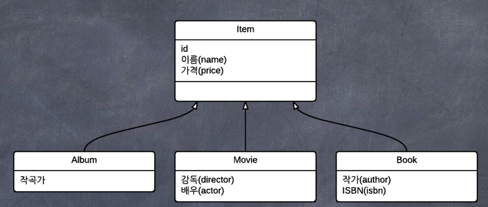

# Chapter 1. JPA 소개

## 1. SQL 을 직접 다룰 때 발생하는 문제점

- 데이터베이스에 데이터를 관리하려면 SQL 사용
- 자바로 작성한 애플리케이션은 JDBC API 사용

### 1-1. 반복, 반복 그리고 반복

---

- 회원 객체
    
    ```java
    public class Member {
        private String memberId;
        private String name;
        ...
    }
    ```
    
- 회원용 DAO
    
    ```java
    public class MemberDAO {
        public Member find(String memberId) {...}
    }
    ```
    
- 조회하는 기능 `find()` 개발해보자
    1. 회원 조회용 SQL 작성
        
        ```sql
        SELECT MEMBER_ID, NAME FROM MEMBER M WHERE MEMBER_ID = ?
        ```
        
    2. JDBC API를 사용해서 SQL 실행
        
        ```java
        ResultSet rs = stmt.executeQuery(sql);
        ```
        
    3. 조회 결과를 Member 객체로 매핑
        
        ```java
        String memberId = rs.getString("MEMBER_ID");
        String name = rs.getString("NAME");
        
        Member member = new Member();
        member.setMemberId(memberId);
        member.setName(name);
        ```
        
- 등록하는 기능 `save()` 만들어보자
    - 회원용 DAO: `save()` 추가
        
        ```java
        public class MemberDAO {
            public Member find(String memberId){...}
            public void save(Member member){...} //추가
        }
        ```
        
    1. 회원등록용 SQL 작성
        
        ```java
        String sql = "INSERT INTO MEMBER(MEMBER_ID, NAME) VALUES(?,?)";
        ```
        
    2. 회원 객체의 값을 꺼내서 등록 SQL 에 전달
        
        ```java
        pstmt.setString(1, member.getMemberId());
        pstmt.setString(2, member.getName());
        ```
        
    3. JDBC API를 사용해서 SQL을 실행
        
        ```java
        pstmt.executeUpdate(sql);
        ```
        

👉

- 회원 수정, 삭제 기능도 추가하다 보면..,
    - 데이터베이스는 객체 구조와는 다른 데이터 중심의 구조 → 개발자가 중간에서 SQL 과 JDBC API 를 사용해서 변환 작업을 직접 해주어야 한다.
- 너무 많은 SQL 과 JDBC API 를 코드로 작성해야 한다.➕  테이블마다 이런 비슷한 일을 반복해야 한다.

### 1-2. SQL 에 의존적인 개발

---

- 회원 객체를 관리하는 `MemberDAO` 완성 후에 회원의 연락처도 함께 저장해달라는 요구사항 추가
    - 등록 코드 변경
        1. 회원 객체:  연락처 필드 추가
            
            ```java
            public class Member {
                private String memberId;
                private String name;
                **private String tel; // 추가** 
            }
            ```
            
        2. 연락처를 저장할 수 있도록 INSERT SQL 수정
            
            ```java
            String sql = "INSERT INTO MEMBER(MEMBER_ID, NAME, TEL) VALUES(?,?,?)";
            ```
            
        3. 회원 객체의 연락처 값을 꺼내서 등록 SQL 에 전달
            
            ```java
            pstmt.setString(3, member.getTel());
            ```
            
    - 조회 코드 변경
        1. 회원 조회용 SQL 수정
            
            ```sql
            SELECT MEMBER_ID, NAME, TEL FROM MEMBER WHERE MEMBER_ID = ?
            ```
            
        2. 연락처 조회 결과를 Member 객체에 추가로 매핑
            
            ```java
            ...
            String tel = rs.getString("TEL");
            member.setTel(tel); // 추가
            ...
            ```
            
    - 수정 코드 변경
        - 연락처가 수정되지 않는 버그 발생 → UPDATE SQL에 `TEL` 컬럼을 추가하지 않았음

👉

- 애플리케이션에서 SQL 을 직접 다룰 때 발생하는 문제점
    - 진정한 의미의 계층 분할이 어렵다.
    - 엔티티를 신뢰할 수 없다.
    - SQL 에 의존적인 개발을 피하기 어렵다.

### 1-3. JPA 와 문제 해결

---

- JPA 는 SQL 사용시 이런 문제를 어떻게 해결하는가?
- JPA 사용하면 → 개발자가 직접 SQL 을 작성하는 것이 아니라 JPA 가 제공하는 API 를 사용하면 된다.
    - 저장 기능 `persist()`: 객체를 데이타베이스에 저장
        
        ```java
        jpa.persist(member); // 저장
        ```
        
        - JPA 가 객체와 매핑정보를 보고 적절한 INSERT SQL 생성
        - 데이타베이스에 전달
    - 조회 기능 `find()`: 객체 하나를 데이터베이스에서 조회
        
        ```java
        String memberId = "helloId";
        Member member = jpa.find(Member.class, memberId); // 조회
        ```
        
        - JPA 는 객체와 매핑정보를 보고 적절한 SELECT SQL 을 생성
        - 데이타베이스에 전달
        - 결과로 Member 객체를 생성해서 반환
    - 수정 기능: JPA 는 별도로 수정 메소드를 제공하지 않는다.
        
        ```java
        Member member = jpa.find(Member.class, memberId);
        member.setName("이름변경") // 수정
        ```
        
        - 대신 객체를 조회해서 값을 변경만 하면 트랜잭션 커밋할 때 데이터베이스에 적절한 UPDATE SQL 이 전달된다.
    - 연관된 객체 조회: JPA는 연관된 객체를 사용하는 시점에 적절한 SELECT SQL 을 실행
        
        ```java
        Member member = jpa.find(Member.class, memberId);
        Team team = member.getTeam(); // 연관된 개체 조회
        ```
        

## 2. 패러다임의 불일치

- 어플리케이션 발전 → 내부의 복잡성 증가

- 객체지향 프로그래밍: 추상화, 캡슐화, 정보은닉, 상속, 다형성 등 시스템의 복잡성을 제어할 수 있는 다양한 장치들을 제공한다.
- 관계형 데이타베이스: 데이터 중심으로 구조화되어 있고, 집합적인 사고를 요구한다.

👉

- 객체와 관계형 데이타베이스의 패러다임 불일치 문제: 지향하는 목적이 서로 다르므로 둘의 기능과 표현 방법이 다르다.
    - 패러다임 불일치 문제를 해결하는 데 너무 많은 시간과 코드를 소비해야 한다.

### 2-1. 상속

---

- 객체는 상속이 있지만, 테이블은 상속이 없다.
    - 객체 상속 모델
        
        
        
    - 테이블 설계
        
        
        
    - 객체 모델 코드
        
        ```java
        abstract class Item {
            Long id;
            String name;
            int price;
        }
        
        class Album extends Item {
            String artist;
        }
        
        class Movie extends Item {
            String director;
            String actor;
        }
        
        class Book extends Item {
            String author;
            String isbn;
        }
        ```
        
    - 저장 시 SQL
        
        ```sql
        -- Album 객체 저장
        INSERT INTO ITEM ...
        INSERT INTO ALBUM ...
        
        -- Movie 객체 저장
        INSERT INTO ITEM ...
        INSERT INTO MOVIE ...
        ```
        
- 관련 처리 → 패러다임의 불일치를 해결하려고 소모하는 비용
    - 저장
        1. 부모 객체에서 부모 데이터만 꺼냄
        2. `ITEM` 용 INSERT SQL 작성
        3. 자식 객체에서 자식 데이터만 꺼내서 `ALBUM` INSERT SQL 작성
    - 조회
        1. `ITEM` 과 `ALBUM` 테이블을 조인해서 그 결과를 다시 Album 객체 생성

👉

- 자바 컬렉션에 보관한다면 → 부모 자식이나 타입에 대한 고민 없이 해당 컬렉션을 그냥 사용하면 된다.
    
    ```java
    list.add(album);
    list.add(movie);
    
    Album album = list.get(albumId);
    ```
    

- JPA 와 상속
    - JPA 는 상속과 관련한 패러다임의 불일치 문제를 개발자 대신 해결해준다.
    - 자바 컬렉션에 객체를 저장하듯이 JPA 에게 객체를 저장하면 된다.
        - Item 을 상속한 Album 객체 저장 → JPA `persist()` 사용
            
            ```java
            jpa.persist(album);
            ```
            
            - JPA 는 다음 SQL 을 실행해서 객체를 `ITEM`, `ALBUM` 두 테이블에 나누어 저장
                
                ```sql
                INSERT INTO ITEM ...
                INSERT INTO ALBUM ...
                ```
                
    - Album 객체 조회 → JPA `find()` 사용
        
        ```java
        String albumId = "id100";
        Album album = jpa.find(Album.class, albumId);
        ```
        
        - JPA 는 `ITEM`과 `ALBUM` 두 테이블을 조인해서 필요한 데이터를 조회하고 결과를 반환
            
            ```sql
            SELECT I.*, A.*
                FROM ITEM I
                JOIN ALBUM A ON I.ITEM_ID = A.ITEM_ID
            ```
            

### 2-2. 연관관계

---

- 객체의 참조 사용
    - 참조를 사용해서 다른 객체와 연관관계를 가진다.
    - 참조에 접근해서 연관된 객체를 조회한다.
- 테이블의 외래 키 사용
    - 외래 키를 사용해서 다른 테이블과 연관관계를 가진다.
    - 조인을 사용해서 연관된 테이블을 조회한다.

- 객체를 테이블에 맞춰 모델링
    
    ```java
    class Member {
        String id;      // MEMBER_ID 컬럼 사용
        **Long teamId;    // TEAM_ID FK 컬럼 사용**
        String userName;
    }
    
    class Team {
        Long id;        // TEAM_ID PK 사용
        String name;
    }
    ```
    
    - 관계형 데이터베이스 방식에 맞추면 Member 객체와 연관된 Team 객체를 참조를 통해서 조회할 수 없다.
    - 좋은 객체 모델링은 기대하기 어렵고 결국 객체지향의 특징을 잃어버린다.
- 객체지향 모델링
    
    ```java
    // 참조를 사용하는 객체 모델
    class Member {
        String id;
        **Team team;          // 참조로 연관관계를 맺는다.**
        String username;
    
        Team getTeam() {
            return team;
        }
    }
    
    class Team {
        Long id;
        String name;
    }
    ```
    
    - 객체지향 모델링을 사용하면 객체를 테이블에 저장하거나 조회하기는 쉽지 않다.
        - 객체 모델은 외래 키가 필요 없고 단지 참조만 있으면 된다.
        - 테이블은 참조가 필요 없고 외래 키만 있으면 된다.
    - 결국, 개발자가 중간에서 변환 역할을 해야 한다. → 객체를 생성하고 연관관계를 설정해서 반환
        
        ```java
        public Member find(String memberId) {
            // SQL 실행
            Member member = new Member();
            ...
            // 데이터베이스에서 조회한 회원 관련 정보를 모두 입력
            Team team = new Team();
            ...
            // 데이터베이스에서 조회한 팀 관련 정보를 모두 입력
        
            // 회원과 팀 관계 설정
            **member.setTeam(team);**
            return member;
        }
        ```
        
- JPA 와 연관관계
    - JPA 는 연관관계와 관련한 패러다임 불일치 문제를 해결해준다.
        
        ```java
        member.setTeam(team);   // 회원과 팀 연관관계 설정
        jpa.persist(member);    // 회원과 연관관계 함께 저장
        ```
        
    - 객체를 조회할 때 외래 키를 참조로 변환하는 일도 JPA 가 처리해준다.
        
        ```java
        Member member = jpa.find(Member.class, memberId);
        Team team = member.getTeam();
        ```
        

### 2-3. 객체 그래프 탐색

---

- 객체 그래프 탐색 ex> 회원이 소속된 팀을 조회할 때, 참조를 사용해서 연관된 팀 찾기
    
    ```java
    member.getOrder().getOrderItem()... // 자유로운 객체 그래프 탐색
    ```
    


- SQL 을 직접 다루면 처음 실행하는 SQL 에 따라 객체 그래프를 어디까지 탐색할 수 있는지 정해진다. → 객체지향 개발자에게 너무 큰 제약
    - 비즈니스 로직에 따라 사용하는 객체 그래프가 다른데, 언제 끊어질지 모를 객체 그래프를 함부로 탐색할 수는 없기 때문이다.
    
    ```java
    // 회원 조회 비지니스 로직
    class MemberService {
        ...
        public void process() {
            Member member = memberDAO.find(memberId);
            member.getTeam();                   // member->team 객체 그래프 탐색이 가능한다.?
            member.getOrder().getDelivery();    // ???
        }
    }
    ```
    
- 그렇다고 연관된 모든 객체 그래프를 조회해서 메모리에 올리는 것은 현실성이 없다. → 결국 MemberDAO 에 상황에 따라 메소드를 여러 벌 만들어서 사용해야 한다.
    
    ```java
    memberDAO.getMember();
    memberDAO.getMemberWithTeam();
    memberDAO.getMemberWithOrderWithDelivery();
    ```
    

- JPA 와 객체 그래프 탐색
    
    ```java
    member.getOrder().getOrderItem()... // 자유로운 객체 그래프 탐색
    ```
    
    - JPA 는 연관된 객체를 사용하는 시점에 적절한 SELECT SQL 실행
    - 지연로딩: 실제 객체를 사용하는 시점까지 데이타베이스 조회를 미룬다.
        - JPA 는 지연 로딩을 투명하게 처리한다.
    - 투명한 엔티티
        
        ```java
        class Member {
            private Order order;
        
            public Order getOrder() {
                return order;
            }
        }
        ```
        
        - `getOrder()` 구현 부분에 JPA 와 관련된 어떤 코드도 직접 사용하지 않는다.
    - 지연 로딩 사용
        
        ```java
        // 처음 조회 시점에 SELECT MEMBER SQL
        Member member = jpa.find(Member.class, memberId);
        
        Order order = member.getOrder();
        order.getOrderDate();   // Order를 사용하는 시점에 SELECT ORDER SQL
        ```
        

### 2-4. 비교

---

- 데이터베이스 : 기본 키의 값으로 각 ROW 를 구분
- 객체 : 동일성(Identity) 비교와 동등성(Equality) 비교
    - 동일성 비교 : == 비교, 객체 인스턴스의 주소값 비교
    - 동등성 비교 : `equals()` 를 사용해서 객체 내부의 값 비교

- MemberDAO
    
    ```java
    class MemberDAO {
        public Member getMember(String memberId) {
            String sql = "SELECT * FROM MEMBER WHERE MEMBER_ID = ?";
            ...
            // JDBC API, SQL실행
            return new Member(...);
        }
    }
    ```
    
- 조회한 회원 비교하기
    
    ```java
    String memberId = "100";
    Member member1 = memberDAO.getMember(memberId);
    Member member2 = memberDAO.getMember(memberId);
    
    member1 == member2;     //다르다.
    ```
    
- JPA 와 비교
    
    ```java
    String memberId = "100";
    Member member1 = jpa.find(Member.class, memberId);
    Member member2 = jpa.find(Member.class, memberId);
    
    member1 == member2;     //같다.
    ```
    
    - JPA는 같은 트랜잭션일 때 같은 객체가 조회되는 것을 보장한다.
    - member1 과 member2 는 동일성 비교에 성공한다.


## 3. JPA 란 무엇인가?

- JPA(Java Persistence API): 자바 진영의 ORM 기술 표준
    - 애플리케이션과 JDBC 사이에서 동작한다.
    
    
    

- ORM(Object Relational Mapping): 객체와 테이블을 매핑해서 패러다임의 불일치를 개발자 대신 해결해준다.
    - 객체를 저장하는 코드
        
        
        
        ```java
        jpa.persist(member);    // 저장
        ```
        
    - 객체를 조회하는 코드
        
        
        
        ```java
        Member member = jpa.find(memberId); // 조회
        ```
        

### 3-1. JPA 소개

---

- JPA: EJB 3.0 에서 하이버네이트를 기반으로 만들어진 새로운 자바 ORM 기술 표준
    
    
    

- 버전별 특징
    - JPA 1.0(JSR 220) - 2006년: 초기 버전, 복합 키와 연관관계 기능 부족
    - JPA 2.0(JSR 317) - 2009년: 대부분의 ORM 기능 포함, JPA Criteria가 추가
    - JPA 2.1(JSR 338) - 2013년: 스토어드 프로시저 접근, 컨버터, 엔티티 그래프 기능 추가
    - JPA 2.2(JSR 338) - 2017년: [Hibernate 5.3](https://hibernate.org/orm/releases/) 이상 (`spring-boot-starter-data-jpa:2.5.0` 경우, `hibernate-core:5.4.31` 사용중)
        - 모든 관련 어노테이션에 `@Repeatable` 추가 ([@Repeatable 이란?](https://github.com/kyh1126/java8-to-11/blob/e73e8be69c6ce1e864538e3fc27970ce8a952732/src/main/java/me/jenny/java8to11/_7_etc/Chicken.java))
            - 관련 어노테이션 16개
                - `@AssociationOverride`
                - `@AttributeOverride`
                - `@Convert`
                - `@JoinColumn`
                - `@MapKeyJoinColumn`
                - `@NamedEntityGraph`
                - `@NamedNativeQuery`
                - `@NamedQuery`
                - `@NamedStoredProcedureQuery`
                - `@PersistenceContext`
                - `@PersistenceUnit`
                - `@PrimaryKeyJoinColumn`
                - `@SecondaryTable`
                - `@SqlResultSetMapping`
                - `@SequenceGenerator`
                - `@TableGenerator`
            - 실 사용할 어노테이션과 그 어노테이션 묶음 값을 관리하는 컨테이너 어노테이션을 작성해야함
                - before
                    
                    ```java
                    @Entity
                    @NamedQueries({
                        @NamedQuery(name = “Book.findByTitle”, query = “SELECT b FROM Book b WHERE b.title = :title”),
                        @NamedQuery(name = “Book.findByPublishingDate”, query = “SELECT b FROM Book b WHERE b.publishingDate = :publishingDate”)
                    })
                    public class Book {
                        ...
                    }
                    ```
                    
                - after
                    - `@NamedQuery`
                        
                        ```java
                        **@Repeatable(NamedQueries.class) // 추가됨**
                        @Target({TYPE}) 
                        @Retention(RUNTIME)
                        public @interface NamedQuery { ... }
                        ```
                        
                    
                    ```java
                    @Entity
                    @NamedQuery(name = “Book.findByTitle”, query = “SELECT b FROM Hibernate5Book b WHERE b.title = :title”)
                    @NamedQuery(name = “Book.findByPublishingDate”, query = “SELECT b FROM Hibernate5Book b WHERE b.publishingDate = :publishingDate”)
                    public class Book {
                        ...
                    }
                    ```
                    
        - 메타 annotation 에서 모든 JPA annotation 을 사용할 수 있다.
            - `@CacheableEntity` 추가: `@Entity`, `@Cacheable` 일괄 적용 용도
                
                ```java
                @Target(TYPE)
                @Retention(RUNTIME)
                @Entity
                @Cacheable
                public @interface CacheableEntity
                {
                }
                ```
                
            - 엔티티에 적용
                
                ```java
                @CacheableEntity
                public class MyClass
                {
                    ...
                }
                ```
                
        - 쿼리 결과 stream 기능 추가
            
            ```java
            Stream<Book> books = em.createQuery("SELECT b FROM Book b", Book.class).getResultStream();
            books.map(b -> b.getTitle() + " was published on " + b.getPublishingDate())
                .forEach(m -> log.info(m));
            ```
            
        - AttributeConverter 에 CDI(Contexts and Dependency Injection) 주입 가능
            
            ```java
            @Converter(autoApply = true)
            public class MyAttributeConverter implements AttributeConverter<MyObject, String> {
             
                **@Inject
                private Converter convert;**
                 
                @Override
                public String convertToDatabaseColumn(MyObject obj) {
                    return convert.toString(obj);
                }
             
                @Override
                public MyObject convertToEntityAttribute(String s) {
                    return convert.toMyObject(s);
                }
            }
            ```
            
        - Java 8 의 Date 와 Time 타입 지원
            
            ```java
            @Entity
            public class MyEntity {
             
                @Id
                @GeneratedValue(strategy = GenerationType.AUTO)
                @Column(name = "id", updatable = false, nullable = false)
                private Long id;
                 
                @Column
                private LocalDate date;
                 
                @Column
                private LocalDateTime dateTime;
                 
                ...
            }
            ```
            
            - JSR-310 스펙인 Date 와 Time API 를 기본적으로 지원하게 되어, LocalDate, LocalTime, LocalDateTime, OffsetTime, OffsetDateTime 등이 `@Converter` 없이 사용 가능하게 되었다.

### 3-2. 왜 JPA 를 사용해야 하는가?

---

- 생산성
    - JPA 를 사용하면 자바 컬렉션에 객체를 저장하듯이 JPA 에게 저장할 객체를 전달하면 된다.
    - INSERT SQL 을 작성하고 JDBC API 사용하는 지루하고 반복적인 일을 JPA 가 대신 처리해준다.
    
    ```java
    jpa.persist(member);    // 저장
    Member member = jpa.find(memberId);    // 조회
    ```
    
    - CREATE TABLE 같은 DDL 문 자동 생성 기능도 있다.
    
    → 데이터베이스 설계 중심의 패러다임을 객체 설계 중심으로 역전시킬 수 있다.
    
- 유지보수
    - 엔티티에 필드 추가 시 등록, 수정, 조회 관련 코드 모두 변경해야 했다.
    - JPA 를 사용하면 이런 과정을 JPA 가 대신 처리
    - 개발자가 작성해야 할 SQL 과 JDBC API 코드를 JPA 가 대신 처리해줌으로 유지보수해야 하는 코드 수가 줄어든다.
- 패러다임 불일치 해결
    - 상속, 연관관계, 객체 그래프 탐색, 비교하기 같은 패러다임 불일치 해결
- 성능
    - 다양한 성능 최적화 기회 제공한다.
    - 애플리케이션과 데이터베이스 사이에 존재함으로 여러 최적화 시도 가능
- 데이터 접근 추상화와 벤더 독립성
    - 데이터베이스 기술에 종속되지 않도록 한다.
    - 데이타베이스를 변경하면 JPA 에게 다른 데이터베이스를 사용한다고 알려주면 됨
    
    
    
- 표준
    - 자바 진영의 ORM 기술 표준

- 참고
    - [https://thorben-janssen.com/whats-new-in-jpa-2-2/](https://thorben-janssen.com/whats-new-in-jpa-2-2/)
    - [https://en.wikipedia.org/wiki/Jakarta_Persistence#JPA_2.2](https://en.wikipedia.org/wiki/Jakarta_Persistence#JPA_2.2)
    - [https://ultrakain.gitbooks.io/jpa/content/chapter1/chapter1.1.html](https://ultrakain.gitbooks.io/jpa/content/chapter1/chapter1.1.html)
    - [https://jgrammer.tistory.com/76](https://jgrammer.tistory.com/76)