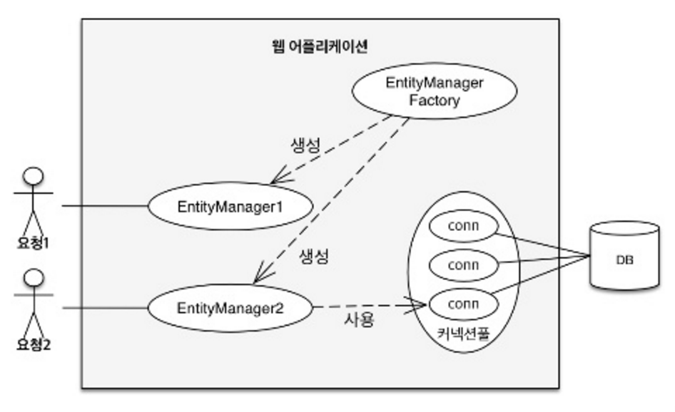

# Chapter 3. 영속성 관리

## 1. 엔티티 매니저 팩토리와 엔티티 매니저

- 데이타베이스를 하나만 사용하는 어플리케이션은 일반적으로 `EntityManagerFactory`를 하나만 생성한다.
- `EntityManagerFactory` 얻기
    
    ```java
    // 비용이 아주 많이 든다.
    // 엔티티 매니저 팩토리 생성
    EntityManagerFactory emf = Persistence.createEntityManagerFactory("jpabook");
    ```
    
    - 만드는 비용이 상당히 큼
    - 한 개만 만들어서 어플리케이션 전체에서 공유하도록 설계
    - 여러 스레드가 동시에 접근해도 안전, 서로 다른 스레드 간 공유 가능
- `EntityManger` 생성
    
    ```java
    // 엔티티 매니저 생성, 비용이 거의 안든다.
    EntityManager em = emf.createEntityManager();
    ```
    
    - 여러 스레드가 동시에 접근하면 동시성 문제 발생
    - 스레드간 절대 공유하면 안된다.
    - 데이터베이스 연결이 필요한 시점까지 커넥션을 얻지 않는다.
        
        
        

## 2. 영속성 컨텍스트란?

- 영속성 컨텍스트(persistence context): 엔티티를 영구 저장하는 환경
- 관련 코드
    
    
    
    ```java
    em.persist(member);
    ```
    
    - 단순하게 회원 엔티티 저장한다고 표현했는데, 정확하게는
        - `persist()`: 엔티티 매니저를 사용해서 회원 엔티티를 영속성 컨텍스트에 저장한다.
    - 영속성 컨텍스트는 논리적인 개념에 가까움
        - 눈에 보이지 않는다.
    - 엔티티 매니저를 생성할 때 하나 만들어진다.
    - 엔티티 매니저를 통해 영속성 컨텍스트에 접근하고 관리할 수 있다.


## 3. 엔티티의 생명주기

- 4가지 상태
    - 비영속(new/transient): 영속성 컨텍스트와 전혀 관계가 없는 상태
    - 영속(managed): 영속성 컨텍스트에 저장된 상태
    - 준영속(detached): 영속성 컨텍스트에 저장되었다가 분리된 상태
    - 삭제(removed): 삭제된 상태
- 생명주기
    
    
    

### 비영속

---

- 엔티티 객체를 생성
- 순수한 객체 상태, 아직 저장하지 않음
- 영속성 컨텍스트나 데이터베이스와 상관없다.

```java
// 객체를 생성한 상태(비영속)
Member member = new Member();
member.setId(100L);
member.setUsername("회원1");
```

- `em.persist()` 호출 전, 비영속 상태
    
    
    

### 영속

---

- 엔티티 매니저를 통해 엔티티를 영속성 컨텍스트에 저장
- 영속성 컨텍스트가 관리하는 엔티티를 영속 상태라고 한다.
- 회원 엔티티 : 비영속 상태 → 영속 상태
- 영속상태 = 영속성 컨텍스트에 의해 관리된다는 뜻
- `em.find()`나 JPQL를 사용해서 조회한 엔티티도 영속 상태
- `em.persist()` 호출 후, 영속상태
    
    ```java
    // 객체를 저장한 상태(영속)
    em.persist(member);
    ```
    
    
    

### 준영속

---

- 영속성 컨텍스트가 관리하던 영속 상태의 엔티티를 영속성 컨텍스트가 관리하지 않으면 준영속 상태
    - `em.detach()`: 준영속 상태로 만든다.
    - `em.close()`: 영속성 컨텍스트를 닫음
    - `em.clear()`: 영속성 컨텍스트 초기화

```java
// 회원 엔티티를 영속성 컨텍스트에서 분리, 준영속 상태
em.detach(member);
```

### 삭제

---

- 엔티티를 영속성 컨텍스트와 데이타베이스에서 삭제
    
    ```java
    // 객체를 삭제한 상태(삭제)
    em.remove(member);
    ```
    

## 4. 영속성 컨텍스트의 특징

- 영속성 컨텍스트와 식별자 값
    - 엔티티를 식별자 값(`@id`로 테이블의 기본 키와 매핑한 값)으로 구분
    - 영속 상태는 식별자 값이 반드시 있어야 한다.
    - 식별자 값이 없으면 예외 발생.
- 영속성 컨텍스트와 데이터베이스 저장
    - JPA 는 보통 트랜잭션을 커밋하는 순간 영속성 컨텍스트에 새로 저장된 엔티티를 데이터베이스에 반영
    - 플러시(flush)
- 영속성 컨텍스트가 엔티티를 관리하는 것의 장점
    - 1차 캐시
    - 동일성 보장
    - 트랜잭션을 지원하는 쓰기 지연
    - 변경 감지
    - 지연 로딩

### 4-1. 엔티티 조회

---

- 영속성 컨텍스트는 내부에 캐시를 가지고 있음 → 1차 캐시
- 영속 상태의 엔티티는 모두 이곳에 저장

영속성 컨텍스트 내부에 Map 이 하나 있다. (키: `@Id`로 매핑한 식별자, 값: 엔티티 인스턴스)

- 1차 캐시에 회원 엔티티 저장, DB 에는 저장되지 않은 상태
    
    ```java
    // 엔티티를 생성한 상태(비영속)
    Member member = new Member();
    member.setId(100L);
    member.setUsername("회원1");
    
    // 엔티티 영속
    em.persist(member);
    ```
    
    - 영속성 컨텍스트 1차 캐시 상태
        
        
        
        - 1차 캐시의 키는 식별자 값
        - 식별자 값은 데이타베이스 기본 키와 매핑
        - 영속성 컨텍스트에 데이터를 저장하고 조회하는 모든 기준은 데이타베이스 기본 키 값
- 엔티티 조회
    
    ```java
    Member member = em.find(Member.class, 100L);
    ```
    
    - `em.find()` 호출 → 1차 캐시에서 엔티티 조회
    - 엔티티가 1차 캐시에 없으면 데이터베이스에서 조회한다.

- 1차 캐시에서 조회
    
    
    
    - `em.find()` 호출 시
        - 우선 1차 캐시에서 식별자 값으로 엔티티 찾음.
        - 찾는 엔티티가 있으면 데이타베이스 조회하지 않고, 메모리에 있는 1차 캐시에서 엔티티를 조회
    - 1차 캐시에 있는 엔티티 조회
        
        ```java
        Member member = new Member();
        member.setId(100L);
        member.setUsername("회원1");
        
        // 1차 캐시에 저장됨
        em.persist(member);
        
        // 1차 캐시에서 조회
        Member findMember = em.find(Member.class, 100L);
        ```
        
- 데이터베이스에서 조회
    - 엔티티가 1차 캐시에 없으면 엔티티 매니저는 데이터베이스를 조회해서 엔티티를 생성.
    - 1차 캐시에 저장한 후에 영속 상태의 엔티티를 반환.
    
    
    
    - 분석
        1. `em.find(Member.class, 200L)`를 실행.
        2. member2 가 1차 캐시에 없으므로 데이터베이스에서 조회.
        3. 조회한 데이터로 member2 엔티티를 생성해서 1차 캐시에 저장한다.(영속상태)
        4. 조회한 엔티티를 반환
- 영속 엔티티의 동일성 보장
    
    ```java
    Member a = em.find(Member.class, "member1");
    Member b = em.find(Member.class, "member1");
    
    System.out.println(a == b); // 동일성 비교
    ```
    
    - 결과는 `true`
    - 둘은 같은 인스턴스
    - 영속성 컨텍스트는 성능상 이점과 엔티티의 동일성을 보장한다.

### 4-2. 엔티티 등록

---

- 엔티티 등록 코드
    
    ```java
    EntityManager em = emf.createEntityManager();
    EntityTransaction transaction = em.getTransaction();
    
    // 엔티티 매니저는 데이터 변경 시 트랜잭션을 시작해야 한다.
    transaction.begin();    // 트랜잭션 시작
    
    em.persist(memberA);
    em.persist(memberB);
    // 여기까지 INSERT SQL을 데이터베이스에 보내지 않는다.
    
    // 커밋하는 순간 데이터베이스에 INSERT SQL을 보낸다.
    transaction.commit();   // 트랜잭션 커밋
    ```
    
- 엔티티 매니저는 트랜잭션을 커밋하기 직전까지 데이터베이스의 엔티티를 저장하지 않음.
- 내부 쿼리 저장소에 INSERT SQL을 차곡차곡 모아둔다.
- 트랜잭션 커밋할 때 모아둔 쿼리를 데이터베이스에 보낸다.
- 트랜잭션을 지원하는 쓰기 지연

- 쓰기 지연, 회원 A 영속
    
    
    
- 쓰기 지연, 회원 B 영속
    
    
    
- 트랜잭션 커밋, 플러시, 동기화
    
    
    

1. 트랜잭션 커밋
2. 엔티티 매니저 → 영속성 컨텍스트 플러시
3. 데이타베이스 동기화 → 등록, 수정, 삭제한 엔티티를 DB에 반영
    - 쓰기 지연 SQL 저장소에 모인 쿼리를 데이터베이스에 보낸다.
4. 마지막으로 실제 데이타베이스 트랜잭션 커밋

트랜잭션 범위 안에서 실행. 등록 쿼리를 그때 그때 데이타베이스에 전달해도 트랜잭션을 커밋하지 않으면 아무 소용이 없다.

### 4-3. 엔티티 수정

---

- JPA는 엔티티를 수정할 때는 단순히 엔티티를 조회해서 데이터만 변경하면 된다.
- `update()`라는 메소드 없음
- 변경 감지 기능을 사용해서 데이타베이스에 자동 반영


플러시 시점에 스냅샷과 엔티티를 비교

- 수정 순서
    1. 트랜잭션 커밋 → 엔티티 매니저 내부에서 먼저 플러시 호출
    2. 엔티티와 스냅샷을 비교해서 변경된 엔티티 찾는다.
    3. 변경된 엔티티가 있으면 수정 쿼리를 생성해서 쓰기 지연 SQL 저장소로 보낸다.
    4. 쓰기 지연 저장소의 SQL을 데이터베이스로 보낸다.
    5. 데이터베이스 트랜잭션을 커밋

변경감지는 영속성 컨텍스트가 관리하는 영속 상태의 엔티티에만 적용된다.

- 업데이트 기본 전략: JPA 의 기본전략은 모든 필드를 업데이트한다.
    - 모든 필드를 사용하면 수정 쿼리가 항상 같음.
    - 동일한 쿼리를 보내면 데이터베이스는 이전에 파싱된 쿼리는 재사용.

- 필드가 많거나 저장되는 내용이 큰 경우: 하이버네이트 확장 기능 사용
    
    ```java
    @Entity
    @org.hibernate.annotation.DynamicUpdate
    @Table(name = "Member")
    public class Member {...}
    ```
    
    - 수정된 데이터만 사용해서 동적으로 UPDATE SQL 을 생성

### 4-4. 엔티티 삭제

---

- 엔티티를 삭제하려면 먼저 삭제 대상 엔티티를 조회해야 한다.
    
    ```java
    Member memberA = em.find(Member.class, 100L);  // 삭제 대상 엔티티 조회
    em.remove(memberA);     // 엔티티 삭제
    ```
    
- 엔티티를 즉시 삭제하는 것이 아님
- 삭제 쿼리를 쓰기 지연 SQL 저장소에 등록
- `em.remove(memberA)`를 호출하는 순간 영속성 컨텍스트에서 제거


## 5. 플러시

- 플러시(`flush()`)는 영속성 컨텍스트의 변경 내용을 데이터베이스에 반영한다.

- 플러시 실행
    1. 변경 감지 동작. 모든 엔티티를 스냅샷과 비교.
    2. 수정된 엔티티는 수정쿼리를 만들어 쓰기 지연 SQL 저장소 등록.
    3. 쓰기 지연 SQL 저장소의 쿼리를 데이터베이스에 전송.
        - 등록, 수정, 삭제 쿼리

- 영속성 컨텍스트를 플러시하는 방법 3가지
    1. `em.flush()` 직접 호출.
    2. 트랜잭션 커밋 시 플러시 자동 호출.
    3. JPQL(Java Persistence Query Langauge) 쿼리 실행시 플러시가 자동 호출.

👉

- 직접 호출: 테스트나 다른 프레임워크와 JPA를 함께 사용할 때를 제외하고 거의 사용하지 않음.
- 트랜잭션 커밋 시 플러시 자동 호출
    - 트랜잭션 커밋하기 전에 꼭 플러시 호출해서 변경 내용을 데이터베이스에 반영해야 함.
    - JPA 는 트랜잭션 커밋할 때 플러시를 자동 호출
- JPQL 쿼리 실행 시 플러시 자동 호출
    
    ```java
    em.persist(memberA);
    em.persist(memberB);
    em.persist(memberC);
    
    // 중간에 조회
    query = em.createQuery("select m from Member m", Member.class);
    List<Member> members = query.getResultList();
    ```
    
    - memberA, memberB, memberC 는 데이터베이스에 없음
    - 이런 문제를 해결하기 위해 JPQL 실행 시에 플러시 자동 호출
    - memberA, memberB, memberC 는 쿼리 결과에 포함된다.

### 5-1. 플러시 모드 옵션

---

- 별도로 설정하지 않으면 `AUTO`로 동작한다. 대부분 `AUTO` 기본 설정을 그대로 사용한다.
    - `FlushModeType.AUTO`: 커밋이나 쿼리를 실행할 때 플러시(기본값)
    - `FlushModeType.COMMIT`: 커밋할 때만 플러시

- 플러시는 영속성 컨텍스트의 변경 내용을 데이터베이스에 동기화하는 것이다.
- 영속성 컨텍스트에 보관된 엔티티를 지우는 것이 아님


## 6. 준영속

- 준영속 상태를 만드는 방법 3가지
    - `em.detach(entity)`: 특정 엔티티만 준영속 상태로 전환
    - `em.clear()`: 영속성 컨텍스트를 완전히 초기화
    - `em.close()`: 영속성 컨텍스트를 종료

### 6-1. 엔티티를 준영속 상태로 전환: `detach()`

---

- `detach()` 테스트 코드
    
    ```java
    public void testDetached() {
        ...
        // 회원 엔티티 생성, 비영속 상태
        Member member = new Member();
        member.setId("memberA");
        member.setUsername("회원A");
    
        // 회원 엔티티 영속 상태
        em.persist(member);
    
        // 회원 엔티티를 영속성 컨텍스트에서 분리, 준영속 상태
        em.detach(member);
    
        transaction.commit();   //트랜잭션 커밋
    }
    ```
    
    - `em.detach(member)`
    - 해당 엔티티를 관리하지 말라는 것
    - 메소드를 호출하는 순간, 1차 캐시부터 쓰기 지연 SQL저장소까지 해당 엔티티를 관리하기 위한 모든 정보가 제거된다.
- detach 실행 전
    
    
    
- detach 실행 후
    
    
    
- 영속 상태였다가 더는 영속성 컨텍스트가 관리하지 않는 상태 → 준영속 상태
- 준영속 상태는 영속성 컨텍스트로부터 분리된 상태

### 6-2. 영속성 컨텍스트 초기화: `clear()`

---

- 영속성 컨텍스트를 초기화해서 해당 영속성 컨텍스트의 모든 엔티티를 준영속 상태로 만든다.
- 영속성 컨텍스트 초기화
    
    ```java
    //엔티티 조회, 영속 상태
    Member member = em.find(Member.class, "memberA");
    
    em.clear();     //영속성 컨텍스트 초기화
    
    //준영속 상태
    member.setUsername("changeName");
    ```
    
- 영속성 컨텍스트 초기화 전
    
    
    
- 영속성 컨텍스트 초기화 후
    
    
    
- memberA, memberB → 준영속 상태

### 6-3. 영속성 컨텍스트 종료: `close()`

---

- 영속성 컨텍스트를 종료하면 해당 영속성 컨텍스트가 관리하던 영속 상태의 엔티티가 모두 준영속 상태가 된다.
- 영속성 컨텍스트 닫기
    
    ```java
    public void closeEntityManager() {
    
        EntityManagerFactory emf =
            Persistence.createEntityManagerFactory("jpabook");
    
        EntityManager em = emf.createEntityManager();
        EntityTransaction transaction = em.getTransaction();
    
        transaction.begin();    // [트랜잭션] - 시작
    
        Member memberA = em.find(Member.class, "memberA");
        Member memberB = em.find(Member.class, "memberB");
    
        transaction.commit();   // [트랜잭션] = 커밋
    
        em.close();     // 영속성 컨텍스트 닫기(종료)
    }
    ```
    
- 영속성 컨텍스트 제거 전
    
    
    
- 영속성 컨텍스트 제거 후 → 더는 memberA, memberB를 관리하지 않는다.
    
    
    

개발자가 직접 준영속 상태를 만드는 일은 드물다.

### 6-4. 준영속 상태의 특징

---

- 거의 비영속 상태에 가깝다.
    - 1차 캐시, 쓰기 지연, 변경 감지, 지연 로딩을 포함한 영속성 컨텍스트가 제공하는 어떤 기능도 동작하지 않는다.
- 식별자 값을 가지고 있다.
    - 준영속 상태는 이미 한 번 영속 상태였으므로 반드시 식별자 값을 가지고 있다.
- 지연 로딩을 할 수 없다.(문제 발생)
    - 지연 로딩: 실제 객체 대신 프록시 객체를 로딩해두고 해당 객체를 실제 사용할 때 영속성 컨텍스트를 통해 데이터를 불러오는 방법

### 6-5. 병합: `merge()`

---

- 준영속 상태의 엔티티를 다시 영속 상태로 변경하려면 병합(merge)를 사용하면 된다.
- `merge()` 메소드는 준영속 상태의 엔티티를 받아서 그 정보로 새로운 영속 상태의 엔티티를 반환.
- `merge()` 메소드 정의
    
    ```java
    public <T> T merge(T entity);
    ```
    
- `merge()` 사용 예
    
    ```java
    Member mergeMember = em.merge(member);
    ```
    

- 준영속 병합
    
    
    
    1. `merge()`를 실행한다.
    2. 파라미터로 넘어온 준영속 엔티티의 식별자 값으로 1차 캐시에서 엔티티를 조회
    3. 만약 1차 캐시에 엔티티가 없으면 데이터베이스에서 엔티티를 조회하고 1차 캐시에 저장
    4. 조회한 영속 엔티티(mergeMember)에 member 엔티티의 값을 채워 넣는다.(member 엔티티의 모든 값을 mergeMember 에 밀어넣는다. 이때 mergeMember 의 "회원1"이라는 이름이 "회원명 변경"으로 바뀐다.
    5. mergeMember를 반환.
- 비영속 병합
    
    ```java
    Member member = new Member();
    Member newMember = em.merge(member);    //비영속 병합
    tx.commit();
    ```
    
    1. 파라미터로 넘어온 엔티티의 식별자 값으로 영속성 컨텍스트를 조회.
    2. 엔티티가 없으면 데이터베이스에서 조회.
    3. 데이터베이스에서도 발견하지 못하면 새로운 엔티티를 생성해서 병합.

병합은 준영속, 비영속을 신경쓰지 않는다. 식별자 값으로 엔티티를 조회할 수 있으면 불러서 병합. 조회할 수 없으면 새로 생성해서 병합한다.


## 기타

### 트랜잭션 범위의 영속성 컨텍스트

---

- 스프링 컨테이너의 기본 전략
    
    
    
- `@Transaction` 어노테이션, 트랜잭션 AOP
    
    
    
- 트랜잭션이 같으면 같은 영속성 컨텍스트 사용
    
    
    
- 트랜잭션이 다르면 다른 영속성 컨텍스트를 사용
    
    
    

- 참고
    - [https://ultrakain.gitbooks.io/jpa/content/chapter3/chapter3.6.html](https://ultrakain.gitbooks.io/jpa/content/chapter3/chapter3.6.html)
