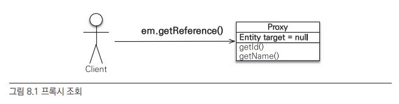

# Chapter 8. 프록시와 연관관계 관리

## 1. 프록시

- 지연 로딩: JPA 는 엔티티가 실제 사용될 때까지 데이터베이스 조회를 지연하는 방법을 제공한다.
- 프록시 객체: 지연 로딩을 사용하기 위한, 실제 엔티티객체 대신에 DB 조회를 지연할 수 있는 가짜 객체

### 1-1. 프록시 기초

---

```java
// 엔티티 직접 조회 - 영속성 컨텍스트에 없으면 DB 조회
Member member = em.find(Member.class, 100L);
// 엔티티를 실제 사용하는 시점까지 미루고 프록시 객체 반환
Member member = em.getReference(Member.class, 100L);
```

- 프록시 조회
    
    
    

- 프록시의 특징
    - 프록시 클래스는 실제 클래스를 상속 받아서 만들어지므로 실제 클래스와 겉 모양이 같다.
        
        
        
    - 프록시 객체는 실제 객체에 대한 참조(target)를 보관한다.
    - 프록시 객체의 메소드를 호출하면 프록시 객체는 실제 객체의 메소드를 호출한다.
        
        
        
    - 프록시 객체는 처음 사용할 때 한번만 초기화된다.
    - 프록시 객체가 초기화된다고 실제 엔티티로 바뀌는 것은 아니다. 프록시 객체가 초기화되면 프록시 객체를 통해서 실제 엔티티에 접근할 수 있다.
    - 프록시 객체는 원본 엔티티 객체를 상속받은 객체이므로 타입 체크 시에 주의해서 사용해야 한다.
    - 영속성 컨텍스트에 이미 해당 엔티티가 있으면 DB 를 조회할 필요가 없으므로 `em.getReference()`를 호출해도 프록시가 아닌 실제 엔티티를 반환한다.
    - 초기화는 영속성 컨텍스트에 도움을 받아야 가능하다. 따라서 영속성 컨텍스트의 도움을 받을 수 없는 준영속 상태의 프록시를 초기화하면 문제가 발생한다.
        - 하이버네이트는 `LazyInitializationException` 발생시킨다.

- 프록시 초기화 예제
    
    ```java
    // MemberProxy 반환
    Member member = em.getReference(Member.class, "id1");
    member.getName(); // 1. getName
    ```
    
- 프록시 클래스 예상 코드
    
    ```java
    class MemberProxy extends Member {
    	Member target = null; // 실제 엔티티 참조
    	
    	public String getName(){
    		if(target==null){
    			// 2. 초기화 요청
    			// 3. DB 조회
    			// 4. 실제 엔티티 생성 및 참조 보관
    			this.target = ...;
    		}
    		// 5. target.getName();
    		return target.getName();
    	}
    }
    ```
    
- 프록시 객체의 초기화: 실제 사용될 때 DB 를 조회해서 실제 엔티티 객체를 생성하는 것
    
    
    
    - 프록시 초기화 과정
        1. 프록시 객체의 메소드 `member.getName()`를 호출해서 실제 데이터 조회
        2. 프록시 객체는 실제 엔티티가 생성되어 있지 않으면 영속성 컨텍스트에 실제 엔티티 생성을 요청 (초기화)
        3. 영속성 컨텍스트는 데이터베이스를 조회해서 실제 엔티티 객체를 생성한다.
        4. 프록시 객체는 생성된 실제 엔티티 객체의 참조를 `Member` target 멤버변수에 보관한다.
        5. 프록시 객체는 실제 엔티티 객체의 `getName()`을 호출해서 결과를 반환한다.

### 1-2. 프록시와 식별자

---

- 프록시 객체는 식별자 값을 보관한다.
    - 엔티티를 프록시로 조회할 때 식별자(PK) 값을 파라미터로 전달한다.
- 프록시 객체는 식별자 값을 가지고 있으므로 식별자 값 조회 메소드를 호출해도 프록시가 초기화되지 않는다.
    - 단, 엔티티 접근 방식을 프로퍼티 `@Access(AccessType.PROPERTY)`로 설정한 경우에만 초기화되지 않는다.
    
    ```java
    Team team = em.getReference(Team.class, "team1"); // 식별자 보관
    team.getId(); // 초기화되지 않음
    ```
    
- 엔티티 접근 방식을 필드 `@Access(AccessType.FIELD)`로 설정하면 JPA 는 `getId()`가 id 만 조회하는 메소드인지 다른 필드까지 활용해서 어떤 일을 하는 메소드인지 알지 못하므로 프록시 객체를 초기화한다.

- 프록시는 연관관계 설정 시 유용하게 사용 가능하다.
    
    ```java
    Member member = em.find(Member.class, "member1");
    Team team = em.getReference(Team.classm, "team1"); // SQL 실행 X
    member.setTeam(team);
    ```
    
- 연관관계 설정 시 식별자 값만 사용하므로 프록시를 사용하면 데이터베이스 접근 횟수를 줄일 수 있다.
    - 연관관계를 설정할 때는 엔티티 접근 방식을 필드로 설정해도 프록시를 초기화하지않는다.

### 1-3. 프록시 확인

---

- JPA 가 제공하는 `PersistenceUnitUtil.isLoaded(Object entity)`메소드를 사용하면 프록시 인스턴스의 초기화 여부를 확인할 수 있다.
- 이미 초기화되었거나 프록시 인스턴스가 아니면 `true`를 반환한다.
    
    ```java
    boolean isLoad = em.getEntityManagerFactory().getPersistenceUnitUtil().isLoaded(entity);
    ```
    
- 조회한 엔티티가 진짜 엔티티인지 프록시로 조회한 것인지 확인하려면 클래스명을 직접 출력해보면 된다.
    - `..javassist..`라 되어있는 것으로 프록시인 것을 확인할 수 있다.(라이브러리 버전에 따라 다름)

- JPA 표준에는 프록시 강제 초기화 메소드가 없고, 하이버네이트의 `initialize()`메소드를 사용하면 가능하다.
    - JPA 표준은 단지 초기화 여부만 확인할 수 있다.


## 2. 즉시 로딩과 지연 로딩

- 즉시 로딩 : 엔티티를 조회할때 연관 엔티티도 같이 조회
    - `em.find(Member.class,"member1")` 호출시 member 엔티티와 연관된 엔티티도 함께 호출
    - `@ManyToOne`
- 지연 로딩 : 연관 엔티티는 실제 사용할때에 조회
    - `member.getTeam().getName()` 처럼 연관 엔티티를 실제 사용하는 시점에 DB 접근
    - `@ManyToOne(fetch = FetchType.LAZY)`

### 2-1. 즉시 로딩

---

- 즉시 로딩 설정, 실행 코드
    
    ```java
    @Entity
    public class Member {
        //...
        @ManyToOne(fetch = FetchType.EAGER)
        @JoinColumn(name = "TEAM_ID")
        private Team team;
    }
    
    // 즉시 로딩 실행 코드
    Member member = em.find(Member.class, "member1");
    Team team = member.getTeam();   // 객체 그래프 탐색
    ```
    
- 즉시 로딩, 회원을 조회할 때 팀 즉시 로딩
    
    
    
- 대부분의 JPA 구현체는 즉시 로딩을 최적화하기 위해 가능하면 조인 쿼리를 사용한다.
- 즉시 로딩 실행 SQL
    
    ```sql
    SELECT
    	M.MEMBER_ID AS MEMBER_ID,
    	M.TEAM_ID AS TEAM_ID,
    	M.USERNAME AS USERNAME,
    	T.TEAM_ID AS TEAM_ID,
    	T.NAME AS NAME
    FROM
    	MEMBER M LEFT OUTER JOIN TEAM T
    		ON M.TEAM_ID=T.TEAM_ID
    WHERE
    	M.MEBER_ID='member1'
    ```
    

- NULL 제약조건과 JPA 조인 전략
    - 성능과 최적화에 더 유리한 내부 조인을 사용하려면, 외래 키에 `NOT NULL`제약 조건을 설정하고 JPA 에게도 이 사실을 알려줘야 한다.
    - nullable 설정에 따른 조인 전략
        - `@JoinColumn(nullable = true)`: NULL 허용(기본값), 외부 조인 사용
        - `@JoinColumn(nullable = false)`: NULL 허용 X, 내부 조인 사용
        
        `@ManyToOne.optional = false`로 설정해도 내부 조인을 사용한다.
        
    - 예시
        
        ```java
        @Entity
        public class Member {
          // ...
          @ManyToOne(fetch = FetchType.EAGER)
          @JoinColumn(name = "TEAM_ID", nullable = false)
          private Team team;
          // ...
        }
        
        @Entity
        public class Member {
          // ...
          @ManyToOne(fetch = FetchType.EAGER, optional = false)
          @JoinColumn(name = "TEAM_ID")
          private Team team;
          // ...
        }
        ```
        

### 2-2. 지연 로딩

---

- 지연 로딩 설정, 실행 코드
    
    ```java
    @Entity
    public class Member {
        //...
        @ManyToOne(fetch = FetchType.LAZY)
        @JoinColumn(name = "TEAM_ID")
        private Team team;
        //...
    }
    
    // 지연 로딩 실행 코드
    Member member = em.find(Member.class, "member1");
    Team team = member.getTeam();   //프록시 객체
    team.getName();                 //실제 사용 순간
    ```
    
    - team 멤버변수에 프록시 객체를 넣어둔다. 실제 사용될 때까지 데이터 로딩을 미룬다.
- 지연 로딩, 회원을 조회할 때 팀 지연 로딩
    
    
    
- 지연 로딩 SQL
    
    ```sql
    // em.find(Member.class, "member1");
    SELECT * FROM MEMBER
    WHERE MEMBER_ID = 'member1'
    
    // team.getName() 호출
    SELECT * FROM TEAM
    WHERE TEAM_ID = 'team1'
    ```
    

### 2-3. 즉시 로딩, 지연 로딩 정리

---

- 지연 로딩 (LAZY)
    - 연관된 엔티티를 프록시로 조회
    - 프록시를 실제 사용할 때 초기화하면서 데이터베이스를 조회
- 즉시 로딩 (EAGER)
    - 연관된 엔티티를 즉시 조회
    - 하이버네이트는 가능하면 SQL 조인으로 한 번에 조회


## 3. 지연 로딩 활용

- 클래스 모델
    
    
    
- 회원 엔티티
    
    ```java
    // Member
    @Entity
    public class Member{
    	@Id
    	private String id;
    	private String username;
    	private Integer age;
    	
    	@ManyToOne(fetch = FetchType.EAGER)
    	private Team team;
    	
    	@OneToMany(mappedBy = "member",fetch = FetchType.LAZY)
    	private List<Order> orders;
    	...
    }
    ```
    
- 회원 조회
    
    
    

### 3-1. 프록시와 컬렉션 래퍼

---

- 주문내역 조회
    
    ```java
    Member member = em.find(Member.class,"member1");
    List<Order> orders = member.getOreders();
    System.out.println("orders = "+orders.getClass().getName());
    // orders = org.hibernate.collection.internal.PersistentBag
    ```
    
- 컬렉션 래퍼: 하이버네이트는 엔티티를 영속 상태로 만들 때 엔티티에 컬렉션이 있으면 컬렉션을 추적하고 관리할 목적으로 원본 컬렉션을 하이버네이트가 제공하는 내장 컬렉션으로 변경한다.
    - `org.hibernate.collection.internal.PersistentBag`
- 엔티티를 지연 로딩하면 프록시 객체를 사용하는데 컬렉션(orders)은 컬렉션 래퍼가 지연 로딩을 처리해준다.
    - `member.getOrders()`를 호출해도 컬렉션은 초기화되지 않는다.
    - `member.getOrders().get(0)`처럼 컬렉션에서 실제 데이터를 조회할 때 데이터베이스를 조회해서 초기화한다.

### 3-2. JPA 기본 페치 전략

---

- fetch 속성의 기본 설정값
    - `@ManyToOne`, `@OneToOne`: 즉시 로딩
    - `@ManyToMany`, `@OneToMany`: 지연 로딩

- 추천하는 방법은 모든 연관관계에 지연 로딩을 사용하는 것이다.

### 3-3. 컬렉션에 `FetchType.EAGER` 사용 시 주의점

---

- 컬렉션을 하나 이상 즉시 로딩하는 것은 권장하지 않는다.
    - 컬렉션과 조인한다는 것은 데이터베이스 테이블로 보면 일대다 조인이다.
    - 일대다 조인은 결과 데이터가 다 쪽에 있는 수만큼 증가하게 된다.
    - 서로 다른 컬렉션을 2개 이상(예를 들어 N, M 테이블) 조인하면 SQL 실행 결과가 N * M 이 되면서 너무 많은 데이터를 반환하여 애플리케이션 성능 저하
- 컬렉션 즉시 로딩은 항상 외부 조인을 사용한다.
    - 예를 들어, 회원과 팀은 다대일 관계
    - 이 둘을 조인할 때 회원 테이블의 외래 키에 `not null` 제약조건을 걸어두면 모든 회원은 팀에 소속되므로 항상 내부 조인 사용 가능
    - 하지만 팀에서 회원으로 일대다 관계 조인 시 회원이 한 명도 없는 팀을 내부 조인하면 팀까지 조회되지 않는다.

- `FetchType.EAGER` 설정과 조인 전략 정리
    - `@ManyToOne`, `@OneToOne`
        - `optional=false`: 내부 조인
        - `optional=true`: 외부조인
    - `@ManyToMany`, `@OneToMany`
        - `optional=false`: 외부 조인
        - `optional=true`: 외부조인


## 4. 영속성 전이: CASCADE

- 특정 엔티티를 영속 상태로 만들 때 연관된 엔티티도 함께 영속 상태로 만들고 싶을 경우 사용
- JPA 는 `CASCADE` 옵션으로 영속성 전이 제공
- 쉽게 말해서 영속성 전이를 사용하면 부모 엔티티를 저장할 때 자식 엔티티도 함께 저장할 수 있다.

- CASCADE 예제
    
    
    

### 4-1. 영속성 전이: 저장

---

- 영속성 전이를 활성화하는 CASCADE 옵션 적용
    
    ```java
    @Entity
    public class Parent {
        ...
        **@OneToMany(mappedBy = "parent", cascade = CascadeType.PERSIST)** // 부모 영속화할 때 연관된 자식들도 함께 영속화 시키는 옵션
    ****    private List<Child> children = new ArrayList<Child>();
        ...
    }
    ```
    
- `cascade = CascadeType.PERSIST`: 부모를 영속화할 때 연관된 자식들도 함께 영속화하는 옵션

- CASCADE 저장 코드
    - 간편하게 부모와 자식 엔티티를 한 번에 영속화할 수 있다.
    
    ```java
    private static void saveWithCascade(EntityManager em) {
        Child child1 = new Child();
        Child child2 = new Child();
    
        Parent parent = new Parent();
        **child1.setParent(parent);       //연관관계 추가
        child2.setParent(parent);       //연관관계 추가**
        parent.getChildren().add(child1);
        parent.getChildren().add(child2);
    
        // 부모 저장, 연관된 자식들 저장
        em.persist(parent);
    }
    ```
    
- CASCADE 실행
    
    
    

- 연관관계를 매핑하는 것과는 아무 관련이 없다.
- 단지 엔티티를 영속화할 때 연관된 엔티티도 같이 영속화하는 편리함을 제공할 뿐이다.

### 4-2. 영속성 전이: 삭제

---

- `CascadeType.REMOVE`: 부모 엔티티만 삭제하면 연관된 자식 엔티티도 함께 삭제해준다.
    
    ```java
    Parent findParent = em.find(Parent.class, 1L);
    em.remove(findParent);
    ```
    
- `cascade = CascadeType.REMOVE`설정하지 않으면,
    - 부모 엔티티만 삭제된다.
    - 하지만 DB 의 부모 row 를 삭제하는 순간, 자식 테이블에 걸려 있는 외래 키 제약조건으로 인해, DB 에서 외래 키 무결성 예외가 발생한다.

### 4-3. CASCADE 의 종류

---

- CascadeType 코드
    
    ```java
    public enum CascadeType {
    	ALL, // 모두 적용
    	PERSIST, // 영속
    	MERGE, // 병합
    	REMOVE, // 삭제
    	REFRESH,
    	DETACH
    }
    ```
    

`PERSIST`, `REMOVE`는 `em.persist()`, `em.remove()` 실행할 때 바로 전이가 발생하지 않고 플러시를 호출할 때 전이가 발생한다.


## 5. 고아 객체

- 고아 객체 제거: JPA에서는 부모 엔티티와 연관관계가 끊어진 자식 엔티티를 자동으로 삭제하는 기능을 제공
- 부모 엔티티의 컬렉션에서 자식 엔티티의 참조만 제거하면 자식 엔티티가 자동으로 삭제된다.
- 고아 객체 제거 기능 설정
    
    ```java
    @Entity
    public class Parent {
        @Id @GeneratedValue
        private Long id;
    
        **@OneToMany(mappedBy = "parent", orphanRemoval = true)**
        private List<Child> children = new ArrayList<Child>();
        ...
    }
    ```
    

- 고아 객체 제거는 참조가 제거된 엔티티는 다른 곳에서 참조하지 않는 고아 객체로 보고 삭제하는 기능
- 참조하는 곳이 하나일 때만 사용해야 한다 → `orphanRemoval`은 `@OneToOne`, `@OneToMany`에만 사용 가능
- 또한 부모를 제거하면 자식은 고아가 되므로, 부모 제거 시 자식도 같이 제거된다.
    - `CascadeType.REMOVE` 설정한 것과 같다.


## 6. 영속성 전이 + 고아 객체, 생명주기

- `CascadeType.ALL` + `orphanReomval=true`를 모두 활성화하면 부모 엔티티를 통해서 자식의 생명주기를 관리할 수 있다.
    - 자식을 저장하려면 부모에 등록만 하면 된다(`CASCADE`)
        
        ```java
        parent.addChild(child1);
        ```
        
    - 자식을 삭제하려면 부모에서 제거하면 된다(`orphanReomval`)
        
        ```java
        parent.getChildren().remove(removeObject);
        ```
        

- 참고
    - [https://velog.io/@shininghyunho/JPA프로그래밍-8.프록시와-연관관계](https://velog.io/@shininghyunho/JPA%ED%94%84%EB%A1%9C%EA%B7%B8%EB%9E%98%EB%B0%8D-8.%ED%94%84%EB%A1%9D%EC%8B%9C%EC%99%80-%EC%97%B0%EA%B4%80%EA%B4%80%EA%B3%84)
    - [https://www.nowwatersblog.com/jpa/ch8/8-5](https://www.nowwatersblog.com/jpa/ch8/8-5)
