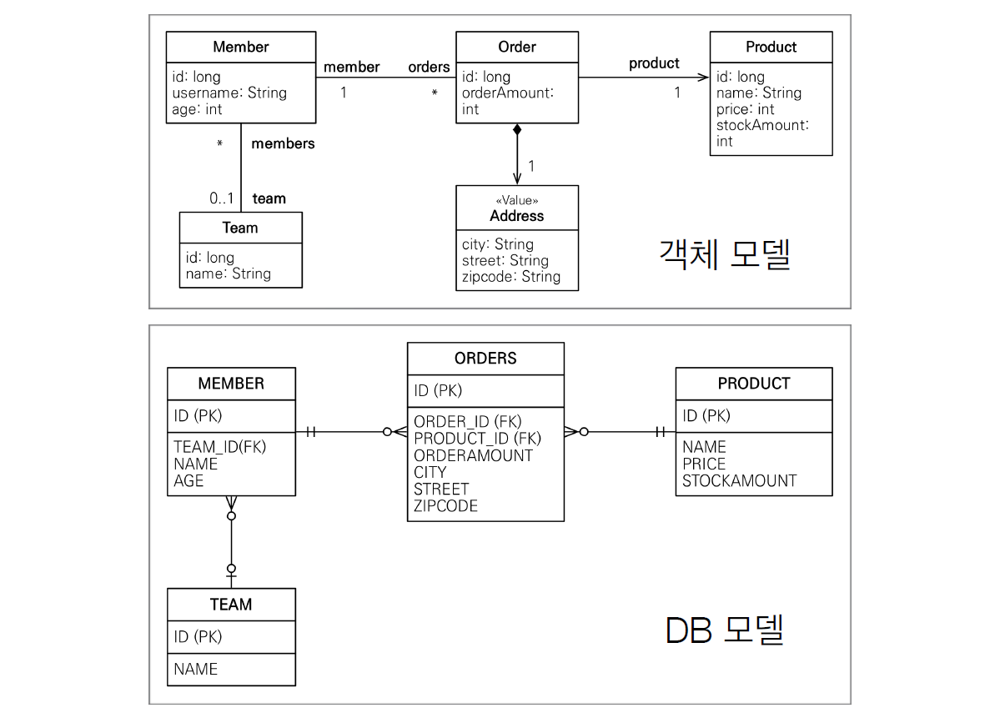

# Chapter 10. 객체지향 쿼리 언어(1) (~ 10-2. JPQL)

## 1. 객체지향 쿼리 소개

- 모든 엔티티를 메모리에 올려두고 애플리케이션에서 특정 조건으로 검색하는 것은 현실성이 없다. 결국 데이터는 데이터베이스에 있으므로 SQL 로 필요한 내용을 최대한 걸러서 조회해야 한다.
- 하지만 ORM을 사용하면 데이터베이스 테이블이 아닌 엔티티 객체를 대상으로 개발하므로, 검색도 테이블이 아닌 엔티티 객체를 대상으로 하는 방법이 필요하다.

- `SQL`: 데이터베이스 테이블을 대상으로 하는 데이터 중심의 쿼리
- `JPQL`: 엔티티 객체를 대상으로 하는 객체지향 쿼리. SQL 을 추상화해서 특정 DB 의 `SQL`에 의존하지 않는다.
    - `JPQL`을 사용하면 `JPA`는 이 `JPQL`을 분석한 다음 적절한 `SQL`을 만들어 DB 를 조회한다. 그리고 조회한 결과로 엔티티 객체를 생성해서 반환한다.

- `JPA`가 공식 지원하는 검색 방법
    - `JPQL`: Java Persistence Query Language
    - `Criteria`: 쿼리 `JPQL`을 편하게 작성하도록 도와주는 API, 빌더 클래스 모음
    - 네이티브 SQL: `JPA`에서 `JPQL` 대신 직접 `SQL`을 사용
- 다른 객체지향 검색 방법
    - `QueryDSL`: `JPQL` 을 편하게 작성하도록 도와주는 빌더 클래스 모음. 비표준 오픈소스 프레임워크
    - JDBC 직접 사용, MyBatis 등: 필요 시 JDBC 직접 사용 가능

👉 가장 중요한 건 JPQL. `Criteria`나 `QueryDSL`은 `JPQL`을 편하게 작성하도록 도와주는 빌더 클래스일 뿐

### 1-1. JPQL 소개

---

- `JPQL`(Java Persistence Query Language)은 엔티티 객체를 조회하는 객체지향 쿼리다.
- `JPQL`은 `SQL`을 추상화해서 특정 데이트베이스에 의존하지 않는다.
    - 데이터베이스 방언만 변경하면 JPQL을 수정하지 않아도 자연스럽게 데이터베이스를 변경할 수 있다.
- `JPQL`은 `SQL`보다 간결하다.
    - 엔티티 직접 조회, 묵시적 조인, 다형성 지원으로 SQL보다 코드가 간결하다.

- 회원 엔티티
    
    ```java
    @Entity(name = "Member")
    public class Member {
        @Column(name = "name")
        private String username;
        // ...
    }
    ```
    
- JPQL 사용
    
    ```java
    // 쿼리 생성
    String jpql = "select m from Member as m where m.username = 'kim'";
    List<Member> resultList =
            em.createQuery(jpql, Member.class).getResultList();
    ```
    
    - `getResultList()`메소드를 실행하면 `JPA`는 `JPQL`을 `SQL`로 변환해서 데이터베이스를 조회한다.
    - 그리고 조회한 결과로 `Member` 엔티티를 생성해서 반환한다.
- 실행된 SQL
    
    ```sql
    select
        member.id as id,
        member.age as age,
        member.team_id as team,
        member.name as name
    from
        Member mbmer
    where
        member.name = 'kim'
    ```
    

### 1-2. Criteria 쿼리 소개

---

- `Criteria`는 `JPQL`을 생성하는 빌더 클래스다.
- 장점
    - 프로그래밍 코드로 `JPQL`을 작성할 수 있다. ex> `query.select(m).where(...)`
    - 컴파일 시점에 오류를 발견할 수 있다.
        - `JPQL` 같은 문자기반 쿼리는 런타임 시점에 오류가 발생한다.
    - IDE를 사용하면 코드 자동완성을 지원한다.
    - 동적 쿼리를 작성하기 편하다.
- 단점
    - 모든 장점을 상쇄할 정도로 복잡하고 장황하다.
- 메타모델 API: 자바가 제공하는 `어노테이션 프로세서` 기능을 사용하면 어노테이션을 분석해서 클래스를 생성할 수 있다.
    - 아래의 "username" 같은 필드명도 코드로 작성하고 싶을 때 사용하면 된다.
    - JPA는 이 기능을 사용해서 엔티티 클래스로부터 Criteria 전용 클래스를 생성하는데, 이를 메타 모델이라 한다. ex> Member 엔티티 클래스로부터 Member_ 라는 `Criteria` 전용 클래스 생성
    - (전)`m.get("username")` → `m.get(Member_.username)`(후)

- Criteria 쿼리
    
    ```java
    // Criteria 사용 준비
    CriteriaBuilder cb = em.getCriteriaBuilder();
    CriteriaQuery<Member> query = cb.creatQuery(Member.class);
    
    // 루트 클래스(조회를 시작할 클래스)
    Root<Member> m = query.from(Member.class);
    
    // 쿼리 생성
    CriteriaQuery<Member> cq =
                query.select(m).where(cb.equal(m.get("username"), "kim"));
    List<Member> resultList = em.createQuery(cq).getResultList();
    ```
    

<aside>
💡 JPA 2.0 부터 Criteria를 지원한다.

</aside>

### 1-3. QueryDSL 소개

---

- `QueryDSL`도 `Criteria`처럼 `JPQL` 빌더 역할을 한다. JPA 표준은 아니고 오픈소스 프로젝트다.
- 장점
    - 코드 기반이면서 단순하고 사용하기 쉽다.
    - 작성한 코드도 `JPQL`과 비슷해서 한눈에 들어온다.
    - 스프링 데이터 프로젝트에서 지원할 정도로 기대되는 프로젝트

- QueryDSL 코드
    
    ```java
    //준비
    JPAQuery query = new JPAQuery(em);
    QMember member = QMember.member;
    
    //쿼리, 결과조회
    List<Member> members =
            query.from(member)
            .where(member.username.eq("kim"))
            .list(member);
    ```
    
- `QueryDSL`도 `어노테이션 프로세서`를 사용해서 쿼리 전용 클래스를 만들어야 한다. `QMember`는 Member 엔티티 클래스를 기반으로 생성한 `QueryDSL` 쿼리 전용 클래스.

### 1-4. 네이티브 SQL 소개

---

- 네이티브 SQL: `JPA`는 `SQL`을 직접 사용할 수 있는 기능을 지원한다.
- 표준화되어 있지 않거나 `SQL`은 지원하지만 `JPQL`이 지원하지 않는 기능을 사용할 때 `네이티브 SQL`을 사용하면 된다.
- `em.createNativeQuery()`를 사용하여 직접 작성한 `SQL`을 DB에 전달한다.
- 단점
    - 특정 데이터베이스에 의존하는 SQL 작성해야 한다는 것 → DB 변경 시 네이티브 SQL도 수정해야 한다.

- 네이티브 SQL
    
    ```java
    String sql = "SELECT ID, AGE, ITEM_ID, NAME FROM MEMBER WHERE NAME = 'kim'";
    List<Member> resultList =
        em.createNativeQuery(sql, Member.class).getResultList();
    ```
    

### 1-5. JDBC 직접 사용, 마이바티스 같은 SQL 매퍼 프레임워크 사용

---

- JDBC 커넥션에 직접 접근하고 싶으면 `JPA`는 JDBC 커넥션을 얻는 API 를 제공하지 않으므로 `JPA` 구현체가 제공하는 방법을 사용해야 한다.

- 하이버네이트 JDBC 획득
    
    ```java
    Session session = entityManager.unwrap(Session.class);
    session.doWork(new Work() {
        @Override
        public void execute(Connection connection) throws SQLExcetion {
            // work ...
        }
    });
    ```
    
- `JDBC`나 `마이바티스`를 사용은 모두 `JPA`를 우회해서 DB 에 접근한다.
- `JPA`를 우회하는 DB 접근은 `JPA`가 전혀 인식하지 못한다.
    
    → 영속성 컨텍스트와 DB 를 불일치 상태로 만들어 데이터 무결성을 훼손할 수 있다.
    

👉 JDBC 나 마이바티스를 `JPA`와 함께 사용하려면 영속성 컨텍스트를 적절한 시점에 강제로 플러시해야 한다.

<aside>
💡 스프링 프레임워크의 `AOP`를 적절히 활용해서, `JPA`를 우회하여 DB 에 접근하는 메소드를 호출할 때마다 영속성 컨텍스트를 플러시하면 깔끔하게 해결할 수 있다.

</aside>


## 2. JPQL

- 어떤 방법을 사용하든 `JPQL`(Java Persistence Query Language)에서 모든 것이 시작한다.
    - `JPQL`은 객체지향 쿼리 언어다. 테이블 대상이 아닌 엔티티 객체를 대상으로 쿼리한다.
    - `JPQL`은 `SQL`을 추상화해서 특정 데이터베이스 `SQL`에 의존하지 않는다.
    - `JPQL`은 결국 `SQL`로 변환된다.
- 샘플모델
    
    
    

### 2-1. 기본 문법과 쿼리 API

---

- `SQL`과 비슷하게 `SELECT`, `UPDATE`, `DELETE` 문을 사용할 수 있다.
    - `UPDATE`, `DELETE` 문은 벌크 연산이라고 한다.
- INSERT 문은 없다. → `EntityManager.persist()` 메소드 사용
- JPQL 문법
    
    ```java
    select_문 :: =
        select_절
        from_절
        [where_절]
        [groupby_절]
        [having_절]
        [orderby_절]
    
    update_문 :: = update_절 [where_절]
    delete_문 :: = delete_절 [where_절]
    ```
    

- SELECT 문
    
    ```java
    SELECT m FROM Member AS m where m.username = 'Hello'
    ```
    
    - 특징
        - 대소문자 구분
            - 엔티티와 속성은 대소문자를 구분한다.
            - 반면에 `SELECT`, `FROM`, `AS` 같은 `JPQL` 키워드는 대소문자를 구분하지 않는다.
        - 엔티티 이름
            - `JPQL`에서 사용한 Member 는 클래스 명이 아니라 엔티티명이다.
            - 엔티티명은 `@Entity(name="xxx")`로 지정할 수 있다.
            - 지정하지 않으면 클래스명이 기본값.
            - 기본값인 클래스명을 엔티티명으로 사용하는 것을 추천
        - 별칭은 필수
            - `JPQL`은 별칭을 필수로 사용해야 한다.
                - 잘못된 문법 ex> `SELECT username FROM Member m`
                    - `m.username`으로 바꿔줘야 한다.
            - `AS`는 생략 가능 ex> `Member m`
    
    <aside>
    💡 하이버네이트의 `JPQL` 표준 외의 `HQL`(Hibernate Query Language)에서는 별칭 없이 사용할 수 있다.
    
    </aside>
    
- TypeQeury, Query
    - 작성한 `JPQL`을 실행하려면 쿼리 객체를 만들어야 한다.
    - 쿼리 객체
        - TypeQuery: 반환 타입이 명확한 경우
            
            ```java
            **TypedQuery<Member> query =
                em.createQuery("SELECT m FROM Member m", Member.class);**
            
            List<Member> resultList = query.getResultList();
            for (Member member : resultList) {
                System.out.println("member = " + member);
            }
            ```
            
            - `em.createQuery()`의 두 번째 파라미터에 반환할 타입을 지정하면 TypeQuery 반환
        - Query: 반환 타입이 명확하지 않은 경우
            
            ```java
            **Query result = em.createQuery("select m.username, m.age from Member m");**
            List resultList = result.getResultList();
            
            for (Object object : resultList) {
                // String username = (String) object;
                Object[] objects = (Object[]) object;
            
                //System.out.println("1 = " + username);
                System.out.println("1 = " + objects[0]);
            }
            ```
            
            - SELECT 절의 조회 대상이 하나면 `Object`를 반환, 둘 이상이면 `Object[]` 반환
    
    → 타입 변환이 필요없는 `TypeQuery`를 사용하는 것이 더 편리하다.
    
- 결과 조회
    - 다음 메소드들을 호출하면 실제 쿼리를 실행해서 DB 를 조회한다.
    - `query.getResultList()`
        - 만약 결과가 없으면 빈 컬렉션 반환
    - `query.getSingleResult()`
        - 결과가 정확히 하나일 때 사용
        - 결과가 없으면 예외 발생: `NoResultException`
        - 결과가 1개보다 많으면 예외 발생: `NonUniqueResultException`

### 2-2. 파라미터 바인딩

---

- JDBC 는 위치 기준 파라미터 바인딩만 지원하지만, `JPQL`은 위치 기준 파라미터 바인딩 + 이름 기준 파라미터 바인딩도 지원한다.

- 이름 기준 파라미터
    - 파라미터를 이름으로 구분하는 방법이다. (메소드 체인 방식)
    - 파라미터 이름 앞에 `:`를 사용한다.
    
    ```java
    String usernameParam = "User1";
    
    List<Member> members =
        em.createQuery("SELECT m FROM Member m where m.username = :username", Member.class)
            .setParameter("username", usernameParam)
            .getResultList();
    ```
    
- 위치 기준 파라미터
    - `?` 다음에 위치값을 주면 된다. 위치 값은 1부터 시작한다.
    
    ```java
    List<Member> members =
            em.createQuery("SELECT m FROM Member m where m.username = ?1", Member.class)
                .setParameter(1, usernameParam)
                .getResultList();
    ```
    

→ 이름 기준 파라미터 바인딩 방식을 사용하는 것이 더 명확하다.

<aside>
💡 파라미터 바인딩 방식을 사용하지 않고 `JPQL`을 수정해서 직접 문자를 더해 만들어 넣으면 `SQL` 인젝션 공격을 당할 수 있다. ex> `"select m from Member m where m.username = '" + usernameParam + "'"` 또한 성능 이슈도 존재한다. 파라미터 바인딩 방식을 사용하면 파라미터의 값이 달라도 같은 쿼리로 인식해서 `JPA`는 `JPQL`을 `SQL`로 파싱한 결과를 재사용할 수 있다. DB 도 내부에서 실행한 `SQL`을 파싱해서 사용하는데 같은 쿼리는 파싱한 결과를 재사용할 수 있다. 결과적으로 애플리케이션과 데이터베이스 모두 해당 쿼리의 파싱 결과를 재사용할 수 있어서 전체 성능이 향상된다. 👉 파라미터 바인딩 방식은 선택이 아닌 필수다.

</aside>

### 2-3. 프로젝션

---

- 프로젝션(Projection): `SELECT` 절에 조회할 대상을 지정하는 것
- 프로젝션 대상
    - 엔티티
    - 임베디드 타입
    - 스칼라 타입(숫자, 문자 등 기본 데이터)

- 엔티티 프로젝션
    
    ```java
    SELECT m FROM Member m          // 멤버
    SELECT m.team FROM Member m     // 팀
    ```
    
    - 원하는 객체를 바로 조회 가능 → `SQL`에선 컬럼 하나하나 나열해서 조회해야 한다.
    - 조회한 엔티티는 `영속성 컨텍스트`에서 관리된다.
- 임베디드 타입 프로젝션
    - `JPQL`에서 임베디드 타입은 엔티티와 거의 비슷하게 사용된다.
    - 조회의 시작점이 될 수 없다는 제약이 있다.
    
    ```java
    // 잘못된 쿼리
    String query = "SELECT a FROM Address a";
    
    // Order 엔티티가 시작점인 올바른 쿼리
    String query = "SELECT o.address FROM Order o";
    List<Address> address = em.createQuery(query, Address.class)
                              .getResultList();
    ```
    
    <aside>
    💡 임베디드 타입은 엔티티 타입이 아닌 값 타입. 따라서 영속성 컨텍스트에서 관리되지 않는다.
    
    </aside>
    
- 스칼라 타입 프로젝션
    - 숫자, 문자, 날짜와 같은 기본 데이터 타입들을 스칼라 타입이라 한다.
        
        ```java
        // 전체 회원의 이름 조회
        List<String> usernames =
            em.createQuery("SELECT username FROM Member m", String.class)
                .getResultList();
        ```
        
    - 중복제거: `DISTINCT`
        
        ```java
        SELECT DISTINCT username FROM Member m
        ```
        
    - 통계 쿼리도 주로 스칼라 타입으로 조회한다.
        
        ```java
        Double orderAmountAvg =
          em.createQuery("SELECT AVG(o.orderAmount) FROM Order o", Double.class)
            .getSingleResult();
        ```
        
- 여러 값 조회
    - 꼭 필요한 데이터들만 선택해서 조회해야 할 때,
    - 프로젝션에 여러 값을 선택하면 `TypeQuery`를 사용할 수 없고 대신 `Query`를 사용해야 한다.
    - 조회한 엔티티는 `영속성 컨텍스트`에서 관리된다.
    
    ```java
    List<Object[]> resultList =
        em.createQuery("SELECT o.member, o.product, o.orderAmount FROM Order o")
        .getResultList();
    
    for (Object[] row : resultList) {
        Member member = (Member) row[0];        //엔티티
        Product product = (Product) row[1];     //엔티티
        int orderAmount = (Integer) row[2];     //스칼라
    }
    ```
    
- NEW 명령어
    - 실제 개발에서 `Object[]`를 직접 사용하지 않고 DTO 형태의 의미있는 객체로 변환해서 사용한다.
    - UserDTO
        - 생성자에 직접 매핑하는 방식
        
        ```java
        public class UserDTO {
            private String username;
            private int age;
        
            public UserDTO(String username, int age) {
                this.username = username;
                this.age = age;
            }
            // ...
        }
        ```
        
    - NEW 명령어 사용 후
        
        ```java
        TypeQuery<UserDTO> query =
            em.createQuery("SELECT new jpabook.jpql.UserDTO(m.username, m.age)
                            FROM Member m", UserDTO.class);
        
        List<UserDTO> resultList = query.getResultList();
        ```
        
        - NEW 명령어를 사용하면 반환받을 클래스를 지정해줄 수 있는데 이 클래스의 생성자에 `JPQL` 조회 결과를 넘겨줄 수 있다.
        - NEW 명령어를 통해 지정해준 클래스로 `TypeQuery`를 사용할 수 있어 지루한 객체 변환 작업을 줄일 수 있다.
    - NEW 명령어 주의사항
        - 패키지 명을 포함한 전체 클래스 명을 입력해야 한다.
        - 순서와 타입이 일치하는 생성자가 필요하다.

### 2-4. 페이징 API

---

- 페이징 처리용 SQL은 지루하고 반복적이다.
- 더 큰 문제는 DB 마다 페이징 처리 `SQL` 문법이 다르다.
- `JPA`는 페이징을 두 API 로 추상화
    - `setFirstResult(int startPosition)`: 조회 시작 위치(0부터 시작)
    - `setMaxResults(int maxResult)`: 조회할 데이터 수
- 페이징 사용
    
    ```java
    TypeQuery<Member> query =
        em.createQuery("SELECT m FROM Member m ORDER BY m.username DESC",
        Member.class);
    
    // 11번째부터 20건의 데이터 조회, 11~30
    query.setFirstResult(10);
    query.setMaxResult(20);
    query.getResultList();
    ```
    

<aside>
💡 데이터베이스 방언 덕분에 DB 마다 다른 페이징 처리를 같은 API로 처리할 수 있다.

</aside>

### 2-5. 집합과 정렬

---

- 집합은 집합함수와 함께 통계 정보를 구할 때 사용한다.
    
    ```java
    select
        COUNT(m),       // 회원수
        SUM(m.age),     // 나이 합
        AVG(m.age),     // 나이 평균
        MAX(m.age),     // 최대 나이
        MIN(m.age),     // 최소 나이
    from Member m
    ```
    

- 집합 함수
    - `COUNT`: 결과 수를 구한다. 반환 타입: `Long`
    - `MAX`, `MIN`: 최대, 최소 값을 구한다. 문자, 숫자, 날짜 등에 사용한다.
    - `AVG`: 평균값을 구한다. 숫자타입만 사용할 수 있다. 반환 타입: `Double`
    - `SUM`: 합을 구한다. 숫자타입만 사용할 수 있다. 반환 타입: `Long`, `Double`, `BigInteger`, `BigDecimal`
- 집합 함수 사용 시 참고사항
    - `NULL`값은 무시, 통계에 잡히지 않는다. (`DISTINCT`가 정의되어 있어도 무시된다)
    - 값이 없는데 `SUM`, `AVG`, `MAX`, `MIN` 함수를 사용하면 `NULL`값이 된다. 단, `COUNT`는 0이 된다.
    - `DISTINCT`를 집합 함수에 사용해서 중복된 값을 제거하고 나서 집합을 구할 수 있다.
        
        ```java
        select COUNT( DISTINCT m.age) from Member m
        ```
        
    - `DISTINCT`를 `COUNT`에 사용시 임베디드 타입은 지원하지 않는다.
- GROUP BY, HAVING
    - `GROUP BY`: 특정 그룹끼리 묶어준다.
    - `HAVING`: `GROUP BY`와 함께 사용, `GROUP BY`로 그룹화한 통계 데이터를 기준으로 필터링한다.
    
    ```java
    // 평균 나이가 10살 이상인 그룹을 조회
    select t.name, COUNT(m.age), SUM(m.age), AVG(m.age), MAX(m.age), MIN(m.age)
      from Member m LEFT JOIN m.team t
     GROUP BY t.name
    HAVING AVG(m.age) >= 10
    ```
    
    - 결과가 아주 많다면 통계 결과만 저장하는 테이블을 별도로 만들어두고 사용자가 적은 새벽에 통계 쿼리를 실행해서 그 결과를 보관하는 것이 좋다.
- 정렬(ORDER BY)
    - 결과 정렬 시 사용한다.
        - `ASC`: 오름차순(기본값)
        - `DESC`: 내림차순
    
    ```java
    select m from Member m order by m.age DESC, m.username ASC
    ```
    

### 2-6. JPQL 조인

---

- `SQL` 조인과 기능은 같고 문법만 약간 다르다.

- 내부 조인
    - 내부 조인은 `INNER JOIN`을 사용. `INNER`는 생략 가능
    - 내부 조인 사용 예
        
        ```java
        String teamName = "팀A";
        String query = "SELECT m FROM Member m INNER JOIN m.team t " // 회원이 가지고 있는 연관 필드로 팀과 조인
                    + "WHERE t.name = :teamName";
        
        List<Member> members = em.createQuery(query, Member.class)
                .setParameter("teamName", teamName)
                .getResultList();
        ```
        
    - `JPQL` 조인 특징: 연관 필드를 사용한다.
        - 오류 예시
            
            ```java
            FROM Member m JOIN Team t   // 오류!
            ```
            
        - ex> `m.team`이 연관필드
        - 다른 엔티티와 연관관계를 가지기 위해 사용하는 필드
- 외부 조인
    
    ```java
    SELECT m
      FROM Member m LEFT [OUTER] JOIN m.team t
    ```
    
    - `OUTER`는 생략 가능. 보통 `LEFT JOIN`으로 사용한다.
- 컬렉션 조인
    - 일대다 관계, 다대다 관계처럼 컬렉션을 사용하는 곳에 조인하는 것.
        - [회원 ->팀] 으로의 조인은 다대일 조인, 단일 값 연관 필드(m.team) 사용.
        - [팀 -> 회원] 은 반대로 일대다 조인, 컬렉션 값 연관 필드(t.members) 사용.
    
    ```java
    SELECT t, m FROM Team t LEFT JOIN t.members m
    ```
    
- 세타 조인
    - `WHERE`절을 사용해서 세타 조인을 할 수 있다.
    - 세타 조인은 내부 조인만 지원한다.
    - 전혀 관계없는 엔티티도 조회할 수 있다.
    - 전혀 관계없는 Member.username과 Team.name을 조인
        
        ```java
        //JPQL
        select count(m) from Member m, Team t
        where m.username = t.name
        
        //SQL
        SELECT COUNT(M.ID)
        FROM
            MEMBER M CROSS JOIN TEAM T
        WHERE
            M.USERNAME = T.NAME
        ```
        
- JOIN ON 절 (JPA2.1)
    - JPA 2.1부터 조인할 때 ON 절을 지원. 조인 대상을 필터링하고 조인할 수 있다.
    - 내부 조인의 ON 절은 `WHERE`절과 결과가 같음.
    - 따라서 보통 `ON`절은 외부 조인에 사용.
    
    ```java
    //JPQL
    select m, t from Member m
    left join m.team t on t.name = 'A'
    
    //SQL
    SELECT m.*, t.*
    FROM Member m
    LEFT JOIN Team t ON m.team_id = t.id and t.name = 'A'
    ```
    

### 2-7. 페치 조인

---

- SQL 에서 이야기하는 조인의 종류는 아니고, `JPQL`에서 성능 최적화를 위해 제공하는 기능이다.
- 연관된 엔티티나 컬렉션을 한 번에 같이 조회하는 기능, `join fetch` 명령어로 사용할 수 있다.

```java
페치 조인 ::= [ LEFT [OUTER] | INNER ] JOIN FETCH 조인경로
```

- 엔티티 페치 조인
    - 회원 엔티티를 조회하면서 연관된 팀 엔티티도 함께 조회하는 JPQL
        
        ```java
        select m
        from Member m join fetch m.team
        ```
        
    - 일반적인 JPQL 조인과 다르게 페치 조인은 별칭을 사용할 수 없다.
        
        <aside>
        💡 하이버네이트는 페치 조인에도 별칭을 허용한다.
        
        </aside>
        
    - 실행된 SQL
        
        ```sql
        SELECT
            M.*, T.*
        FROM MEMBER T
        INNER JOIN TEAM T ON M.TEAM_ID = T.ID
        ```
        
    - 페치 조인 사용
        
        ```java
        String jpql = "select m from Member m join fetch m.team";
        List<Member> members = em.createQuery(jpql, Member.class).getResultList();
        
        for (Member member : members) {
          //페치조인으로 회원과 팀을 함께 조회 -> 지연로딩 발생 안 함
          System.out.println("username = " + memrber.getUserName() + ", " +
          "teamname = " + member.getTeam().name());
          ...
          // 출력결과
          username = 회원 1, teamname = 팀A
          username = 회원 2, teamname = 팀A
          username = 회원 3, teamname = 팀B
        }
        ```
        
    - 회원과 팀을 지연 로딩 설정시,
        - 회원 조회 시 페치 조인으로 팀을 함께 조회 → 연관된 팀 엔티티는 프록시가 아닌 실제 엔티티
        - 지연 로딩이 일어나지 않는다.
        - 실제 엔티티이므로 회원 엔티티가 영속성 컨텍스트에서 분리되어 준영속 상태가 되어도 팀 조회 가능
- 컬렉션 페치 조인
    - 일대다 관계인 컬렉션 페치 조인 JPQL
        
        ```java
        select t
        from Team t join fetch t.members
        where t.name = '팀A'
        ```
        
    - 실행된 SQL
        
        ```sql
        SELECT
            T.*, M.*
        FROM TEAM T
        INNER JOIN MEMBER M ON T.ID = M.TEAM_ID
        WHERE T.NAME = '팀A'
        ```
        
    - 컬렉션 페치 조인 시도, 결과 테이블
        - TEAM: (1, "팀A"), (2, "팀B"), (3, "팀C")
        - MEMBER: (1, 1, "회원1"), (2, 1, "회원2"), (3, 2, "회원3"), (4, null, "회원4")
        
        → 결과: (1, "팀A", 1, 1, "회원1"), (1, "팀A", 2, 1, "회원2")
        
    - 팀을 조회하면서 페치 조인으로 연관된 회원 컬렉션(t.members)도 함께 조회한다 → 지연 로딩 발생 x
    - `select t`로 팀만 선택했는데, 실행된 SQL 을 보면 T.*, M.* 로 팀과 연관된 회원도 함께 조회한 것을 확인할 수 있다.
    - 그리고 `팀 A`는 하나지만 `MEMBER` 테이블과 조인하면서 결과가 증가해서 같은 `팀 A`가 2건 조회되었다.
    - 컬렉션 페치 조인 사용
        
        ```java
        String jpql = "select t from Team t join fetch t.members where t.name = `팀A`";
        List<Team> teams = em.createQuery(jpql, Team.class).getResultList();
        
        for(Team team: teams){
            System.out.println("teamname = " + team.getName() + ", team = " + team);
        
            for(Member member : team.getMembers()){
                System.out.println("->username = " + member.getUsername() + ", member = " + member);
            }
        }
        
        //출력결과
        teamname = 팀A, team = Team@0x100
        ->username = 회원1, member = Member@0X200
        ->username = 회원2, member = Member@0X300
        teamname = 팀A, team = Team@0x100
        ->username = 회원1, member = Member@0X200
        ->username = 회원2, member = Member@0X300
        ```
        
        → 위와 같이 `팀A` 2건이 존재해서, 하나의 `팀A` 에 `회원1`, `회원2`가 각각 포함되어 있는 현상 발생
        
    
    <aside>
    💡 일대다 조인은 결과가 증가할 수 있지만 일대일, 다대일 조인은 결과가 증가하지 않는다.
    
    </aside>
    
- 페치 조인과 DISTINCT
    - 중복된 결과를 제거하기 위해 SQL 에서는 `DISTINCT` 명령어를 사용한다.
    - JPQL 의 `DISTINCT` 명령어는 SQL 에 `DISTINCT`를 추가하는 것은 물론이고, 애플리케이션에서 한 번 더 중복을 제거한다.
        
        ```java
        select **distinct** t
        from Team t join fetch t.members
        where t.name = '팀A'
        
        //출력결과
        teamname = 팀A, team = Team@0x100
        ->username = 회원1, member = Member@0X200
        ->username = 회원2, member = Member@0X300
        ```
        
    - 하지만 SQL 단에서 조회한 각 로우의 데이터가 다르므로 SQL 의 DISTINCT 는 효과가 없다.
        - 애플리케이션에서 `distinct` 명령어를 보고 중복된 데이터를 걸러낸다.
- 페치 조인과 일반 조인의 차이
    - 내부 조인 JPQL
        
        ```java
        select table
        from Team t join t.members m
        where t.name = '팀A'
        ```
        
    - 실행된 SQL
        
        ```sql
        SELECT T.*
        FROM TEAM T
        INNER JOIN MEMBER M ON T.ID = M.TEAM_ID
        WHERE T.NAME = '팀A'
        ```
        
    - JPQL 은 결과 반환 시 연관관계까지 고려하지 않는다. 단지 SELECT 절에 지정한 엔티티만 조회할 뿐
- 페치 조인의 특징과 한계
    - 특징
        1. 페치 조인을 사용하면 SQL 한 번으로 연관된 엔티티들을 함께 조회할 수 있어서 SQL 호출 횟수를 줄여 성능을 최적화할 수 있다.
        2. 글로벌 로딩 전략보다 우선한다.
            - 예를 들어 글로벌 로딩 전략을 지연 로딩으로 설정해도 JPQL에서 페치 조인을 사용하면 페치 조인을 적용해서 함께 조회한다.
            - ex) `@OneToMany(fetch = FetchType.LAZY)` // 글로벌 로딩 전략
            - 따라서 글로벌 전략은 될 수 있으면 지연 로딩을 사용하고, 최적화가 필요하면 페치 조인을 적용하는 것이 효과적이다.
        3. 연관된 엔티티를 쿼리 시점에 조회하므로 준영속 상태에서도 객체 그래프를 탐색할 수 있다.
    - 한계
        
        1. 별칭을 줄 수 없다.
        
        - 따라서 `SELECT`, `WHERE 절`, `서브 쿼리`에 페치 조인 대상을 사용할 수 없다.
        
        2. 둘 이상의 컬렉션을 페치할 수 없다.
        
        3. 컬렉션 페치 조인 시 페이징 API 를 사용할 수 없다.
        
        - 컬렉션(일대다)이 아닌 단일 값 연관 필드(일대일, 다대일)들은 페치 조인을 사용해도 페이징 API 사용 가능
        - 하이버네이트에서 컬렉션 페치 조인하고 페이징 API 를 사용하면 경고 로그 남기며 메모리에서 페이징 처리 → 데이터가 많으면 성능 이슈, 메모리 초과 예외 발생 가능해서 위험

### 2-8. 경로 표현식

---

- 경로 표현식이란 .(점) 을 찍어 객체 그래프를 탐색하는 것
    
    ```java
    select m.username
    from Member m
        join m.team t
        join m.orders o
    where t.name = '팀A'
    ```
    
    - 여기서 `m.username`, `m.team`, `m.orders`, `t.name` 모두 경로 표현식을 사용한다.
- 상태 필드, 연관 필드 설명 예제 코드
    
    ```java
    @Entity
    public class Member {
    
        @Id
        @GeneratedValue
        private Long id;
    
        @Column(name = "name")
        private String username; // 상태 필드
        private Integer age; // 상태 필드
    
        @ManyToOne
        private Team team; // 연관 필드(단일 값 연관 필드)
    
        @OneToMany(mappedBy = "member")
        private List<Order> orders = new ArrayList<Order>(); // 연관 필드(컬렉션 값 연관 필드)
    }
    ```
    
- 경로 표현식의 용어 정리
    - 상태 필드: 단순히 값을 저장하기 위한 필드(필드 or 프로퍼티) ex> t.username, t.age
    - 연관 필드: 연관관계를 위한 필드, 임베디드 타입 포함(필드 or 프로퍼티)
        - 단일 값 연관 필드: `@ManyToOne`, `@OneToOne`, 대상이 엔티티 ex> member.team
        - 컬렉션 값 연관 필드: `@OneToMany`, `@ManyToMany`, 대상이 컬렉션 ex> member.orders
- 경로 표현식과 특징
    - 상태 필드 경로: 경로 탐색의 끝이다. 더는 탐색할 수 없다.
    - 단일 값 연관 경로: 묵시적으로 내부 조인 발생. 단일 값 연관 경로는 계속 탐색 가능
    - 컬렉션 값 연관 경로: 묵시적으로 내부 조인 발생. 더 이상 탐색이 불가능하다.
        - 단, `FROM` 절에서 조인을 통해 별칭을 얻으면 별칭으로 탐색 가능
    
    <aside>
    💡 명시적 조인: `JOIN`을 직접 적어주는 것
    묵시적 조인: 경로 표현식에 의해 묵시적으로 조인이 발생. 내부 조인만 할 수 있다.
    
    </aside>
    

- JPQL - 조인 몇번 발생?
    
    ```java
    select o.member.team
    from Order o
    where o.product.name = 'productA' and o.address.city = 'SEOUL'
    ```
    
    - 총 3번의 조인이 발생한다.
    - `o.address`처럼 임베디드 타입에 접근하는 것도 단일 값 연관 경로 탐색이지만, 주문 테이블에 이미 포함되어 있으므로 조인이 발생하지 않는다.
    - 실행된 SQL
        
        ```sql
        select t.*
        from Order o
        inner join Member m on o.member_id=m.id
        inner join Team t on m.team_id=t.id
        inner join Product p on o.product_id=p.id
        where p.name='productA' and o.city='SEOUL'
        ```
        
- 많이 하는 실수 - 컬렉션 값에서 경로 탐색 시도
    
    ```java
    select t.members from Team t            //성공
    select t.members.username from Team t   //실패
    ```
    
    - 컬렉션에서 경로 탐색을 하려면
        
        ```java
        select m.username from Team t join t.members m
        ```
        
        - 조인을 사용해서 새로운 별칭을 획득해야 한다.
    - 컬렉션은 컬렉션의 크기를 구할 수 있는 `SIZE`라는 특별한 기능 사용 가능
        
        ```java
        select t.members.size from Team t
        ```
        
        - COUNT 함수를 사용하는 SQL 로 적절히 변환된다.
- 경로 탐색을 사용한 묵시적 조인 시 주의사항
    - 항상 내부 조인이다.
    - 컬렉션은 경로 탐색의 끝이다.
        - 컬렉션에서 경로 탐색을 하려면 명시적으로 조인해서 별칭을 얻어야 한다.
    - 경로 탐색은 주로 `SELECT`, `WHERE`절에서 사용하지만
        - 묵시적 조인으로 인해 SQL 의 FROM 절에 영향을 준다.

👉

- 조인은 성능상 큰 영향을 미친다. 묵시적 조인은 조인이 일어나는 상황을 한눈에 파악하기 어렵다.
    - 경로 탐색을 사용하면 묵시적 조인 발생 → SQL 에서 내부 조인 발생

→ 따라서 성능이 중요하면 분석하기 쉽도록 묵시적 조인보다는 명시적 조인을 사용하자.

### 2-9. 서브 쿼리

---

- `WHERE`, `HAVING` 절에서만 사용할 수 있고, `SELECT`, `FROM` 절에서는 사용할 수 없다.
    
    <aside>
    💡 하이버네이트의 HQL 은 SELECT 절의 서브 쿼리도 허용한다. 일부 JPA 구현체는 FROM 절의 서브 쿼리도 지원한다.
    
    </aside>
    

- ex1> 나이가 평균보다 많은 회원
    
    ```java
    select m from Member m
    where m.age > (select avg(m2.age) from Member m2)
    ```
    
- ex2> 한 건이라도 주문한 고객
    
    ```java
    select m from Member m
    where (select count(o) from Order o where m = o.member) > 0
    ```
    
    - 위의 where 절은 `m.orders.size > 0` 을 사용해도 같은 결과가 나온다.

- 서브 쿼리 함수
    - [NOT] `EXISTS` (subquery)
        - 서브쿼리에 결과가 존재하면 참이다. NOT은 반대
        - ex> 팀 A 소속인 회원
            
            ```java
            select m from Member m
            where exists (select t from m.team t where t.name = '팀A')
            ```
            
    - {`ALL` | `ANY` | `SOME`} (subquery)
        - 비교 연산자와 같이 사용한다.
            - ALL: 조건을 모두 만족해야 참
            - ANY 혹은 SOME: 조건을 하나라도 만족하면 참
        - ex> 전체 상품 각각의 재고보다 주문량이 많은 주문들
            
            ```java
            select o from Order o
            where o.orderAmount > ALL (select p.stockAmount from Product p)
            ```
            
        - ex> 어떤 팀이든 소속된 회원
            
            ```java
            select m from Member m
            where m.team = ANY (select t from Team t)
            ```
            
    - [NOT] `IN` (subquery)
        - 서브쿼리의 결과 중 하나라도 같은 것이 있으면 참. `IN`은 서브쿼리가 아닌 곳에서도 사용한다.
        - ex> 20세 이상 회원을 보유한 팀
            
            ```java
            select t from Team t
            where t IN (select t2 from Team t2 JOIN t2.members m where m.age >= 20) )
            ```
            

### 2-10. 조건식

---

- 타입 표현
    
    
    
- 연산자 우선 순위
    1. 경로 탐색 연산 (`.`)
    2. 수학 연산: `+`, `-`(단항 연산자), `*`, `/`, `+`, `-`
    3. 비교 연산: `=`, `>`, `≥`, `<`, `≤`, `<>`, [NOT] {`BETWEEN` | `LIKE` | `IN`}, `IS` [NOT] {`NULL` | `EMPTY`}, [NOT] `MEMBER` [OF], [NOT] `EXISTS`
    4. 논리 연산: `NOT`, `AND`, `OR`
- 논리 연산과 비교식
    - 논리 연산
        - `AND`: 둘 다 만족하면 참
        - `OR`: 둘 중 하나만 만족해도 참
        - `NOT`: 조건식의 결과 반대
    - 비교식
        - `=`, `>`, `≥`, `<`, `≤`, `<>`
- `Between`, `IN`, `Like`, `NULL` 비교
    - BETWEEN
        - X 는 A~B 사이의 값이면 참 (A, B 값 포함)
        
        ```java
        select m from Member m
        where m.age between 10 and 20
        ```
        
    - IN
        - 하나라도 있으면 참이다.
        
        ```java
        select m from Member m
        where m.username in ('회원1', '회원2')
        ```
        
    - LIKE
        - `%`: 아무 값들이 입력되어도 된다. (값이 없어도 됨)
        - `_`: 한 글자는 아무 값이 입력되어도 되지만 값이 있어야 한다.
        
        ```java
        // 중간에 '원'이 들어간 회원
        select m from Member m
         where m.username like '%원%'
         where m.username like '회원%'
         where m.username like '%회원'
        
        //회원A, 회원1
         where m.username like '회원_'
        
        //회원3
         where m.username like '__3'
        
        //회원%
         where m.username like '회원\%' ESCAPE '\'
        ```
        
    - NULL
        - `NULL`인지 비교한다. `NULL`은 꼭 `IS NULL`을 사용해야 한다.
        
        ```java
        where m.username is null
        where null = null       //거짓
        where 1 = 1             //참
        ```
        
- 컬렉션식
    - 컬렉션에서만 사용하는 특별한 기능. 컬렉션은 컬렉션 식 이외에 다른 식은 사용할 수 없다.
    - 빈 컬렉션 비교 식: IS [NOT] EMPTY
        - 컬렉션에 값이 비었으면 참
        
        ```java
        //JPQL : 주문이 하나라도 있는 회원 조회
        select m from Member m
         where m.orders is not empty
        //실행된 SQL
        select m.* from Member m
         where exists (
            select o.id from Orders o where m.id=o.member_id
         )
        
        // 오류: 컬렉션 식이 아닌 것은 사용할 수 없다.
        select m from Member m
         where m.orders is null
        ```
        
    - 컬렉션의 멤버 식: [NOT] MEMBER [OF]
        - 엔티티나 값이 컬렉션에 포함되어 있으면 참
        
        ```java
        select t from Team t
         where :memberParam member of t.members
        ```
        
- 스칼라식
    - 숫자, 문자, 날짜, case, 엔티티 타입같은 기본적인 타입들
    - 수학 식
        - `+`, `-`: 단항 연산자
        - `*`, `/`, `+`, `-`: 사칙연산
    - 문자함수
        
        
        
    - 수학함수
        
        
        
    - 날짜함수
        - `CURRENT_DATE`: 현재 날짜
        - `CURRENT_TIME`: 현재 시간
        - `CURRENT_TIMESTAMP`: 현재 날짜 시간
        - 하이버네이트는 날짜 타입에서 년, 월, 일, 시간, 분, 초 값을 구하는 기능을 지원
            - `YEAR`, `MONTH`, `DAY`, `HOUR`, `MINUTE`, `SECOND`
- CASE 식
    - 특정 조건에 따라 분기할 때 CASE 식 사용
    - 기본 CASE
        
        ```java
        select
          case when m.age <= 10 then '학생요금'
               when m.age >= 60 then '경로요금'
               else '일반 요금'
           end
          from Member m
        ```
        
    - 심플 CASE
        
        ```java
        select
          case t.name
               when '팀A'then '인센티브110%'
               when '팀B'then '인센티브120%'
               else '인센티브105%'
           end
          from Team t
        ```
        
    - COALESCE
        - 스칼라식을 차례대로 조회해서 `null`이 아니면 반환한다.
        
        ```java
        select coalesce(m.username, '이름 없는 회원') from Member m
        ```
        
    - NULLIF
        - 두 값이 같으면 `null`, 다르면 첫 번째 값 반환.
        - 집합 함수는 `null`을 포함하지 않으므로 집합 함수와 함께 사용된다.
        
        ```java
        select NULLIF(m.username, '관리자') from Member m
        ```
        

### 2-11. 다형성 쿼리

---

- JPQL 로 부모 엔티티 조회 시 자식 엔티티도 함께 조회한다.
- TYPE
    - 엔티티의 상속 구조에서 조회 대상을 자식 타입으로 한정할 때 주로 사용
    - ex> Item 중에 Book, Movie 를 조회
        
        ```java
        // JPQL
        select i from Item i
        where type(i) IN (Book ,Movie)
        
        // SQL
        SELECT i FROM Item i
        WHERE i.DTYPE in ('B', 'M')
        ```
        
- TREAT(JPA2.1)
    - 자바의 타입 캐스팅과 비슷. 상속 구조에서 부모 타입을 특정 자식 타입으로 다룰 때 사용
    - JPA 표준은 `FROM`, `WHERE` 절에서 사용 가능. 하이버네이트는 `SELECT` 절에서도 사용 가능
    
    ```java
    // JPQL
    select i from Item i where treat(i as Book).author = 'kim'
    
    // SQL
    select i.* from Item i
     where i.DTYPE='B'
       and i.author='kim'
    ```
    

### 2-12. 사용자 정의 함수 호출(JPA 2.1)

---

- JPA 2.1 부터 사용자 정의 함수를 지원한다.
    
    ```java
    function_invocation::= FUNCTION(function_name {, function_arg}*)
    ```
    

- ex> 하이버네이트 구현체를 사용하면 방언 클래스를 상속해서 구현하고 사용할 DB 함수를 미리 등록해야 한다.
    
    ```java
    public class MyH2Dialect extends H2Dialect {
        public MyH2Dialect() {
            registerFunction("group_concat", new StandardSQLFunction
                    ("group_concat", StandardBasicTypes.STRING));
        }
    }
    ```
    
- 그리고 `hibernate.dialect` 에 해당 방언을 등록해야 한다.
    
    ```xml
    <property name="hibernate.dialect" value="hello.MyH2Dialect">
    ```
    
- 그 후 하이버네이트 구현체를 사용하면 DB 함수로 축약해서 쓸 수 있다.
    
    ```java
    select group_concat(i.name) from Item i
    ```
    

### 2-13. 기타 정리

---

- enum은 `==` 비교 연산만 지원
- 임베디드 타입은 비교를 지원하지 않는다.
- EMPTY STRING
    - JPA 표준은 `''`을 길이 0인 `Empty String`으로 정했지만, DB 에 따라 `''`를 `NULL`로 사용하는 것도 있다.
- `NULL` 정의
    - 조건을 만족하는 데이터가 하나도 없으면 `NULL`이다.
    - `NULL`은 알 수 없는(unknown) 값이다. `NULL`과의 모든 수학적 계산 결과는 `NULL`이 된다.
    - `NULL == NULL`은 알 수 없는 값이다.
    - `NULL is Null`은 참이다.

### 2-14. 엔티티 직접 사용

---

- 기본 키 값
    - 객체 인스턴스는 참조 값으로 식별하고 테이블 로우는 기본 키 값으로 식별한다.
    - JPQL 에서 엔티티 객체를 직접 사용하면 SQL 에서는 해당 엔티티의 기본 키값을 사용한다.
    
    👉 엔티티를 직접 사용하던, 식별자 값을 직접 사용하던 결과가 같다.
    
    - 엔티티를 파라미터로 직접 받는 코드
        
        ```java
        String jpql = "select m from Member m where m = :member"; //m.id = :memberId 로 해도 결과가 같음
        List resultList = em.createQuery(jpql)
            .setParameter("member", member)
            .getResultList();
        ```
        
        - 실행된 SQL
            
            ```java
            select m.* from Member m where m.id=?
            ```
            
- 외래 키 값
    - 외래 키를 직접 사용하던, 엔티티를 직접 사용하던 생성되는 SQL 은 같다.
    - 외래 키 대신 엔티티를 사용하는 코드
        
        ```java
        Team team = em.find(Team.class, 1L);
        
        String jpql = "select m from Member m where m.team = :team"; //m.team.id = :teamId 도 결과는 같다.
        List resultList = em.createQuery(jpql)
            .setParameter("team", team)
            .getResultList();
        ```
        
        - 실행된 SQL
            
            ```java
            select m.* from Member m where m.team_id=? //팀 파라미터의 ID값
            ```
            
    
    <aside>
    💡 m.team.id 를 조회할 때 Member 와 Team 간에 묵시적 조인 X → MEMBER 테이블이 이미 외래 키(team_id)를 가지고 있기 때문. m.team.name 호출하면 묵시적 조인이 발생한다.
    
    </aside>
    

### 2-15. Named 쿼리: 정적 쿼리

---

- Named 쿼리는 어플리케이션 로딩 시점에 JPQL 문법을 체크하고 미리 파싱해둔다.
- 오류를 빨리 확인할 수 있고, 사용하는 시점에는 파싱된 결과를 재사용하므로 성능상 이점이 있다.
- 변하지 않는 정적 SQL 이 생성되므로 DB 조회 성능 최적화에도 도움이 된다.
- `@NamedQuery` 어노테이션으로 자바 코드에 작성하거나 XML 에 작성 가능하다.

- Named 쿼리를 어노테이션에 정의
    
    ```java
    // 정의
    @Entity
    @NamedQuery(
      name = "Member.findByUsername",
      query = "select m from Member m where m.username = :username")
    public class Member {
        ...
    }
    
    // 사용
    List<Member> resultList = em.createNamedQuery("Member.findByUsername", Member.class)
      .setParameter("username", "회원1")
      .getResultList();
    ```
    
- 하나의 엔티티에 2개 이상의 Named 쿼리 정의
    - `@NamedQueries` 어노테이션 사용
    
    ```java
    @Entity
    @NamedQueries({
        @NamedQuery(
            name = "Member.findByUsername",
            query = "select m from Member m where m.username = :username"),
        @NamedQuery(
            name = "Member.count"
            query = "select count(m) from Member m")
    })
    public class Member { ... }
    ```
    
    - `lockMode`: 쿼리 실행 시 락을 건다.
    - `hints`: SQL 힌트가 아니라 JPA 구현체에게 제공하는 힌트 ex> 2차 캐시를 다룰 때 사용

- 참고
    - [https://github.com/namjunemy/TIL/blob/master/Jpa/inflearn/11_jpql.md](https://github.com/namjunemy/TIL/blob/master/Jpa/inflearn/11_jpql.md)
    - [https://www.nowwatersblog.com/jpa/ch10/10-2](https://www.nowwatersblog.com/jpa/ch10/10-2)
