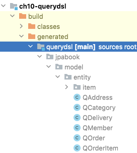

# Chapter 10. 객체지향 쿼리 언어(2) (10-3. Criteria ~)

## 3. Criteria

- Criteria 쿼리는 JPQL을 자바 코드로 작성하도록 도와주는 빌더 클래스 API다.
- 장점은 코드로 JPQL을 작성하므로 컴파일 시점에 문법 오류를 확인할 수 있다.
- 단점은 코드가 복잡하고 장황해서 직관적으로 이해가 힘들다.

### 3-1. Criteria 기초

---

```java
// JPQL: select m from Member m

// Criteria 쿼리 생성에 필요한 Criteria 빌더
// - EntityManager, EntityManagerFactory에서 get 가능
CriteriaBuilder cb = em.getCriteriaBuilder();

// Criteria 생성, 반환 타입 지정
CriteriaQuery<Member> cq = cb.createQuery(Member.class);

// FROM절 생성(반환된 값은 Criteria에서 사용하는 특별한 별칭)
Root<Member> m = cq.from(Member.class);

// SELECT절 생성
cq.select(m);

// 생성한 Criteria 쿼리 이용해서 조회
TypedQuery<Member> query = em.createQuery(cq);
List<Member> members = query.getResultList();
```

- 검색 조건(where)과 정렬(order by) 추가 예제
    - Criteria는 검색 조건부터 정렬까지 `CriteriaBuilder`를 사용해서 코드를 완성한다.
    
    ```java
    /**
     * JPQL
     * select m from Member m
     *  where m.username = '회원1'
     *  order by m.age desc
     */
    CriteriaBuilder cb = em.getCriteriaBuilder();
    CriteriaQuery<Member> cq = cb.createQuery(Member.class);
    
    Root<Member> m = cq.from(Member.class);    // FROM 절 생성
    
    // 검색 조건 정의
    Predicate usernameEqual = cb.equal(m.get("username"), "회원1");
    
    // 정렬 조건 정의
    Order ageDesc = cb.desc(m.get("age"));
    
    // 쿼리 생성
    cq.select(m)
        .where(usernameEqual)   // WHERE 절 생성
        .orderBy(ageDesc);      // ORDER BY 절 생성
    
    List<Member> members = em.createQuery(cq).getResultList();
    ```
    

- 10살을 초과하는 회원을 조회하고 나이를 역순으로 정렬하는 예제
    
    ```java
    /**
     * JPQL
     * select m from Member m
     * where m.age > 10 order by m.age desc
     */
    CriteriaBuilder cb = em.getCriteriaBuilder();
    CriteriaQuery<Member> cq = cb.createQuery(Member.class);
    
    Root<Member> m = cq.from(Member.class);
    
    Predicate p = cb.greaterThan(m.get("age"), 10);
    
    cq.select(m)
        .where(p)
        .orderBy(cb.desc(m.get("age")));
    
    List<Member> members = em.createQuery(cq).getResultList();
    ```
    

- Query root (=JPQL 의 별칭)
    - `Root<Member> m = cq.from(Member.class);` 여기서 m이 쿼리 루트다.
    - 쿼리 루트는 조회의 시작점이다.
    - Criteria 에서 사용되는 특별한 별칭, JPQL 의 별칭이라 생각하면 된다.
    - 별칭은 엔티티에만 부여할 수 있다.

- 경로 표현식
    - Criteria는 코드로 JPQL을 완성하는 도구이므로 경로 표현식도 지원한다.
    - `m.get("username")`은 JPQL의 `m.username`과 같다.
    - `m.get("team").get("name")`은 JPQL의 `m.team.name`과 같다.

### 3-2. Criteria 쿼리 생성

---

- Criteria를 사용하려면 `CriteriaBuilder.createQuery()`로 `CriteriaQuery`를 생성하면 된다.
- Criteria 쿼리를 생성할 때 반환 타입을 지정하면 `em.createQuery(cq)`에서 반환 타입을 지정하지 않아도 된다.
- 반환 타입을 지정할 수 없거나 반환 타입이 둘 이상이면 타입을 지정하지 않고 `Object`로 반환 받으면 된다.
- CriteriaBuilder
    
    ```java
    public interface CriteriaBuilder {
        // 조회값 반환 타입: Object
        CriteriaQuery<Object> createQuery();
        
        // 조회값 반환 타입: 엔티티, 임베디드 타입, 기타
        <T> CriteriaQuery<T> createQuery(Class<T> resultClass);
    
        // 조회값 반환 타입: Tuple
        CriteriaQuery<Tuple> createTupleQuery();
    }
    ```
    

### 3-3. 조회

---

- 조회 대상을 하나만 지정하려면 `select()`를, 여러 건을 지정하려면 `multiselect()`를 사용하면 된다.
- CriteriaQuery
    
    ```java
    public interface CriteriaQuery<T> extends AbstractQuery<T> {
        // 한 건 지정
        CriteriaQuery<T> select(Selection<? extends T> selection);
       
        // 여러 건 지정
        CriteriaQuery<T> multiselect(Selection<?>... selections);
    
        // 여러 건 지정
        CriteriaQuery<T> multiselect(List<Selection<?>> selectionList);
    }
    ```
    

- 조회 대상을 한 건, 여러 건 지정
    
    ```java
    CriteriaBuilder cb = new CriteriaBuilder();
    
    // JPQL: select m
    cq.select(m);
    
    // JPQL: select m.username, m.age
    cq.multiselect(m.get("username"), m.get("age"));
    
    // JPQL: select m.username, m.age
    // 여러 건 지정은 cb.array를 사용해도 된다.
    cq.select(cb.array(m.get("username"), m.get("age")));
    ```
    
- DISTINCT
    - distinct는 select, multiselect 다음에 `distinct(true)`를 사용하면 된다.
    
    ```java
    // JPQL : select distinct m.username, m.age from Member m
    
    CriteriaQuery<Object[]> cq = cb.createQuery(Object[].class);
    Root<Member> m = cq.from(Member.class);
    cq.multiselect(m.get("username"), m.get("age")).distinct(true);
    
    TypedQuery<Object[]> query = em.createQuery(cq);
    List<Object[]> resultList = query.getResultList();
    ```
    
- NEW, construct()
    - JPQL에서 `select new 생성자()` 구문을 Criteria 에서는 `cb.construct(클래스 타입, ...)` 로 사용한다.
    
    ```java
    /**
     * JPQL
     * select new jpabook.domain.MemberDTO(m.username, m.age)
     * from Member m
     */
    CriteriaBuilder cb = em.getCriteriaBuilder();
    CriteriaQuery<MemberDTO> cq = cb.createQuery(MemberDTO.class);
    Root<Member> m = cq.from(Member.class);
    
    cq.select(cb.construct(MemberDTO.class, m.get("username"), m.get("age")));
    
    TypedQuery<MemberDTO> query = em.createQuery(cq);
    List<MemberDTO> members = query.getResultList();
    ```
    
- 튜플
    - Criteria는 `Map`과 비슷한 튜플이라는 특별한 반환 객체를 제공한다.
    
    ```java
    CriteriaBuilder cb = em.getCriteriaBuilder();
    CriteriaQuery<Tuple> cq = cb.createTupleQuery();
    Root<Member> m = cq.from(Member.class);
    
    // cq.select(cb.tuple(...)) 은 동일한 기능을 수행한다.
    cq.multiselect(
        m.get("username").alias("username"),    // Tuple에서 사용할 튜플 별칭(필수)
        m.get("age").alias("age"),
        m.alias("m")
    );
    
    TypedQuery<Tuple> query = em.createQuery(cq);
    List<Tuple> tuples = query.getResultList();
    for (Tuple tuple : tuples) {
        // 튜플 별칭으로 조회
        String username = tuple.get("username", String.class);
        Integer age = tuple.get("age", Integer.class); // 속성
        Member member = tuple.get("m", Member.class);  // 엔티티
    }
    ```
    
    - 여러 행을 조회할 때 `Object[]`로 받던 것을 튜플로 받도록 할 수 있고, 이름 기반이므로 `Object` array 보다 안전하다.
    - `tuple.getElements()` 같은 메소드를 사용해서 현재 튜플의 별칭과 자바 타입도 조회할 수 있다.
    - 튜플은 속성 뿐만 아니라, 엔티티도 조회할 수 있다.

### 3-4. 집합

---

- GROUP BY
    - 팀 이름별로 나이가 가장 많은 사람과 가장 적은 사람을 구하기
    
    ```java
    /**
     * JPQL
     * select m.team.name, max(m.age), min(m.age)
     * from Member m
     * group by m.team.name
     */
    CriteriaBuilder cb = em.getCriteriaBuilder();
    CriteriaQuery<Object[]> cq = cb.createQuery(Object[].class);
    Root<Member> m = cq.from(Member.class);
    
    cq.multiselect(m.get("team").get("name"), cb.max(m.get("age")), cb.min(m.get("age")))
            .groupBy(m.get("team").get("name"));
    
    TypedQuery<Object[]> query = em.createQuery(cq);
    List<Object[]> results = query.getResultList();
    ```
    
- HAVING
    - 위 조건 + 팀에서 가장 어린 사람이 10살을 초과하는 팀을 조회
    
    ```java
    /**
     * JPQL
     * select m.team.name, max(m.age), min(m.age)
     * from Member m
     * group by m.team.name
     * having min(m.age) > 10
     */
    cq.multiselect(m.get("team").get("name"), cb.max(m.get("age")), cb.min(m.get("age")))
            .groupBy(m.get("team").get("name"))
            .having(cb.greaterThan(cb.min(m.get("age")), 10));
    ```
    

### 3-5. 정렬

---

- `cb.desc(..)` 또는 `cb.asc(..)`로 생성할 수 있다.
    
    ```java
    cb.select(m)
        .where(ageGt)
        .orderBy(cb.desc(m.get("age")));    // JPQL: order by m.age desc
    ```
    

### 3-6. 조인

---

- `join()` 메소드와 `JoinType` 클래스를 사용한다.
    
    ```java
    Root<Member> m = cq.from(Member.class);
    **Join<Member, Team> t = m.join("team", JoinType.INNER);  // 내부 조인**
    
    cq.multiselect(m, t)
        .where(cb.equal(t.get("name"), "팀A"));
    
    TypedQuery<Object[]> query = em.createQuery(cq);
    List<Object[]> results = query.getResultList();
    ```
    
- `JoinType`을 생략하면 내부 조인을 사용한다.
    
    ```java
    public enum JoinType {
        INNER,  // 내부 조인
        LEFT,   // 외부 조인
        RIGHT   // 오른쪽 외부 조인(JPA 구현체나 DB에 따라 지원하지 않을 수도 있다.)
    }
    ```
    

- FETCH JOIN
    - 페치 조인은 `fetch(조인대상, JoinType)`을 사용한다.
    
    ```java
    Root<Member> m = cq.from(Member.class);
    **m.fetch("team", JoinType.LEFT);**
    
    cq.select(m);
    ```
    

### 3-7. 서브 쿼리

---

- 간단한 서브쿼리
    
    ```java
    /**
     * JPQL
     * select m from Member m
     *  where m.age >= (select AVG(m2.age) from Member m2)
     */
    CriteriaBuilder cb = em.getCriteriaBuilder();
    CriteriaQuery<Member> mainQuery = cb.createQuery(Member.class);
    
    // 서브 쿼리 생성
    Subquery<Double> subQuery = mainQuery.subquery(Double.class);
    Root<Member> m2 = subQuery.from(Member.class);
    subQuery.select(cb.avg(m2.get("age")));
    
    // 메인 쿼리 생성
    Root<Member> m = mainQuery.from(Member.class);
    mainQuery.select(m)
            .where(cb.ge(m.get("age"), subQuery));
    
    TypedQuery<Member> query = em.createQuery(mainQuery);
    List<Member> results = query.getResultList();
    ```
    
    - 서브쿼리는 `mainQuery.subQuery(...)`로 생성한다.
    - 메인 쿼리의 `where(... subQuery)`에서 생성한 서브쿼리를 사용한다.
- 상호 관련 서브쿼리
    
    ```java
    /**
     * JPQL
     * select m from Member m
     * where exists (select t from m.team t where t.name = '팀A')
     */
    CriteriaBuilder cb = em.getCriteriaBuilder();
    CriteriaQuery<Member> mainQuery = cb.createQuery(Member.class);
    
    // 서브쿼리에서 사용되는 메인 쿼리의 별칭
    Root<Member> m = mainQuery.from(Member.class);
    
    // 서브쿼리 생성
    Subquery<Team> subQuery = mainQuery.subquery(Team.class);
    **Root<Member> subM = subQuery.correlate(m);    // 메인 쿼리의 별칭을 가져옴**
    Join<Member, Team> t = subM.join("team");
    subQuery.select(t)
            .where(cb.equal(t.get("name"), "팀A"));
    
    // 메인 쿼리 생성
    mainQuery.select(m)
            .where(cb.exists(subQuery));
    
    List<Member> results = em.createQuery(mainQuery).getResultList();
    ```
    
    - `correlate(...)` 메소드를 사용하면 메인 쿼리의 별칭을 서브쿼리에서 사용할 수 있다.

### 3-8. IN 식

---

- `CriteriaBuilder.in(...)` 메소드를 사용하여 IN 식을 사용할 수 있다.
    
    ```java
    /**
     * JPQL
     * select m from Member m
     * where m.username in ("회원1", "회원2")
     */
    CriteriaBuilder cb = em.getCriteriaBuilder();
    CriteriaQuery<Member> cq = cb.createQuery(Member.class);
    
    Root<Member> m = cq.from(Member.class);
    
    cq.select(m)
            .where(cb.in(m.get("username"))
                    .value("회원1")
                    .value("회원2"));
    
    List<Member> members = em.createQuery(cq).getResultList();
    ```
    

### 3-9. CASE 식

---

- `selectCase()`와 `when(), otherwise()` 메소드를 사용한다.
    
    ```java
    /**
     * JPQL
     * select m.username,
     *  case when m.age >= 60 then 600
     *       when m.age <= 15 then 500
     *       else 100
     *  end
     *  from Member m
     */
    CriteriaBuilder cb = em.getCriteriaBuilder();
    CriteriaQuery<Object[]> cq = cb.createQuery(Object[].class);
    
    Root<Member> m = cq.from(Member.class);
    
    cq.multiselect(m.get("username"),
            cb.selectCase()
                    .when(cb.ge(m.get("age"), 60), 600)
                    .when(cb.le(m.get("age"), 15), 500)
                    .otherwise(100));
    ```
    

### 3-10. 파라미터 정의

---

- JPQL 의 :PARAM1 처럼 Criteria도 파라미터를 정의할 수 있다.
    
    ```java
    /**
     * JPQL
     * select m from Member m
     * where m.username = :usernameParam
     */
    CriteriaBuilder cb = em.getCriteriaBuilder();
    CriteriaQuery<Member> cq = cb.createQuery(Member.class);
    
    Root<Member> m = cq.from(Member.class);
    
    cq.select(m)
            **.where(cb.equal(m.get("username"), cb.parameter(String.class, "usernameParam")));**
    
    List<Member> results = em.createQuery(cq)
            .setParameter("usernameParam", "회원1")
            .getResultList();
    ```
    
    - cb.parameter(타입, 파라미터 이름) 메소드를 사용해서 파라미터를 정의한다.

### 3-11. 네이티브 함수 호출

---

- Native SQL 함수를 호출하려면 `cb.function(...)` 메소드를 사용하면 된다.
    
    ```java
    CriteriaBuilder cb = em.getCriteriaBuilder();
    CriteriaQuery<Long> cq = cb.createQuery(Long.class);
    
    Root<Member> m = cq.from(Member.class);
    
    Expression<Long> function = cb.function("SUM", Long.class, m.get("age"));
    cq.select(function);
    
    Long result = em.createQuery(cq).getSingleResult();
    ```
    

### 3-12. 동적 쿼리

---

- 다양한 검색 조건에 따라 실행 시점에 쿼리를 생성하는 것을 동적 쿼리라 한다.
    
    ```java
    // 검색 조건
    Integer age = 30;
    String username = null;
    String teamName = "팀A";
    
    CriteriaBuilder cb = em.getCriteriaBuilder();
    CriteriaQuery<Member> cq = cb.createQuery(Member.class);
    
    Root<Member> m = cq.from(Member.class);
    Join<Member, Team> t = m.join("team");
    
    List<Predicate> criteria = new ArrayList<>();
    
    if (age != null)
        criteria.add(cb.equal(m.get("age"), cb.parameter(Integer.class, "age")));
    if (username != null)
        criteria.add(cb.equal(m.get("username"), cb.parameter(String.class, "username")));
    if (teamName != null)
        criteria.add(cb.equal(t.get("name"), cb.parameter(String.class, "teamName")));
    
    cq.where(cb.and(criteria.toArray(new Predicate[0])));
    
    TypedQuery<Member> query = em.createQuery(cq);
    
    if (age != null) query.setParameter("age", age);
    if (username != null) query.setParameter("username", username);
    if (teamName != null) query.setParameter("teamName", teamName);
    
    List<Member> results = query.getResultList();
    ```
    

### 3-13. 함수 정리

---

- Criteria는 JPQL 빌더 역할을 하므로 JPQL 함수를 코드로 지원한다.
- JPQL 에서 사용하는 함수는 대부분 `CriteriaBuilder`에 정의되어 있다.

- 조건 함수 (→ 함수명 / JPQL)
    - `and()` / and
    - `or()` / or
    - `not()` / not
    - `equal()`, `notEqual()` / =, <>
    - `lt()`, `lessThan()` / <
    - `le()`, `lessThanOrEqualTo()` / ≤
    - `gt()`, `greaterThan()` / >
    - `ge()`, `greaterThanOrEqualTo()` / ≥
    - `between()` / between
    - `like()`, `notLike()` / like, not like
    - `isTrue()`, `isFalse()` / is true, is false
    - `in()`, `not(in())` / in, not(in())
    - `exists()`, `not(exists())` / exists, not exists
    - `isNull()`, `isNotNull()` / is null, is not null
    - `isEmpty()`, `isNotEmpty()` / is empty, is not empty
    - `isMember()`, `isNotMember()` / member of, not member of
- 스칼라와 기타 함수
    - `sum()` / +
    - `neg()`, `diff()` / -
    - `prod()` / *
    - `quot()` / /
    - `all()` / all
    - `any()` / any
    - `some()` / some
    - `abs()` / abs
    - `sqrt()` / sqrt
    - `mod()` / mod
    - `size()` / size
    - `length()` / length
    - `locate()` / locate
    - `concat()` / concat
    - `upper()` / upper
    - `lower()` / lower
    - `substring()` / substring
    - `trim()` / trim
    - `currentDate()` / current_date
    - `currentTime()` / current_time
    - `currentTimestamp()` / current_timestamp
- 집합 함수
    - `avg()` / avg
    - `max()`, `greatest()` / max
    - `min()`, `least()` / min
    - `sum()`, `sumAsLong()`, `sumAsDouble()` / sum
    - `count()` / count
    - `countDistinct()` / count distinct
- 분기 함수
    - `nullif()` / nullif
    - `coalesce()` / coalesce
    - `selectCase()` / case

### 3-14. Criteria 메타 모델 API

---

- Criteria는 코드 기반이므로 컴파일 시점에 오류를 발견할 수 있다. 하지만 완전한 코드 기반이라 할 수 없는데
    - `m.get("age")`에서 age는 문자다.
- 이런 부분까지 코드로 작성하려면 메타 모델 API를 사용하면 된다. 메타 모델 API를 사용하려면 먼저 메타 모델 클래스를 만들어야 한다.
    
    ```java
    // 메타 모델 API 적용 전 
    cq.select(m)
        .where(cb.gt(m.get("age"), 20))
        .orderBy(cb.desc(m.get("age")));
    
    // 메타 모델 API 적용 후: Member_ -> 메타 모델 클래스
    cq.select(m)
        .where(cb.gt(m.get(Member_.age), 20))
        .orderBy(cb.desc(m.get(Member_.age)));
    ```
    
- Member_ 클래스
    
    ```java
    // Member_ 클래스
    @Generated(value = "org.hibernate.jpamodelgen.JPAMetaModelEntityProcessor")
    @StaticMetamodel(Member.class)
    public abstract class Member_ {
        public static volatile SingularAttribute<Member, Long> id;
        public static volatile SingularAttribute<Member, String> username;
        ...
    }
    ```
    
    - 이런 클래스를 표준(CANONICAL) 메타 모델 클래스라 하는데 줄여서 메타 모델이라 한다.
    - Member_ 메타 모델 클래스는 Member 엔티티를 기반으로 만들어야 하는데, 코드 자동 생성기가 엔티티 클래스를 기반으로 메타 모델 클래스들을 만들어준다.
    - 하이버네이트 구현체를 사용하면 코드 생성기는 `org.hibernate.jpamodelgen.JPAMetaModelEntityProcessor`를 사용하면 된다.
    - 코드 생성기는 모든 엔티티 클래스를 찾아서 `'엔티티명_.java'` 형식의 메타 모델 클래스를 생성해준다.
        
        ```java
        엔티티 -> 코드 자동 생성기 -> 메타 모델 클래스
        
        // 원본 코드
        src/jpabook/domain/Member.java 
        
        // 자동 생성된 메타 모델
        target/generated-sources/annotations/jpabook/domain/Member_.java
        ```
        

- 코드 생성기 설정
    - 코드 생성기는 보통 Maven, Ant, Gradle 과 같은 빌드 도구를 사용해서 실행한다.
    - Maven 기준의 설정은 다음 코드를 추가하고, `mvn compile` 명령어를 사용하면 메타 모델 클래스들이 생성된다.
    - 코드 생성기 Maven 설정
        
        ```xml
        <dependencies>
            <dependency>
                <groupId>org.hibernate</groupId>
                <artifactId>hibernate-jpamodelgen</artifactId>
                <version>1.3.0.Final</version>
            </dependency>
        </dependencies>
        
        <build>
            <plugins>
                <plugin>
                    <artifactId>maven-compiler-plugin</artifactId>
                    <configuration>
                        <source>1.6</source>
                        <target>1.6</target>
                        <compilerArguments>
                            <processor>org.hibernate.jpamodelgen.JPAMetaModelEntityProcessor</processor>
                        </compilerArguments>
                    </configuration>
                </plugin>
            </plugins>
        </build>
        ```
        

## 4. QueryDSL

- 쿼리를 문자가 아닌 코드로 작성해도, 쉽고 간결하며 그 모양도 쿼리와 비슷하게 개발할 수 있는 오픈소스 프로젝트이다.
- JPA, JDO, JDBC, Lucene, Hibernate Search, MongoDB, 자바 컬렉션 등을 다양하게 지원한다.
- 데이터를 조회하는 데 기능이 특화되어 있다.
- 엔티티를 기반으로 쿼리 타입이라는 쿼리용 클래스를 생성해야 한다. (쿼리 타입 생성용 플러그인 추가 필요)
- 레퍼런스
    - [https://querydsl.com/static/querydsl/4.0.1/reference/ko-KR/html_single/](https://querydsl.com/static/querydsl/4.0.1/reference/ko-KR/html_single/)
    - [https://querydsl.com/static/querydsl/4.4.0/reference/html_single/](https://querydsl.com/static/querydsl/4.4.0/reference/html_single/)

### 4-1. QueryDSL 설정

---

- 필요 라이브러리
    - `querydsl-jpa`: QueryDSL JPA 라이브러리
    - `querydsl-apt`: 쿼리 타입(Q)을 생성할 때 필요한 라이브러리
- 환경설정
    - QueryDSL을 사용하려면 Criteria의 메타 모델처럼 엔티티를 기반으로 쿼리 타입이라는 쿼리용 클래스를 생성해야 한다.
    - 추가 후 `mvn compile`을 입력하면 outputDirectory에 지정한 위치에 [QMember.java](http://qmember.java/) 처럼 Q로 시작하는 쿼리 타입들이 생성된다.
        
        
        
    - build.gradle
        
        ```java
        plugins {
            id "com.ewerk.gradle.plugins.querydsl" version "1.0.10"
        }
        
        dependencies {
            implementation 'org.hibernate:hibernate-entitymanager' // 5.4.32
            implementation 'com.querydsl:querydsl-jpa:4.4.0'
            implementation 'com.querydsl:querydsl-apt:4.4.0'
        }
        
        //querydsl 추가 시작
        def outputDirectory = "$buildDir/generated/querydsl"
        querydsl {
            jpa = true
            querydslSourcesDir = outputDirectory
        }
        sourceSets {
            main.java.srcDir outputDirectory
        }
        configurations {
            querydsl.extendsFrom compileClasspath
        }
        compileQuerydsl {
            options.annotationProcessorPath = configurations.querydsl
        }
        ```
        
    - pom.xml
        
        ```xml
        <dependency>
            <groupId>com.mysema.querydsl</groupId>
            <artifactId>querydsl-jpa</artifactId>
            <version>3.6.3</version>
        </dependency>
        
        <dependency>
            <groupId>com.mysema.querydsl</groupId>
            <artifactId>querydsl-apt</artifactId>
            <version>3.6.3</version>
            <scope>provided</scope>
        </dependency>
        
        <build>
            <plugins>
                <plugin>
                    <groupId>com.mysema.maven</groupId>
                    <artifactId>apt-maven-plugin</artifactId>
                    <version>1.1.3</version>
                    <executions>
                        <execution>
                            <goals>
                                <goal>process</goal>
                            </goals>
                            <configuration>
                                <outputDirectory>target/generated-sources/java</outputDirectory>
                                <processor>com.mysema.query.apt.jpa.JPAAnnotationProcessor</processor>
                            </configuration>
                        </execution>
                    </executions>
                </plugin>
            </plugins>
        </build>
        ```
        

### 4-2. 시작

---

```java
/**
 * JPQL
 * select m
 * from jpabook.model.entity.Member m
 * where m.name = ?1
 * order by m.name desc
 */
public static void queryDSL(EntityManager entityManager) {
    JPAQuery query = new JPAQuery(entityManager);
    QMember qMember = new QMember("m");     // 생성되는 JPQL의 별칭이 m
    JPAQuery qb = (JPAQuery) query
            .from(qMember)
            .where(qMember.name.eq("제니"))
            .orderBy(qMember.name.desc());

    List<Member> members = qb.fetch(); // .list(qMember);
    for (Member member : members) {
        System.out.println("Member : " + member.getMemberId() + ", " + member.getUsername());
    }
}
```

- 사용 방법
    - `com.mysema.query.jpa.impl.JPAQuery` 객체 생성
        - 4점대 부터는 `com.querydsl.jpa.impl`로 바뀜
        - `EntityManager`를 생성자에 넘겨준다.
    - 사용할 쿼리 타입(Q)를 생성하는데 생성자에는 별칭을 준다.
        - JPQL 에서 별칭으로 사용한다.
    - `list()` 내부에 조회할 대상을 지정
        - 4점대 부터는 `fetch()`로 바뀜

- 기본 Q 생성
    - 쿼리 타입(Q)은 사용하기 편리하도록 기본 인스턴스를 보관하고 있다.
    - 같은 엔티티를 조인하거나 같은 엔티티를 서브쿼리에 사용하면 같은 별칭이 사용되므로 이때는 별칭을 직접 지정해서 사용해야 한다.
    
    ```java
    // Member 쿼리 타입
    public class QMember extends EntityPathBase<Member> {
        public static final QMember member = new QMember("member1");
    }
    
    // 쿼리 타입 사용
    QMember qMember = new QMember("m");  // 직접 지정
    QMember qMember = QMember.member;    // 기본 인스턴스 사용
    ```
    
    - import static 활용
        
        ```java
        **import static jpabook.model.entity.QMember.member;**
        
        public static void basic(EntityManager entityManager) {
            JPAQuery query = new JPAQuery(entityManager);
            JPAQuery qb = (JPAQuery) query.from(member)
                .where(member.name.eq("제니"))
                .orderBy(member.name.desc());
            List<Member> members = qb.fetch();
        }
        ```
        

### 4-3. 검색 조건 쿼리

---

```java
/**
 * JPQL
 * select item
 * from jpabook.model.entity.item.Item item
 * where item.name = ?1 and item.price > ?2
 */
public static void queryDSL83(EntityManager entityManager) {
    JPAQuery query = new JPAQuery(entityManager);
    QItem item = QItem.item;
    JPAQuery qb = (JPAQuery) query.from(item)
        .where(item.name.eq("좋은상품").and(item.price.gt(20000)));
    List<Item> items = qb.fetch();

    for (Item findItem : items) {
        System.out.println("Member : " + findItem.getId() + ", " + findItem.getName());
    }
}
```

- QueryDSL 의 `where` 절에는 `and`나 `or`를 사용할 수 있다.
- 또한 `and`로 여러 검색 조건을 사용해도 된다.
- 쿼리 타입의 필드는 필요한 대부분의 메소드를 명시적으로 제공한다.
    
    ```java
    item.price.between(1000, 2000);    // 가격이 10000원~20000원 상품
    item.name.contains("상품1");        // 상품1 이름을 포함하는 상품, like '%상품1%' 검색
    item.name.startsWith("고급");       // like 검색, '고급%' 검색
    ```
    

### 4-4. 결과 조회

---

- 쿼리 작성 후 결과 조회 메소드를 호출하면 실제 데이터베이스를 조회한다. 보통 `uniqueResult()`나 `list()`를 사용하고 파라미터로 프로젝션 대상을 넘겨준다.
    - `uniqueResult()`: 조회 결과가 한 건일때 사용한다. 조회 결과가 없으면 `null`을 반환하고 결과가 하나 이상이면 `NonUniqueResultException` 예외가 발생한다.
    - `singleResult()`: `uniqueResult()`와 같지만 결과가 하나 이상이면 처음 데이터를 반환한다.
    - `list()`: 결과가 하나 이상일 때 사용한다. 결과가 없으면 빈 컬렉션을 반환한다.
- 4점대
    - `fetchOne()`
    - `fetchFirst()`
    - `fetch()`

### 4-5. 페이징과 정렬

---

```java
/**
 * JPQL
 * select item
 * from jpabook.model.entity.item.Item item
 * where item.price > ?1
 * order by item.price desc, item.stockQuantity asc
 */
JPAQuery query = new JPAQuery(em);
QItem item = QItem.item;

JPAQuery qb = (JPAQuery) query.from(item)
            .where(item.price.gt(20000))
            .orderBy(item.price.desc(), item.stockQuantity.asc())
            .offset(10).limit(20);
List<Item> items = qb.fetch();
```

- 정렬: `orderBy` 사용 - `asc()`, `desc()`
- 페이징: `offset`, `limit`

- 페이징은 `restrict()`에 `com.mysema.query.QueryModifiers`를 파라미터로 사용해도 된다.
    - 4점대: `com.querydsl.core.QueryModifiers`
    
    ```java
    QueryModifiers queryModifiers = new QueryModifiers(20L, 10L); // limit, offset
    
    JPAQuery qb = (JPAQuery) query.from(item)
                .where(item.price.gt(20000))
                .orderBy(item.price.desc(), item.stockQuantity.asc())
                .restrict(queryModifiers);
    ```
    
- 실제 페이징 처리
    - 실제 페이징 처리를 하려면 검색된 전체 데이터 수를 알아야 한다. 이 때 `listResults()` 를 사용한다.
    - `listResults()`를 사용하면 전체 데이터 조회를 위한 `count` 쿼리를 한번 더 실행 후 `SearchResults`를 반환한다.
        - 이 객체에서 전체 데이터 수 조회가 가능하다.
        - 4점대: `fetchResults()`
    
    ```java
    SearchResults<Item> result = query.from(item)
            .where(item.price.gt(10000))
            .offset(10).limit(20)
            .listResults(item);
    // QueryResults<Item> items = qb.fetchResults();
            
    long total = result.getTotal();     // 검색된 전체 데이터 수
    long limit = result.getLimit();
    long offset = result.getOffset();
    
    List<Item> results = result.getResults(); // 조회된 데이터
    ```
    

### 4-6. 그룹

---

- `groupBy`를 사용하고, 그룹화된 결과를 제한하려면 `having`을 사용한다.
    
    ```java
    query.from(item)
        .groupBy(item.price)
        .having(item.price.gt(1000))
        .list(item);
    ```
    

### 4-7. 조인

---

- 사용 가능한 조인
    - `innerJoin(join)` `leftJoin` `rightJoin` `fullJoin`
    - JPQL 의 `on`
    - 성능 최적화를 위한 `fetch` 조인: join 뒤에 `.fetch()`를 붙여줌
        - 4점대: `.fetchJoin()`
        
        <aside>
        💡 fetch 조인: 연관된 엔티티나 컬렉션을 한 번에 같이 조회하는 기능. SQL 호출 횟수를 줄여 성능을 최적화한다.
        
        </aside>
        

- 조인의 기본 문법
    - 첫 번째 파라미터에 조인 대상을, 두 번째 파라미터에 별칭으로 사용할 쿼리 타입을 지정
        
        ```java
        join(조인 대상, 별칭으로 사용할 쿼리 타입)
        ```
        
- 조인 예시
    - 기본 조인
        
        ```java
        QOrder order = QOrder.order;
        QMember member = QMember.member;
        QOrderItem orderItem = QOrderItem.orderItem;
        
        query.from(order)
            .join(order.member, member)
            .leftJoin(order.orderItems, orderItem)
            .list(order);
        ```
        
    - 조인 on 사용
        
        ```java
        query.from(order)
            .leftJoin(order.orderItems, orderItem)
            **.on(orderItem.count.gt(2))**
            .list(order);
        ```
        
    - 페치 조인 사용
        
        ```java
        QOrder order = QOrder.order;
        QMember member = QMember.member;
        QOrderItem orderItem = QOrderItem.orderItem;
        
        query.from(order)
            .join(order.member, member)**.fetch()**
            .leftJoin(order.orderItems, orderItem)**.fetch()**
            .list(order);
        ```
        
    - 세타 조인 사용 예시
        - 세타 조인: `from` 절에 여러 조인을 사용하는 방법
        
        ```java
        QOrder order = QOrder.order;
        QMember member = QMember.member;
        
        query**.from(order, member)**
            .where(order.member.eq(member))
            .list(order)
        ```
        

### 4-8. 서브 쿼리

---

- `com.mysema.query.jpa.JPASubQuery`를 생성해서 사용한다.
    - 4점대 부터는 `JPAExpressions`
- 서브 쿼리의 결과가 하나면 `unique()`, 여러 건이면 `list()` 를 사용할 수 있다.
- 결과 단건 조회
    
    ```java
    /**
     * JPQL
     * select item
     * from jpabook.model.entity.item.Item item
     * where item.price = (select max(itemSub.price)
     * from jpabook.model.entity.item.Item itemSub)
     */
    public static void queryDSL93(EntityManager entityManager) {
        JPAQuery query = new JPAQuery(entityManager);
        QItem item = QItem.item;
        QItem itemSub = new QItem("itemSub");
    
        JPAQuery qb = (JPAQuery) query.from(item)
            .where(item.price.eq(
                //new JPASubQuery().from(itemSub).unique(itemSub.price.max())
                JPAExpressions
                    .select(itemSub.price.max())
                    .from(itemSub)
            ));
        List<Item> items = qb.fetch();
    }
    ```
    
- 결과 여러 건 조회
    
    ```java
    /**
     * select item
     * from jpabook.model.entity.item.Item item
     * where item in (select itemSub
     * from jpabook.model.entity.item.Item itemSub
     * where item.name = itemSub.name)
     */
    public static void queryDSL94(EntityManager entityManager) {
        JPAQuery query = new JPAQuery(entityManager);
        QItem item = QItem.item;
        QItem itemSub = new QItem("itemSub");
    
        JPAQuery qb = (JPAQuery) query.from(item)
            .where(item.in(
    //                new JPASubQuery().from(itemSub).where(item.name.eq(itemSub.name))
                JPAExpressions
                    .select(itemSub)
                    .from(itemSub)
                    .where(item.name.eq(itemSub.name))
            ));
        List<Item> items = qb.fetch();
    }
    ```
    

### 4-9. 프로젝션과 결과 반환

---

- 프로젝션: `select` 절에 조회 대상을 지정하는 것
- 프로젝션 대상이 하나
    - 해당 타입으로 반환한다.
    
    ```java
    List<String> result = query.from(item).list(item.name);
    ```
    
- 여러 컬럼 반환과 튜플
    - 프로젝션 대상으로 여러 필드 선택 시, QueryDSL 은 기본으로 `Tuple` 타입을 사용한다. (`Map`과 비슷한 내부 타입)
    - 조회 결과는 `tuple.get()` 메소드에 조회한 쿼리 타입을 지정하면 된다.
    
    ```java
    List<Tuple> result = query.from(item).list(item.name, item.price);
                                        //.list(new QTuple(item.name, item.price)) 와 같다.
    for(Tuple tuple : result){
        System.out.println("name = " + tuple.get(item.name));
        System.out.println("price = " + tuple.get(item.price));
      }
    ```
    
- 빈 생성
    - 쿼리 결과를 엔티티가 아닌 특정 객체로 받고 싶을 때 빈 생성(Bean Population) 기능을 사용한다.
        - 프로퍼티 접근
            - `Projections.bean()`: 수정자(setter)를 사용해서 값을 채운다.
        - 필드 직접 접근
            - `Projections.fields()`: 필드에 직접 접근해서 값을 채운다. `private`이어도 동작한다.
        - 생성자 사용
            - `Projections.constructor()`: (프로젝션과 파라미터 순서가 같은) 생성자를 사용한다.
    - 예제 ItemDTO
        
        ```java
        // DTO 에 값 채우기
        public class ItemDTO{
            private String username;
            private int price;
        
            public ItemDTO(){}
            public ItemDTO(String username, int price){
                this.username = username;
                this.price = price;
            }
            // Getter, Setter
        }
        ```
        
    - 프로퍼티 접근(Setter)
        
        ```java
        JPAQuery query = new JPAQuery(em);
        QItem item = QItem.item;
        List<ItemDTO> result = query.from(item).list(
          Projections.bean(ItemDTO.class, item.name.as("username"), item.price));
          //쿼리 결과와 매핑할 프로퍼티 이름이 달라 as 를 통해 별칭을 준다.
        ```
        
- DISTINCT
    
    ```java
    query.distinct().from(item)...
    ```
    

### 4-10. 수정, 삭제 배치 쿼리

---

- QueryDSL 도 수정, 삭제 배치 쿼리를 지원한다.
    - JPQL 배치 쿼리와 같이 영속성 컨텍스트를 무시하고 DB 를 직접 쿼리한다.
    - 수정: `JPAUpdateClause` / 삭제: `JPADeleteClause`
        
        ```java
        QItem item = QItem.item;
        
        JPAUpdateClause updateClause = new JPAUpdateClause(em, item);
        long count = updateClause.where(item.name.eq("jenny 의 JPA 책"))
            .set(item.price, item.price.add(100)) // 상품의 가격을 100원 증가
            .execute();
        
        JPADeleteClause deleteClause = new JPADeleteClause(em, item);
        long count = deleteClause.where(item.name.eq("jenny 의 JPA 책"))
            .execute();
        ```
        

### 4-11. 동적 쿼리

---

- `com.mysema.query.BooleanBuilder`를 사용하면 특정 조건에 따른 동적 쿼리를 편리하게 생성 가능
    
    ```java
    // 상품 이름과 가격 유무에 따라 동적으로 쿼리 생성
    SearchParam param = new SearchParam();
    param.setName("시골개발자");
    param.setPrice(10000);
    
    QItem item = QItem.item;
    
    BooleanBuilder builder = new BooleanBuilder();
    if(StringUtils.hasText(param.getName())) {
        builder.and(item.name.contains(param.getName()));
    }
    if(param.getPrice() != null) {
        builder.and(item.price.gt(param.getPrice()));
    }
    
    List<Item> result = query.from(item)
        .where(builder)
        .list(item);
    ```
    

### 4-12. 메소드 위임

---

- 쿼리 타입에 검색 조건을 직접 정의할 수 있다.
- 검색 조건 정의
    - 메소드 위임 기능을 사용하려면 정적 메소드를 만들고, `@QueryDelegate` 어노테이션에 속성으로 이 기능을 적용할 엔티티를 지정한다.
    
    ```java
    public class ItemExpression {
        @QueryDelegate(Item.class)
        public static BooleanExpression isExpensive(QItem item, Integer price){ //대상 엔티티의 쿼리타입(Q), 필요한 파라미터...
            return item.price.gt(price);
        }
    }
    ```
    
- 쿼리 타입에 생성된 결과
    
    ```java
    public class QItem extends EntityPathBase<Item> {
        ...
        public com.mysema.query.types.expr.BooleanExpression isExpensive(Interger price) {
            return ItemExpression.isExpensive(this, price);
        }
    }
    ```
    
- 메소드 위임 기능 사용
    
    ```java
    query.from(item.where(item.isExpensive(30000))).list(item);
    ```
    
    - `String`, `Date` 같은 자바 기본 내장 타입에도 메소드 위임 기능을 사용할 수 있다.
    
    ```java
    @QueryDelegate(String.class)
    public static BooleanExpression isHelloStart(StringPath stringPath) {
        return stringPath.startsWith("Hello");
    }
    ```
    

## 5. 네이티브 SQL

- JPQL 은 표준 SQL 이 지원하는 대부분의 문법과 SQL 함수들을 지원하지만 특정 데이터베이스에 종속적인 기능은 지원하지 않는다.
- ex>
    - 특정 DB만 지원하는 함수, 문법, SQL 쿼리 힌트
    - 인라인 뷰(From 절에서 사용하는 서브쿼리), UNION, INTERSECT
    - 스토어드 프로시저

👉

- 때로는 특정 DB 에 종속적인 기능이 필요하다. 따라서 JPA 는 특정 DB에 종속적인 기능을 사용할 수 있도록 여러 방법들을 열어두었다.
- 네이티브 SQL 을 사용하면 엔티티를 조회할 수 있고 JPA가 지원하는 영속성 컨텍스트의 기능을 그대로 사용할 수 있다. (JDBC API 를 직접 사용하면 단순히 데이터의 나열을 조회할 뿐)

- 네이티브 SQL
    - JPQL 을 사용하면 JPA 가 SQL 을 생성한다.
        - 네이티브 SQL 은 이 SQL 을 개발자가 직접 정의하는 것이다.
    - JPA 가 제공하는 기능 대부분을 그대로 사용할 수 있다.
        - 하지만 관리하기 쉽지 않고 자주 사용하면 특정 DB 에 종속적인 쿼리 증가 → 이식성이 떨어진다.
    - 될 수 있으면 표준 JPQL 을 사용하고 기능이 부족하면 차선책으로 JPA 구현체가 제공하는 기능을 사용해야 한다.

### 5-1. 네이티브 SQL 사용

---

- 네이티브 쿼리 API 의 3가지 유형
    
    ```java
    // 결과 타입 정의
    public Query createNativeQuery(String sqlString, Class resultClass);
    
    // 결과 타입 정의할 수 없을 때
    public Query createNativeQuery(String sqlString);
    
    // 결과 매핑 사용
    public Query createNativeQuery(String sqlString, String resultSetMapping);
    ```
    
- 엔티티 조회
    
    ```java
    em.createNativeQuery(네이티브SQL, 결과 클래스)
    ```
    
    - 실제 DB SQL 을 사용하며, 위치기반 파라미터만 지원한다. 나머지는 JPQL 사용할 때와 같다. 조회한 엔티티도 영속성 컨텍스트에서 관리된다.
        - 하이버네이트는 네이티브 SQL 에 이름 기반 파라미터도 사용할 수 있다.
    - 엔티티 조회 코드
        
        ```java
        String sql = "SELECT ID, AGE, NAME, TEAM_ID " +
            "FROM MEMBER WHERE AGE > ?";
        
        Query nativeQuery = em.createNativeQuery(sql, Member.class)
            .setParameter(1, 20);
        
        List<Member> resultList = nativeQuery.getResultList();
        ```
        
- 값 조회
    - 스칼라 값만 조회하기 때문에 결과를 영속성 컨텍스트가 관리하지 않는다.
    - 값 조회 코드
        
        ```java
        String sql = "SELECT ID, AGE, NAME, TEAM_ID " +
          "FROM MEMBER WHERE AGE > ?";
        
        **Query nativeQuery = em.createNativeQuery(sql)** // 두 번째 파라미터 사용 x
            .setParameter(1, 10);
        
        List<Object[]> resultList = nativeQuery.getResultList();
        for(Object[] row: resultList) {
            System.out.println("id = " + row[0]);
            System.out.println("age = " + row[1]);
            System.out.println("name = " + row[2]);
            System.out.println("team_id = " + row[3]);
        }
        ```
        
- 결과 매핑 사용
    - 엔티티와 스칼라 값을 함께 조회하는 것처럼 매핑이 복잡해지면 `@SqlResultSetMapping`을 정의해서 결과 매핑을 사용해야 한다.
    - 결과 매핑 사용 코드
        
        ```java
        // SQL 정의
        String sql =
            "SELECT M.ID, AGE, NAME, TEAM_ID, I.ORDER_COUNT " +
            "FROM MEMBER M " +
            "LEFT JOIN " +
            " (SELECT IM.ID, COUNT(*) AS ORDER_COUNT " +
            " FROM ORDERS O, MEMBER IM " +
            " WHERE O.MEMBER_ID = IM_ID GROUP BY IM.ID) I " +
            "ON M.ID = I.ID";
        
        **Query nativeQuery = em.createNativeQuery(sql, "memberWithOrderCount");** // 두 번째 파라미터: 결과 매핑 정보의 이름
        
        List<Object[]> resultList = nativeQuery.getResultList();
        for(Object[] row: resultList) {
            Member member = (Member) row[0];
            BigInteger orderCount = (BigInteger) row[1];
            System.out.println("member = " + member);
            System.out.println("orderCount = " + orderCount);
        }
        ```
        
    - 결과 매핑 정의 코드
        - `entities`, `columns`로 여러 엔티티와 컬럼을 매핑할 수 있다.
        
        ```java
        @Entity
        @SqlResultSetMapping(name = "memberWithOrderCount", // 결과 매핑 정의
            entities = {@EntityResult(entityClass = Member.class)}, // ID, AGE, NAME, TEAM_ID 는 Member 엔티티와 매핑
            columns = {@ColumnResult(name = "ORDER_COUNT")} // ORDER_COUNT는 단순히 값으로 매핑
        )
        public class Member { ... }
        ```
        
    - 표준 명세 예제
        
        ```java
        Query q = em.createNativeQuery(
            "SELECT o.id AS order_id, " +
                "o.quantity AS order_quantity, " +
                "o.item AS order_item, " +
                "i.name AS item_name, " +
            "FROM Order o, Item i " +
            "WHERE (o.quantity > 25) AND (o.item = i.id)", "OrderResults");
          )
        
        @SqlResultSetMapping(name = "OrderResults", // 결과 매핑 이름
            entities = {
                @EntityResult(entityClass = com.acme.Order.class, fields={ // 여러 엔티티와 여러 컬럼을 매핑, entityClass: 결과로 사용할 엔티티 클래스를 지정
                        @FieldResult(name="id", column="order_id"), // name: 결과를 받을 필드명, column: 결과 컬럼명
                        @FieldResult(name="quantity", column="order_quantity"),
                        @FieldResult(name="item", column="order_item")})},
            columns = {
                @ColumnResult(name = "item_name")}  // 결과 컬럼명
        )
        // 쿼리 결과를 매핑하기 위해 사용. 어떤 엔티티에 어떤 필드값에 쿼리 결과들을 어떤 컬럼명으로 매핑할지 결정!
        ```
        
        - `@FieldResult`를 사용해서 컬럼명과 필드명을 직접 매핑한다.
- 결과 매핑 어노테이션
    - `@SqlResultSetMapping` 속성
        - `name`: 결과 매핑 이름
        - `entities`: `@EntityResult`를 사용해서 엔티티를 결과로 매핑
        - `columns`: `@ColumnResult`를 사용해서 컬럼을 결과로 매핑
    - `@EntityResult` 속성
        - `entityClass`: 결과로 사용할 엔티티 클래스를 지정
        - `fields`: `@FieldResult`를 사용해서 결과 컬럼을 필드와 매핑
        - `discriminatorColumn`: 엔티티의 인스턴스 타입을 구분하는 필드(상속에서 사용)
    - `@FieldResult` 속성
        - `name`: 결과를 받을 필드명
        - `column`: 결과 컬럼명
    - `@ColumnResult` 속성
        - `name`: 결과 컬럼명

### 5-2. Named 네이티브 SQL

---

- `@NamedNativeQuery`로 정적 SQL 을 작성할 수 있다.
    - JPQL Named 쿼리와 같은`createNamedQuery()` 메소드를 사용해서 TypeQuery를 사용할 수 있다.
    
    ```java
    // Named Native SQL 정의
    @Entity
    @NamedNativeQuery(
        name = "Member.memberSQL",
        query = "SELECT ID, AGE, NAME, TEAM_ID " + 
                  "FROM MEMBER WHERE AGE > ?",
        resultClass = Member.class
    )
    public class Member { ... }
    
    // 사용
    TypedQuery<Member> nativeQuery = em.createNamedQuery("Member.memberSQL", Member.class)
                                       .setParameter(1,20);
    ```
    
- 또한 Named 네이티브 쿼리에서 조회 결과를 매핑할 대상까지 지정할 수 있다.
    
    ```java
    @Entity
    @SqlResultSetMapping(name = "memberWithOrderCount",
        entities = {@EntityResult (entityClass = Member.class)},
        columns = {@ColumnResult (name = "ORDER_COUNT")}
    )
    @NamedNativeQuery(
        name = "Member.memberWithOrderCount", // 네임드 쿼리 이름(필수)
        query = "SELECT M.ID, AGE, NAME, TEAM_ID, I.ORDER_COUNT" + // SQL 쿼리(필수)
                "FROM MEMBER M" +
                "LEFT JOIN " +
                "    (SELECT IM.ID, COUNT(*) AS ORDER_COUNT " +
                "    FROM ORDERS O, MEMBER IM" +
                "    WHERE O.MEMBER_ID = IM.ID) I " +
                "ON M.ID = I.ID",
        **resultSetMapping = "memberWithOrderCount"** // 결과 매핑 사용
    )
    public class Member { ... }
    
    // 사용
    List<Object[]> resultList = em.createNamedQuery("Member.memberWithOrderCount")
          .getResultList();
    ```
    

- `@NamedNativeQuery`
    - `name`: 네임드 쿼리 이름(필수)
    - `query`: SQL 쿼리(필수)
    - `hints`: 벤더 종속적인 힌트 (hibernate 같은 JPA 구현체에 제공하는 힌트)
    - `resultClass`: 결과 클래스
    - `resultSetMapping`: 결과 매핑 사용

### 5-3. 네이티브 SQL XML 에 정의

---

- Named Native SQL을 XML에 정의할 수 있다.
    
    ```xml
    <entity-mappings xmlns="http://java.sun.com/xml/ns/persistence/orm" version="2.1">
     
        <named-native-query name="Member.memberWithOrderCountXml"
            result-set-mapping="memberWithOrderCountResultMap">
            <query><CDATA[
                SELECT M.ID, AGE, NAME, TEAM_ID, I.ORDER_COUNT
                FROM MEMBER M
                LEFT JOIN
                    (SELECT IM.ID, COUNT(*) AS ORDER_COUNT
                    FROM ORDERS O, MEMBER IM
                    WHERE I.MEMBER_ID = IM.ID)
                ON M.ID = I.ID
            ]></query>
        </named-native-query>
     
        <sql-result-set-mapping name="memberWithOrderCountResultMap">
            <entity-result entity-class="test.domainMember" />
            <column-result name="ORDER_COUNT" />
        </sql-result-set-mapping>
     
    </entity-mappings>
    ```
    
- Native SQL 은 보통 JPQL 로 작성하기 어려운 복잡한 SQL 쿼리를 작성하거나 SQL 을 최적화해서 DB 성능을 향상시킬 때 사용하는데 이런 쿼리들은 대체로 복잡하고 라인 수가 많다. 따라서 어노테이션보다는 XML을 사용하는 것이 여러모로 편리하다.

### 5-4. 네이티브 SQL 정리

---

- 네이티브 SQL 도 JPQL 사용할 때와 마찬가지로 Query, TypeQuery(Named 네이티브 쿼리의 경우에만)를 반환
- JPQL API 를 그대로 사용 가능
    - ex> 페이징 처리 API 적용 가능
        
        ```java
        // 11~30번 데이터 조회
        String sql = "SELECT ID, AGE, NAME, TEAM_ID FROM MEMBER"
        Query nativeQuery = em.createNamedQuery(sql, Member.class)
                              .setFirstResult(10)  // 조회 시작 위치
                              .setMaxResults(20) // 조회할 데이터 수
        ```
        
- 네이티브 SQL 은 JPQL 이 자동 생성하는 SQL 을 수동으로 직접 정의하는 것 → JPA 가 제공하는 기능 대부분 그대로 사용 가능

- 단, Native SQL 은 관리하기 쉽지 않고 자주 사용하면 이식성이 떨어진다.
    - 될 수 있으면 표준 JPQL 사용
    - 그래도 안되면 hibernate 같은 JPA 구현체가 제공하는 기능 사용
    - 그래도 안되면 Native SQL 사용
    - 그래도 부족하면 MyBatis 나 JdbcTemplate 같은 SQL 매퍼와 JPA 를 함께 사용

### 5-5. 스토어드 프로시저(JPA 2.1)

---

- 스토어드 프로시저 사용
    - ex> proc_multiply MySQL 프로시져
        
        ```java
        -- 입력값을 두 배로 증가시켜주는 스토어드 프로시저
        DELIMITER //
        
        CREATE PROCEDURE proc_multiply (INOUT inParam INT, INOUT outParam INT)
        BEGIN
            SET outParam = inParam * 2;
        END //
        ```
        
    - JPA 로 스토어드 프로시저 호출
        - 순서 기반 파라미터 호출
            
            ```java
            StoredProcedureQuery spq = em.createStoredProcedureQuery("proc_multiply");
            spq.registerStoredProcedureParameter(1, Integer.class, ParameterMode.IN);
            spq.registerStoredProcedureParameter(2, Integer.class, ParameterMode.OUT);
            
            spq.setParameter(1, 100);
            spq.execute();
            
            Integer out = (Integer) spq.getOutputParameterValue(2);
            System.out.println("out = " + out); //out = 200
            ```
            
        - 파라미터에 순서 대신 이름을 사용
            
            ```java
            ...
            spq.registerStoredProcedureParameter("inParam", Integer.class, ParameterMode.IN);
            spq.setParameter("inParam", 100);
            ...
            ```
            
- `ParameterMode`
    
    ```java
    public enum ParameterMode {
        IN,         // INPUT 파라미터
        INOUT,      // INPUT, OUTPUT 파라미터
        OUT,        // OUTPUT 파라미터
        REF_CURSOR  // CURSOR 파라미터
    }
    ```
    

- Named 스토어드 프로시저 사용
    - Named 스토어드 프로시저: 이름을 부여해서 사용하는 것
    
    ```java
    @NamedStoredProcedureQuery(
    		name = "multiply",
    		procedureName = "proc_multiply",
    		paramters = {
    				@StoredProcedureParamter(name = "inParam", mode = ParamterMode.IN, type = Integer.class),
    				@StoredProcedureParamter(name = "outParam", mode = ParamterMode.OUT, type = Integer.class)
    		}
    )
    @Entity
    public class Member {...}
    
    //사용
    StoredProcedureQuery spq = //em.createStoredProcedureQuery("multiplyXml");
                    em.createStoredProcedureQuery("multiply");
    spq.setParameter("inParam", 100);
    spq.execute();
    
    Integer out = (Integer) spq.getOutputParameterValue("outParam");
    System.out.println("out = " + out);
    ```
    
    - `name`: 이름을 부여
    - `procedureName`: 실제 호출할 프로시저 이름 매핑
    - `@StoredProcedureParamter`를 사용해 파라미터 정보 정의
    - 둘 이상 정의하려면 `@NamedStoredProcedureQueries`를 사용
    - Named 스토어드 프로시저 XML 에 정의
        
        ```xml
        <?xml version="1.0" encoding="UTF-8"?>
        <entity-mappings xmlns="http://xmlns.jcp.org/xml/ns/persistence/orm"
                         version="2.2">
        
            <named-stored-procedure-query name="multiplyXml"
                                          procedure-name="proc_multiply">
                <parameter name="inParam" mode="IN" class="java.lang.Integer"/>
                <parameter name="outParam" mode="OUT" class="java.lang.Integer"/>
            </named-stored-procedure-query>
        </entity-mappings>
        ```
        

## 6. 객체지향 쿼리 심화

### 6-1. 벌크 연산

---

- `executeUpdate()`: 여러 건을 한 번에 수정, 삭제하는 벌크 연산. 영향받은 엔티티 수 반환한다.
    
    ```java
    String qlString = "update Product p " +
    	"set p.price = p.price * 1.1 " +
    	"where p.stockAmount < :stockAmount";
    
    String qlString = "delete from Product p " +
    		"where p.stockAmount < :stockAmount";
    
    int resultCount = em.createQuery(qlString)
    									.setParameter("stockAmount", 10)
    									.executeUpdate();
    ```
    
- JPA 표준은 아니지만 하이버네이트는 INSERT 벌크 연산도 지원한다.

- 벌크 연산의 주의점
    - 벌크 연산은 영속성 컨텍스트와 2차 캐시를 무시하고 DB 에 직접 쿼리한다.
        - 조회 후 벌크 연산을 수행했을 경우, 영속성 컨텍스트와 데이터베이스 간에 데이터 차이 발생
    - 벌크 연산 시 주의점 예제
        
        ```java
        // 상품 A 조회(상품A의 가격은 1000원이다.)
        Product productA = em.createQuery("select p from Product p where p.name = :name",
          Product.class)
            .setParameter("name", "productA")
            .getSingleResult();
        
        // 출력 결과: 1000
        System.out.println("productA 수정 전 = " + productA.getPrice());
        
        // 벌크 연산 수행으로 모든 상품 가격 10% 상승
        em.createQuery("update Product p set p.price=price*1.1")
            .executeUpdate();
        
        // 출력 결과: 1000
        System.out.println("productA 수정 후 = " + productA.getPrice());
        ```
        
        
        
        
        
        - 상품 조회를 통해 가져온 Product 객체 productA 가 있다. 이후, 벌크 연산 수행으로 객체의 정보를 수정했을 때, 영속성 컨텍스트를 지나치지 않고 DB의 정보를 바로 변경한다.
        - 하지만 영속성 컨텍스트에 저장되어 있는 productA의 정보는 변경되지 않고 그대로 남아있는다. (1100원이 아니라 1000원 출력)
        - DB 에는 1100원으로 저장되어 있지만, 영속 컨텍스트에는 1000원으로 저장되어 있다. → `불일치`
- 해결 방법
    - `em.refresh()` 사용
        - 벌크 연산을 수행한 직후 `em.refresh()`를 사용해 DB 에서 productA 를 다시 조회한다.
            
            ```java
            em.refresh(productA);
            ```
            
    - 벌크 연산 먼저 실행
        - 가장 실용적인 해결책, 벌크 연산을 먼저 실행하고 나서 productA 를 조회하면 된다.
        - JPA 와 JDBC 를 함께 사용할 때도 유용하다.
    - 벌크 연산 수행 후 영속성 컨텍스트 초기화
        - 이후 엔티티를 조회할 때 벌크 연산이 적용된 DB 에서 엔티티를 조회한다.

### 6-2. 영속성 컨텍스트와 JPQL

---

- 쿼리 후 영속 상태인 것과 아닌 것
    - JPQL 로 엔티티를 조회하면 영속성 컨텍스트에서 관리되지만, 엔티티가 아니면 영속성 컨텍스트에서 관리되지 않는다. (임베디드 타입, 값 타입은 관리 X)
    
    ```java
    select m from Member m                //엔티티 조회 (관리O)
    select o.address from Order o         //임베디드 타입 조회 (관리X)
    select m.id, m.username from Member m //단순 필드 조회 (관리X)
    ```
    
- JPQL 로 조회한 엔티티와 영속성 컨텍스트
    - JPQL 로 DB 에 조회한 엔티티가 영속성 컨텍스트에 존재하면 데이터베이스에 조회한 결과를 버리고 영속성 컨텍스트에 있던 엔티티를 반환한다.
    - 없다면 영속성 컨텍스트에 추가한다.
    
    ```java
    em.find(Member.class, "member1"); //회원1 조회
    
    //엔티티 쿼리 조회 결과가 회원1, 회원2
    List<Member> resultList = em.createQuery("select m from Member m", Member.class)
    		.getResultList();
    ```
    
    - 설명
        1. JPQL 을 사용해서 조회 요청
        2. JPQL 은 SQL 로 변환되어 DB 를 조회
        3. 조회한 결과와 영속성 컨텍스트를 비교
        4. 식별자 값 기준 member1 은 이미 영속성 컨텍스트에 존재하므로 버리고, 기존에 있던 member1 이 반환 대상이 된다.
        5. 식별자 값을 기준 member2 는 없으므로 영속성 컨텍스트에 추가
        6. 쿼리 결과인 member1, member2 반환. 여기서 member1 은 쿼리 결과가 아닌 영속성 컨텍스트에 있던 엔티티다.
    
    <aside>
    💡 새로 조회한 엔티티로 대체한다면, 영속성 컨텍스트에 수정 중인 데이터가 사라질 수 있으므로 위험하다. 영속성 컨텍스트는 영속 상태인 엔티티의 동일성을 보장한다. `em.find()` 또는 `JPQL`을 사용하면 영속성 컨텍스트가 같으면 동일한 엔티티를 반환한다. 이때 `식별자 값`을 사용해서 비교한다.
    
    </aside>
    
- `find()` vs JPQL
    - 둘 다 주소 값이 같은 인스턴스를 반환하고 결과도 같다. 하지만 엔티티를 조회하는 순서가 다르다.
        - `em.find()`: 영속성 컨텍스트 → DB
            - 영속성 컨텍스트에 있으면 메모리에서 바로 찾으므로 성능상 이점 → 1차 캐시라 부른다.
            
            ```java
            //최초 조회, 데이터베이스에서 조회
            Member member1 = em.find(Member.class, 1L);
            //두번째 조회, 영속성 컨텍스트에 있으므로 데이터베이스 조회 X
            Member member2 = em.find(Member.class, 1L);
            // member1 == member2 는 주소 값이 같은 인스턴스
            ```
            
        - JPQL: DB → 영속성 컨텍스트
            - 두 번째 JPQL 을 호출하면 DB 에서 엔티티를 조회, 이미 영속성 컨텍스트에 조회한 같은 엔티티가 있으면 새로 검색한 엔티티를 버리고 영속성 컨텍스트에 있는 기존 엔티티를 반환한다.
            - JPQL 로 조회한 엔티티는 영속 상태다.
            
            ```java
            //첫 번째 호출: 데이터베이스에서 조회
            Member member1 = 
            		em.createQuery("select m from Member m where m.id = :id", Member.class)
            				.setParameter("id", 1L)
            				.getSingleResult();
            
            //두 번째 호출: 데이터베이스에서 조회
            Member member2 = 
            		em.createQuery("select m from Member m where m.id = :id", Member.class)
            				.setParameter("id", 1L)
            				.getSingleResult();
            // member1 == member2 는 주소값이 같은 인스턴스
            ```
            

### 6-3. JPQL 과 플러시 모드

---

- 플러시: 영속성 컨텍스트의 변경 내역을 DB 에 동기화하는 것
    - JPA 는 플러시가 일어날 때 영속성 컨텍스트에 등록, 수정, 삭제 엔티티를 찾아 SQL 문을 만들어 데이터베이스에 반영한다.
    - `em.flush()` 직접 사용 또는 플러시 모드에 따라 커밋 직전이나 쿼리 실행시 플러시가 호출된다.
        
        ```java
        em.setFlushMode(FlushModeType.AUTO);   //커밋 또는 쿼리 실행시 플러시(기본값)
        em.setFlushMode(FlushModeType.COMMIT); //커밋시에만 플러시. 성능 최적화를 위해 꼭 필요할 때만 사용해야 한다.
        ```
        

- 쿼리와 플러시 모드
    - JPQL 은 영속성 컨텍스트에 데이터를 고려하지 않고 데이터베이스에 데이터를 조회한다.
        
        👉 JPQL 을 실행하기 전에 영속성 컨텍스트의 내용을 데이터베이스에 반영해야 한다.
        
    - ex>
        
        ```java
        //가격을 1000 -> 2000원으로 변경 (변경 감지 사용)
        product.setPrice(2000);
        
        //가격이 2000원인 상품 조회
        Product product2 = em.createQuery("select p from Product p where p.price = 2000", Product.class)
        				.getSingleResult();
        ```
        
        - 플러시 모드가 `AUTO`이므로 쿼리 실행 직전에 영속성 컨텍스트가 플러시되므로 수정한 상품(2000원)으로 조회할 수 있다.
        - 플러시 모드를 `COMMIT`으로 설정하면 쿼리시에는 플러시하지 않으므로 수정한 데이터 조회 불가능
            - `em.flush()` 또는 createQuery에 `setFlushMode`를 `AUTO`로 변경하면 조회 가능
                - 쿼리에 설정하는 플러시 모드는 엔티티 매니저 설정 플러시 모드보다 우선권을 가진다.
            
            ```java
            **em.setFlushMode(FlushModeType.COMMIT);**
            
            product.setPrice(2000);
            
            **em.flush(); //1. 직접 호출**
            
            Product product2 = em.createQuery("select p from Product P where p.price = 2000", Product.class)
                    **.setFlushMode(FlushModeType.AUTO) // 2. setFlushMode() 설정**
                    .getSingleResult();
            ```
            
- 플러시 모드와 최적화
    - `FlushModeType.COMMIT` 모드는 트랜잭션을 커밋할 때만 플러시 호출
        - 쿼리를 실행할 때는 플러시하지 않는다.
    - 잘못하면 무결성에 심각한 피해를 주지만, 플러시 횟수를 줄여 성능 최적화가 가능
    - ex>
        
        ```java
        //비즈니스 로직
        등록()
        쿼리() //플러시
        등록() 
        쿼리() //플러시
        등록() 
        쿼리() //플러시
        커밋() //플러시
        ```
        
        - `FlushModeType.AUTO`: 쿼리와 커밋할 때 총 4번 플러시
        - `FlushModeType.COMMIT`: 커밋 시에만 1번 플러시
    - JPA 를 사용하지 않고 JDBC 를 직접 사용할 때도 고민이 필요
        - 별도의 JDBC 호출은 실행한 쿼리를 인식할 방법이 없음. JPA 에 `FlushModeType.AUTO` 설정해도 플러시 발생 X
        - JDBC 로 쿼리를 실행하기 직전에 `em.flush()`를 호출해 DB 와 동기화하는 것이 안전하다.

- 참고
    - [https://github.com/ksw6169/jpa-programming/wiki/10장_객체지향-쿼리-언어(2)](https://github.com/ksw6169/jpa-programming/wiki/10%EC%9E%A5_%EA%B0%9D%EC%B2%B4%EC%A7%80%ED%96%A5-%EC%BF%BC%EB%A6%AC-%EC%96%B8%EC%96%B4(2))
    - [https://milenote.tistory.com/139](https://milenote.tistory.com/139)
