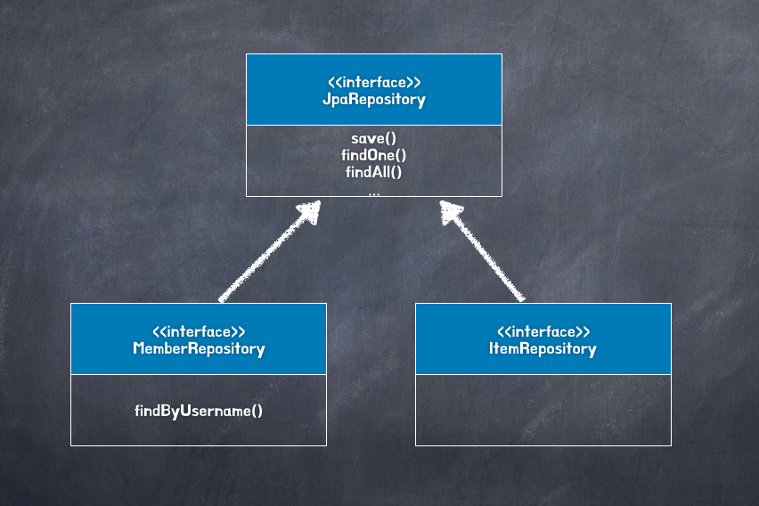

# Chapter 12. 스프링 데이터 JPA

## 1. 스프링 데이터 JPA 소개

---

- 스프링 데이터 JPA
    - 스프링 프레임워크에서 JPA를 편리하게 사용할 수 있도록 지원하는 프로젝트
    - 데이터 접근 계층을 개발할 때 지루하게 반복되던 CRUD 문제를 세련된 방법으로 해결한다.
    - CRUD 를 처리하기 위한 공통 인터페이스를 제공한다. 그리고 리포지토리를 개발할 때 인터페이스만 작성하면 실행 시점에 스프링 데이터 JPA 가 구현 객체를 동적으로 생성해서 주입해준다.
        
        → 데이터 접근 계층을 개발할 때 구현 클래스 없이 인터페이스만 작성해도 개발을 완료할 수 있다.
        
    - (공통 인터페이스 외) 메소드 이름을 분석해서 JPQL 을 실행시켜 준다.
- 스프링 데이터 JPA 적용
    
    ```java
    // 스프링 데이터 JPA 적용 - JpaRepository 인터페이스 내에 공통 메소드가 존재한다.
    public interface MemberRepository extends JpaRepository<Member, Long> {
        Member findByUserName(String username);
        // 스프링 데이터 JPA 가 메소드 이름을 분석해서 JPQL 을 만들어 실행한다.
        // select m from Member m where username = :username
    }
    
    public interface ItemRepository extends JpaRepository<Item, Long> {
    }
    ```
    
    - 클래스 다이어그램
        
        
        

### 1-1. 스프링 데이터 프로젝트

---

- 스프링 데이터 JPA는 스프링 데이터 프로젝트의 하위 프로젝트 중 하나다.
- 스프링 데이터(Spring Data) 프로젝트는 `JPA`, `몽고DB`, `NEO4J`, `REDIS`, `HADOOP`, `GEMFIRE` 같은 다양한 데이터 저장소에 대한 접근을 추상화해서 개발자의 편의를 제공하고 반복 데이터 접근 코드를 줄여준다.
    - 레퍼런스: [https://spring.io/projects/spring-data](https://spring.io/projects/spring-data)
    - 21/11/15 기준 Spring Data 프로젝트들
        - Spring Data JDBC
        - Spring Data JPA
        - Spring Data LDAP
        - Spring Data MongoDB
        - Spring Data Redis
        - Spring Data R2DBC
        - Spring Data REST
        - Spring Data for Apache Cassandra
        - Spring Data for Apache Geode
        - Spring Data for Apache Solr
        - Spring Data for Pivotal GemFire
        - Spring Data Couchbase
        - Spring Data Elasticsearch
        - Spring Data Envers
        - Spring Data Neo4j
        - Spring Data JDBC Extensions
        - Spring for Apache Hadoop
- 스프링 데이터 JPA 프로젝트는 JPA 특화된 기능을 제공한다.
    - 스프링 프레임워크와 JPA를 함께 사용한다면 JPA 사용을 적극 추천

## 2. 스프링 데이터 JPA 설정

---

- 필요 라이브러리: `spring-data-jpa` dependency 추가
    
    ```java
    plugins {
        id "com.ewerk.gradle.plugins.querydsl" version "1.0.10"
    }
    
    dependencies {
        implementation 'org.springframework.boot:spring-boot-starter-web:2.5.5'
        implementation 'org.hibernate:hibernate-entitymanager' // 5.4.32
        implementation 'org.springframework.data:spring-data-jpa'
        implementation 'com.querydsl:querydsl-jpa:4.4.0'
        implementation 'com.querydsl:querydsl-apt:4.4.0'
    }
    
    //querydsl 추가 시작
    def outputDirectory = "$buildDir/generated/querydsl"
    querydsl {
        jpa = true
        querydslSourcesDir = outputDirectory
    }
    sourceSets {
        main.java.srcDir outputDirectory
    }
    configurations {
        querydsl.extendsFrom compileClasspath
    }
    compileQuerydsl {
        options.annotationProcessorPath = configurations.querydsl
    }
    ```
    
- 환경설정: `Repository`를 검색할 base-package 지정
    - XML 방식: appConfig.xml
        
        ```xml
        <jpa:repositories base-package="jpabook.jpashop.repository" />
        ```
        
    - JavaConfig 방식
        
        ```java
        @Configuration
        @EnableJpaRepositories(**basePackages** = "jpabook.jpashop.repository")
        public class AppConfig {}
        ```
        
- Spring Data JPA 는 애플리케이션을 실행할 때 `basePackages`에 있는 리포지토리 인터페이스들을 찾아서 해당 인터페이스를 구현한 클래스를 동적으로 생성한 다음 스프링 빈으로 등록한다.
    
    
    

## 3. 공통 인터페이스 기능

---

- 스프링 데이터 JPA는 간단한 CRUD 기능을 공통으로 처리하는 `JpaRepository` 인터페이스를 제공한다.
    
    ```java
    @NoRepositoryBean
    public interface JpaRepository<T, ID> extends PagingAndSortingRepository<T, ID>, QueryByExampleExecutor<T> {
    		...
    }
    
    // JpaRepository를 사용하는 인터페이스
    public interface MemberRepository extends JpaRepository<Member, Long> {
    }
    ```
    
    - `@NoRepositoryBean`: 이 인터페이스가 Repository 용도로서 사용되는 것이 아닌 단지 Repository의 메서드를 정의하는 인터페이스라는 정보를 부여한다.
    - `T`: 엔티티
    - `ID`: 엔티티 식별자
- 공통 인터페이스 구성
    
    
    
- `Repository`, `CrudRepository`, `PagingAndSortingRepositry`는 스프링 데이터 프로젝트가 공통으로 사용하는 인터페이스
- `JpaRepository`는 스프링 데이터 JPA가 제공하는 특화된 기능을 제공한다.

- `JpaRepository`가 제공하는 주요 메소드 몇 가지
    - (T: 엔티티, ID: 엔티티의 식별자 타입, S: 엔티티와 그 자식 타입 의미)
    - `save(S)`: 새로운 엔티티는 저장하고 이미 있는 엔티티는 수정
        - 엔티티에 식별자 값이 없으면 `persist()`, 식별자 값이 있으면 `merge()`를 호출
    - `delete(T)`: 엔티티 하나를 삭제, 내부에서 `EntityManager.remove()`를 호출
    - `findOne(ID)`: 엔티티 하나를 조회, 내부에서 `EntityManager.find()`를 호출
        - 스프링 데이터 2.0 부터 `CrudRepository`의 `findById`로 변경됨
    - `getOne(ID)`: 엔티티를 프록시로 조회, 내부에서 `EntityManager.getReference()`를 호출
        - 스프링 데이터 JPA 2.5 부터 `getById`로 변경됨
    - `findAll(...)`: 모든 엔티티를 조회, 정렬이나 페이징 조건을 파라미터로 제공
        - `CrudRepository`의 `findAll`
            - `Iterable<T> findAll()`를 오버라이드 했다.
        - `PagingAndSortingRepository`의 `findAll`
            - `Iterable<T> findAll(Sort sort)`를 오버라이드 했다.
            - `Page<T> findAll(Pageable pageable);`
        - `JpaRepository`의 `findAll`
            - `List<T> findAll()`
            - `List<T> findAll(Sort sort)`
            - `<S extends T> List<S> findAll(Example<S> example)`
            - `<S extends T> List<S> findAll(Example<S> example, Sort sort)`

## 4. 쿼리 메소드 기능

---

- 쿼리 메소드 기능은 스프링 데이터 JPA 가 제공하는 마법 같은 기능
    - 대표적으로 메소드 이름만으로 쿼리를 생성하는 기능이 있다.
- 스프링 데이터 JPA 쿼리 메소드 기능 3가지
    - 메소드 이름으로 쿼리 생성
    - 메소드 이름으로 JPA NamedQuery 호출
    - `@Query` 어노테이션을 사용해서 리포지토리 인터페이스에 쿼리 직접 정의

### 4-1. 메소드 이름으로 쿼리 생성

---

- 정해진 규칙에 따라서 메소드 이름을 지어야 한다.
    - 레퍼런스: [https://docs.spring.io/spring-data/jpa/docs/2.5.5/reference/html/#jpa.query-methods.query-creation](https://docs.spring.io/spring-data/jpa/docs/2.5.5/reference/html/#jpa.query-methods.query-creation)
    
    
    
    <aside>
    💡 `In`, `NotIn`은 컬렉션 및 배열, `varargs`도 사용할 수 있다.
    
    </aside>
    
- 쿼리 메소드 예시
    
    ```java
    // 이메일과 이름으로 회원 조회
    public interface MemberRepository extends Repository<Member, Long> {
      List<Member> findByEmailAndName(String email, String name);
    }
    
    // JPQL
    select m from Member m where m.email = ?1 and m.name = ?2
    ```
    
- 스프링 데이터 JPA는 메소드 이름을 분석해서 `JPQL`을 생성하고 실행한다.
- 엔티티의 필드명이 변경되면 인터페이스에 정의한 메소드 이름도 꼭 함께 변경해야 한다.
    - 그렇지 않으면 애플리케이션 시작 시점에 오류가 발생한다.

### 4-2. JPA NamedQuery

---

- 스프링 데이터 JPA는 메소드 이름으로 JPA Named 쿼리를 호출하는 기능 제공
- JPA Named 쿼리: 이름 그대로 쿼리에 이름을 부여해서 사용하는 방법 → 애노테이션이나 XML 에 쿼리를 정의할 수 있다.
- `@NamedQuery` 어노테이션으로 Named 쿼리 정의
    
    ```java
    @Entity
    @NamedQuery(
      name="Member.findByUsername",
      query="select m from Member m where m.username = :username")
    public class Member {
      ...
    }
    
    // 기존 Named 쿼리 호출
    public class MemberRepository {
    		...
    		List<Member> resultList = 
    				em.createNamedQuery("Member.findByUsername", Member.class)
    						.setParameter("username", "회원1")
    						.getResultList();
    }
    
    // 스프링 데이터 JPA
    public interface MemberRepository extends JpaRepository<Member, Long> {
    		List<Member> findByUsername(@Param("username") String username);
    }
    ```
    
    - 스프링 데이터 JPA 는 "도메인 클래스 + `.` + 메소드 이름" 으로 Named 쿼리를 찾아 실행
    - 만약 실행할 Named 쿼리가 없으면 메소드 이름으로 쿼리 생성 전략을 사용한다.
    - `@Param`은 이름기반 파라미터를 바인딩할 때 사용하는 어노테이션

### 4-3. `@Query`, 리포지토리 메소드에 쿼리 정의

---

- 리포지토리 메소드에 직접 쿼리를 정의하려면 `@Query` 어노테이션을 사용한다.
    - 실행할 메소드에 정적 쿼리를 직접 작성하므로 이름 없는 Named 쿼리라 할 수 있다.
- JPA Named 쿼리처럼 애플리케이션 실행 시점에 문법 오류 발견이 가능
    
    ```java
    public interface MemberRepository extends JpaRepository<Member, Long> {
    		@Query("select m from Member m where m.username = ?1")
    		Member findByUsername(String username);
    }
    ```
    
- 네이티브 SQL을 사용하려면 `@Query` 어노테이션에 `nativeQuery = true`를 설정한다.
    - 스프링 데이터 JPA 의 파라미터 바인딩의 경우, JPQL 은 위치 기반 파라미터를 1 부터 시작 네이티브 SQL 은 0 부터 시작
    - 레퍼런스에서 1.9 이후 1 부터 시작중: [https://docs.spring.io/spring-data/jpa/docs/1.9.x/reference/html/](https://docs.spring.io/spring-data/jpa/docs/1.9.x/reference/html/)
    
    ```java
    public interface MemberRepository extends JpaRepository<Member, Long> {
    		@Query(value = "SELECT * FROM MEMBER WHERE USERNAME = ?0", nativeQuery = true)
    		Member findByUsername(String username);
    }
    ```
    

### 4-4. 파라미터 바인딩

---

- 스프링 데이터 JPA 는 위치 기반 파라미터 바인딩과 이름 기반 파라미터 바인딩을 모두 지원한다.
    
    ```java
    select m from Member m where m.username = ?1 //위치 기반
    select m from Member m where m.username = :name //이름 기반
    ```
    
- 기본값은 위치 기반, 파라미터 순서로 바인딩한다.
- 이름 기반 파라미터 바인딩을 사용하려면 `@Param` 어노테이션을 사용하면 된다.
    
    ```java
    public interface MemberRepository extends JpaRepository<Member, Long> {
    		@Query("select m from Member m where m.username = :name")
    		Member findByUsername(@Param("name") String username);
    }
    ```
    

👉  코드 가독성, 유지보수를 위해 이름 기반 파라미터 바인딩을 사용하자

### 4-5. 벌크성 수정 쿼리

---

- JPA 를 사용한 벌크성 수정 쿼리
    
    ```java
    int bulkPriceUp(String stockAmount) {
    		...
    		String qlString = "update Product p set p.price = p.price * 1.1 where p.stockAmount < :stockAmount";
    		
    		int resultCount = em.createQuery(qlString)
    												.setParameter("stockAmount", stockAmount)
    												**.executeUpdate();**
    }
    ```
    
- 스프링 데이터 JPA 를 사용한 벌크성 수정 쿼리
    
    ```java
    @Modifying
    @Query("update Product p set p.price = p.price * 1.1 where p.stockAmount < :stockAmount")
    int bulkPriceUp(@Param("stockAmount") String stockAmount);
    ```
    
- 스프링 데이터 JPA 에서 벌크성 수정, 삭제 쿼리는 `@Modifying` 어노테이션을 사용하면 된다.
- 쿼리 후 영속성 컨텍스트를 초기화하고 싶으면 `@Modifying(clearAutomatically = true)`설정 (기본 값: `false`)
    - 벌크 연산은 영속성 컨텍스트를 무시하고 DB 에 직접 쿼리한다.
    - JPA 는 1차 캐시를 확인 후 DB 에 접근한다.
        - 하지만 벌크 연산은 1차 캐시를 포함한 영속성 컨텍스트를 무시하고 바로 쿼리를 실행하기 때문에 영속성 컨텍스트는 데이터 변경을 알 수가 없다.
    
    👉  즉, 벌크 연산 시 1차 캐시와 DB 싱크가 일치하지 않게 된다.
    

### 4-6. 반환 타입

---

- 스프링 데이터 JPA 는 유연한 반환 타입을 지원
    - 결과가 한 건 이상이면 컬렉션 인터페이스, 단건이면 반환 타입을 지정한다.
    
    ```java
    List<Member> findByName(String name); //컬렉션
    Member findByEmail(String email); //단건
    ```
    
- 조회 결과가 없으면 컬렉션 → 빈 컬렉션, 단건 → `null`을 반환한다.
- 단건의 경우 2건 이상 조회되면 `NonUniqueResultException`예외가 발생한다.
    - 스프링 데이터 JPA 는 내부에서 JPQL 의 `Query.getSingleResult()` 메소드를 호출한다.
    - 조회 결과가 없으면 `NoResultException`예외가 발생하는데 스프링 데이터 JPA 는 이를 무시하고 `null`을 반환한다.

### 4-7. 페이징과 정렬

---

- Spring Data JPA 는 쿼리 메소드에 페이징과 정렬 기능을 사용할 수 있도록 2가지 파라미터를 제공한다.
    - `org.springframework.data.domain.Sort`: 정렬 기능
    - `org.springframework.data.domain.Pageable`: 페이징 기능 (내부에 `Sort` 포함)

- 파라미터에 `Pageable`을 사용하면 반환 타입으로 `List` 나 `Page`를 사용할 수 있다.
    - 반환 타입으로 `Page`를 사용하면 Spring Data JPA 는 페이징 기능을 제공하기 위해 검색된 전체 데이터 건수를 조회하는 count 쿼리를 추가로 호출한다.
        
        ```java
        // count 쿼리 사용
        Page<Member> findByName(String name, Pageable pageable);
        
        // count 쿼리 사용 안함
        List<Member> findByName(String name, Pageable pageable);
        
        List<Member> findByName(String name, Sort sort);
        ```
        
- 페이징과 정렬을 사용하는 예제 코드
    - 검색 조건: 이름이 김으로 시작하는 회원 / 정렬 조건: 이름으로 내림차순 / 페이징 조건: 첫 번째 페이지, 페이지당 보여줄 데이터는 10 건
    - `Page` 사용 예제 코드
        
        ```java
        // 정의
        public interface MemberRepository extends JpaRepository<Member, Long> {
            Page<Member> findByNameStartingWith(String name, Pageable pageable);
        }
        
        // 실행
        /**
         * 페이징 조건과 정렬 조건 설정
         * Pageable 은 인터페이스이므로 실제 사용할 때는 PageRequest 구현체를 사용한다.
         */
        PageRequest pageRequest = PageRequest.of(0, 10, Sort.by(Sort.Direction.DESC, "name"));
        Page<Member> result = memberRepository.findByNameStartingWith("김", pageRequest);
        
        List<Member> members = result.getContent();     // 조회된 데이터
        int totalPages = result.getTotalPages();        // 전체 페이지 수
        boolean hasNextPage = result.hasNext();         // 다음 페이지 존재 여부
        ```
        
- `PageRequest` 파라미터
    
    ```java
    new PageRequest(0, 10, new Sort(Direction.DESC, "name"));
    ```
    
    1. 현재 페이지 (0 부터 시작)
    2. 조회할 데이터 수
    3. 정렬 정보
- `Page` 인터페이스가 제공하는 다양한 메소드들
    
    ```java
    public interface Page<T> extends Slice<T> {
    
    	static <T> Page<T> empty() { // 스프링 데이터 2.0 부터 추가
    		return empty(Pageable.unpaged());
    	}
    	static <T> Page<T> empty(Pageable pageable) {
    		return new PageImpl<>(Collections.emptyList(), pageable, 0);
    	}
    
    	int getTotalPages(); //전체 페이지 수
    	long getTotalElements(); //전체 데이터 수
    	// 현재 Page 내용이 함수로 매핑된 새 Page 를 반환. null 이면 안된다.
    	<U> Page<U> map(Function<? super T, ? extends U> converter); // 스프링 데이터 1.10 부터 추가
    
    	/**
    	 * Slice
    	 */
    	int getNumber(); //현재 페이지
    	int getSize(); //페이지 크기
    	int getNumberOfElements(); //현재 페이지에 나올 데이터 수
    	List<T> getContent(); //조회된 데이터
    	boolean hasContent(); //조회된 데이터 존재 여부
    	Sort getSort(); //정렬 정보
    	boolean isFirst(); //현재 Slice 가 첫 번째 인지 여부 (isFirstPage deprecated 1.9)
    	boolean isLast(); //현재 Slice 가 마지막인지 여부 (isLastPage deprecated 1.9)
    	boolean hasNext(); //다음 Slice 여부 (hasNextPage deprecated 1.9)
    	boolean hasPrevious(); //이전 Slice 여부 (hasPreviousPage deprecated 1.9)
    
    	// 현재 Slice 를 요청하는 데 사용된 Pageable 을 반환한다.
    	default Pageable getPageable() { // 스프링 데이터 2.0 부터 추가
    		return PageRequest.of(getNumber(), getSize(), getSort());
    	}
    	Pageable nextPageable(); //다음 페이지 객체, 다음 페이지가 없으면 null
    	Pageable previousPageable(); //이전 페이지 객체, 이전 페이지가 없으면 null
    	// 현재 Slice 내용이 함수로 매핑된 새 Slice 를 반환. null 이면 안된다.
    	<U> Slice<U> map(Function<? super T, ? extends U> converter); // 스프링 데이터 1.10 부터 추가
    	// 다음 Slice / 현재 Slice 를 설명하는 Pageable(마지막 Slice 인 경우) 을 반환한다.
    	default Pageable nextOrLastPageable() { // 스프링 데이터 2.2 부터 추가
    		return hasNext() ? nextPageable() : getPageable();
    	}
    	// 이전 Slice / 현재 Slice 를 설명하는 Pageable(첫 Slice 인 경우) 을 반환한다.
    	default Pageable previousOrFirstPageable() { // 스프링 데이터 2.2 부터 추가
    		return hasPrevious() ? previousPageable() : getPageable();
    	}
    }
    ```
    

- 스프링에서 `Pageable`을 편리하게 사용하도록 `HandlerMethodArgumentResolver` 제공한다.
    - spring-web 프로젝트(`org.springframework.web`) 하위에 있다.
        - 스프링부트의 경우 `org.springframework.boot:spring-boot-starter-web` 하위에 spring-web 프로젝트가 있다.
        
        
        
    - spring data 에서 이를 bean 으로 선언한다.
        
        
        
        
        
    
    ```java
    @RequestMapping(value = "/members", method = RequestMethod.GET)
    public String list(Pageable pageable, Model model) {
    
        Page<Member> page = memberService.findMembers(pageable);
        model.addAttribute("members", page.getContent());
        return "members/memberList";
    }
    ```
    
    - 12.7.3 Web 확장 에 또 나온다.

### 4-8. 힌트

---

- JPA 힌트를 사용하려면 `@QueryHints` 어노테이션을 사용하면 된다.
    - SQL 힌트가 아니라 JPA 구현체에게 제공하는 힌트
        
        ```java
        @QueryHints(value = { @QueryHint(name = "org.hibernate.readOnly", value = "true") },
        						forCounting = true)
        Page<Member> findByName(String name, Pagable Pageable);
        ```
        
    - `forCounting` 속성은 반환 타입으로 Page 인터페이스를 적용하면 추가로 count 쿼리에도 쿼리 힌트를 적용할지를 설정하는 옵션 (기본값: `true`)

### 4-9. Lock

---

- 쿼리 시 락을 걸려면 `@Lock` 어노테이션을 사용
    
    ```java
    @Lock(LockModeType.PESSIMISTIC_WRITE)
    List<Member> findByName(String name);
    ```
    

## 5. 명세

---

- 책 도메인 주도 설계는 명세라는 개념을 소개, 스프링 데이터 JPA 는 JPA Criteria 로 이 개념을 사용할 수 있도록 지원한다.
- 명세를 이해하기 위한 핵심 단어는 술어(`predicate`)
    - 이것은 단순히 참이나 거짓으로 평가된다.
    - AND, OR 같은 연산자로 조합이 가능
    - ex> 데이터를 검색하기 위한 제약 조건 하나하나가 술어
    
    👉  스프링 데이터 JPA 는 `Specification`클래스로 정의
    
- 명세 기능을 사용하려면 레포지토리에 `JpaSpecificationExecutor` 인터페이스를 상속받으면 된다.
    
    ```java
    public interface OrderRepository extends JpaRepository<Order, Long>, JpaSpecificationExecutor<Order> {
    }
    ```
    

- `JpaSpecificationExecutor` 인터페이스
    
    ```java
    public interface JpaSpecificationExecutor<T> {
    	**Optional<**T**>** findOne(@Nullable Specification<T> spec);
    	List<T> findAll(@Nullable Specification<T> spec);
    	Page<T> findAll(@Nullable Specification<T> spec, Pageable pageable);
    	List<T> findAll(@Nullable Specification<T> spec, Sort sort);
    	long count(@Nullable Specification<T> spec);
    }
    ```
    
- `JpaSpecificationExecutor`의 메소드들은 `Specification`을 파라미터로 받아서 검색 조건으로 사용한다.
    - 명세 사용 코드
        
        ```java
        **import static jpabook.jpashop.domain.OrderSpec.*;**
        
        import org.springframework.data.jpa.domain.Specification; // where()
        
        public List<Order> findOrders(String name) {
        		List<Order> result = orderRepository.findAll(
        				**where(memberName(name)).and(isOrderStatus())**
        		);
        		return result;
        }
        ```
        
- `Specification`는 명세들을 조립할 수 있도록 도와주는 클래스인데 `where()`, `and()`, `or()`, `not()` 메소드를 제공한다.
    - OrderSpec 명세 정의 코드
        - 명세를 정의하려면 `Specification` 인터페이스를 구현해서 반환하면 된다.
        
        ```java
        public class OrderSpec {
        		public static Specification<Order> memberName(final String memberName) {
        				return new Specification<Order>() {
        						public Predicate toPredicate(Root<Order> root, CriteriaQuery<?> query, CriteriaBuilder builder) {
        								if(StringUtils.isEmpty(memberName)) return null;
        
        								Join<Order, Member> m = root.join("member", JoinType.INNER); //회원과 조인
        								return builder.equal(m.get("name"), memberName)
        						}
        				}
        		}
        
        		public static Specification<Order> isOrderStatus() {
        				return new Specification<Order>() {
        						public Predicate toPredicate(Root<Order> root, CriteriaQuery<?> query, CriteriaBuilder builder) {
        								return builder.equal(root.get("status"), OrderStatus.ORDER);
        						}
        				}
        		}
        }
        ```
        

## 6. 사용자 정의 리포지토리 구현

---

- 스프링 데이터 JPA 로 레파지토리로 개발하면 인터페이스만 정의하고 구현체는 만들지 않는다.
- 리포지토리를 직접 구현하면 제공하는 기능을 모두 구현해야하는 문제가 발생
    - 스프링 데이터 JPA 는 필요한 메소드만 구현할 수 있는 방법을 제공한다.

- 사용자 정의 인터페이스를 작성, 인터페이스 이름은 자유롭게 정의
    
    ```java
    public interface MemberRepositoryCustom {
    		public List<Member> findMemberCustom();
    }
    ```
    
- 인터페이스를 구현한 클래스 작성. 이름 짓는 규칙: 리포지토리 인터페이스 이름 + `impl`
    
    ```java
    public class MemberRepositoryImpl implements MemberRepositoryCustom {
    		@Override
    		public List<Member> findMemberCustom() {
    				...//사용자 정의 구현
    		}
    }
    ```
    
- 리포지토리 인터페이스에 사용자 정의 인터페이스를 상속받으면 된다.
    
    ```java
    public interface MemberRepository extends JpaRepository<Member, Long>, MemberRepositoryCustom {
    }
    ```
    

- 사용자 정의 구현 클래스 이름 끝에 `Impl` 대신 다른 이름을 붙이고 싶은 경우 repository-impl-postfix 속성 변경, `Impl`이 기본값
    
    ```java
    <repositories base-package="jpabook.jpashop.repository" repository-impl-postfix="impl" />
    
    // JavaConfig
    @EnableJpaRepositories(basePackages = "jpabook.jpashop.repository",
    											 repositoryImplementationPostfix = "Impl")
    ```
    

## 7. Web 확장

---

- 스프링 데이터 프로젝트는 스프링 MVC 에 사용할 수 있는 편리한 기능을 제공
- 식별자로 도메인 클래스를 바로 바인딩해주는 도메인 클래스 컨버터 기능, 페이징과 정렬 기능 제공

### 7-1. 설정

---

- 스프링 데이터가 제공하는 Web 확장 기능을 활성화하려면 `org.springframework.data.web.config.SpringDataWebConfiguration`을 스프링 빈으로 등록하면 된다.
    - 스프링 부트를 사용하는 경우에는 설정할 것이 없음 (자동 설정)
    - 스프링 부트 사용하지 않는 경우
        
        ```java
        <bean class="org.springframework.data.web.config.SpringDataWebConfiguration" />
        
        // JavaConfig
        @Configuration
        @EnableWebMvc
        **@EnableSpringDataWebSupport**
        public class WebAppConfig {
        		...
        }
        ```
        
- 설정을 완료하면 도메인 클래스 컨버터와 페이징, 정렬을 위한 `HandlerMethodArgumentResolver`가 스프링 빈으로 등록된다.
- 등록되는 도메인 클래스 컨버터명: `DomainClassConverter`

### 7-2. 도메인 클래스 컨버터 기능

---

- 도메인 클래스 컨버터는 HTTP 파라미터로 넘어온 엔티티 아이디로 엔티티 객체를 찾아 바인딩해준다.
    - 수정화면 요청 URL : `/member/memberUpdateForm?id=1`
    - 기존 사용 방법
        
        ```java
        @Contorller
        public class MemberContorller {
        		@Autowired MemberRepository memberRepository;
        
        		@RequestMapping("member/memberUpdateForm")
        		public String memberUpdateForm(@RequestParam("id") Long id, Model model) {
        				Member member = memberRepository.findById(id).get(); //회원 조회
        				model.addAttribute("member", member);
        				return "member/memberSaveForm";
        		}
        }
        ```
        
    - 도메인 클래스 컨버터를 적용한 예제
        
        ```java
        @Contorller
        public class MemberController {
        
        		@RequestMapping("member/memberUpdateForm")
        		public String memberUpdateForm(@RequestParam("id") Member member, Model model) {
        				model.addAttribute("member", member);
        				return "member/memberSaveForm";
        		}
        }
        ```
        
        - HTTP 요청으로 회원 아이디를 받지만 도메인 클래스 컨버터가 중간에 동작해서 아이디를 회원 엔티티 객체로 변환해서 넘겨준다.
- 도메인 클래스 컨버터는 해당 엔티티와 관련된 리포지토리를 사용해서 엔티티를 찾는다.

- 영속성 컨텍스트의 동작 방식과 `OSIV` (13장에서 설명 예정)
    - 스프링 부트에서 디폴트는 `true`이다. https://github.com/spring-projects/spring-boot/issues/7107
        - 조회한 엔티티는 영속 상태다.
    - OSIV 를 사용하지 않으면
        - 조회한 엔티티는 준영속 상태다.
        - 도메인 클래스 컨버터를 통해 넘어온 회원 엔티티를 컨트롤러에서 직접 수정해도 실제 DB 반영 X

### 7-3. 페이징과 정렬 기능

---

- 스프링 데이터가 제공하는 페이징과 정렬 기능을 스프링 MVC 에서 편리하게 사용할 수 있도록 `HandlerMethodArgumentResolver`를 제공한다. (12.4.7 에 소개됨)
    - 페이징 기능: `PageableHandlerMethodArgumentResolver`
    - 정렬 기능: `SortHandlerMethodArgumentResolver`
    
    ```java
    @RequestMapping(value = "/members", method = RequestMethod.GET)
    public String list(Pageable pageable, Model model) {
    
    		Page<Member> page = memberService.findMembers(pageable);
    		model.addAttribute("members", page.getContent());
    		return "members/memberList";
    }
    ```
    
- `Pageable`은 다음 요청 파라미터 정보로 만들어진다.
    - `page`: 현재 페이지, 0 부터 시작
    - `size`: 한 페이지에 노출할 데이터 건수
    - `sort`: 정렬 조건을 정의 (예: 정렬 속성, 정렬 속성...(ASC | DESC)
    
    ```java
    /members?page=0&size=20&sort=name,desc&sort=address.city
    ```
    
    - 페이지를 1부터 시작하고 싶으면 `PageableHandlerMethodArgumentResolver`를 스프링 빈으로 직접 등록 후 `setOneIndexedParameters`를 `true`로 설정
- `PageableHandlerMethodArgumentResolver`
    
    
    

- 접두사
    - 사용해야 할 페이징 정보가 둘 이상이면 접두사를 사용해서 구분
    - 접두사는 스프링 프레임워크가 제공하는 `@Qualifier` 어노테이션을 사용
    - `{접두사명}_`로 구분
        
        ```java
        public String list (
        		@Qualifier("member") Pageable memberPageable,
        		@Qualifier("order") Pageable orderPageable, ...
        
        예: /members?member_page=0&order_page=1
        ```
        
- 기본값
    - `Pageable`의 기본값은 page=0, size=20
    - 기본 값을 변경하고 싶으면 `@PageableDefault` 어노테이션을 사용
        
        ```java
        @RequestMapping(value = "/members_page", method = REquestMethod.GET)
        public String list(@PageableDefault(size = 12, sort = "name",
        		direction = Sort.Direction.DESC) Pageable pageable) {
        		...
        }
        ```
        

## 8. 스프링 데이터 JPA 가 사용하는 구현체

---

- 스프링 데이터 JPA 가 제공하는 공통 인터페이스는 `SimpleJpaRepository` 클래스가 구현한다.
- `SimpleJpaRepository`
    
    ```java
    **@Repository
    @Transactional(readOnly = true)**
    public class SimpleJpaRepository<T, ID extends Serializable> implements 
    JpaRepository<T, ID>, JpaSpecificationExecutor<T> {
    		
    		**@Transactional**
    		public <S extends T> S save(S entity) {
    				if(entityInfomation.isNew(entity) {
    						em.persist(entity;
    						return entity;
    				} else {
    						return em.merge(entity);
    				}
    		}
    }
    ```
    
    - `@Repository` 적용: JPA 예외를 스프링이 추상화한 예외로 변환한다.
    - `@Transactional` 트랜잭션 적용: JPA 의 모든 변경은 트랜잭션 안에서 이뤄져야 한다. 데이터를 변경(등록, 수정, 삭제)하는 메소드에 `@Transactional`로 트랜잭션 처리가 되어 있다. 서비스 계층에서 트랜잭션을 시작했으면 레포지토리도 해당 트랜잭션을 전파받아서 사용한다.
    - `@Transactional(readOnly = true)`: 데이터를 조회하는 메소드에는 `readOnly = true` 옵션이 적용되어 있다. 이 옵션을 사용하면 플러시를 생략해서 약간의 성능 향상
    - `save()` 메소드: 저장할 엔티티가 새로운 엔티티면 저장(persist)하고 이미 있는 엔티티면 병합 (merge)한다. 새로운 엔티티를 판단하는 기본 전략은 엔티티 식별자가 객체일 때 `null`, 숫자일땐 0으로 판단한다. 필요하면 `Persistable` 인터페이스를 구현해서 판단 로직을 변경할 수 있다.
        
        ```java
        public interface Persistable<ID extends Serializable> extends Serializable {
        		ID getId();
        		boolean isNew();
        }
        ```
        

## 9. JPA 샵에 적용

---

### 9-1. 환경설정

---

### 9-2. 리포지토리 리팩토링

---

### 9-3. 명세 적용

---

## 10. 스프링 데이터 JPA 와 QueryDSL 통합

---

- 스프링 데[이터 JPA 는 2가지 방법으로 QueryDSL 을 지원한다.
    - `org.springframework.data.querydsl.QueryDslPredicateExecutor`
        - 2점대부터 `org.springframework.data.querydsl.QuerydslPredicateExecutor`
    - `org.springframework.data.querydsl.QueryDslRepositorySupport`
        - 2점대부터 `org.springframework.data.jpa.repository.support.QuerydslRepositorySupport`

### 10-1. QueryDslPredicateExecutor 사용

---

- 리포지토리에서 `QueryDslPredicateExecutor`를 상속받아서 QueryDSL 을 사용할 수 있다.
    
    ```java
    public interface ItemRepository
    		extends JpaRepository<Item, Long>, QueryDslPredicateExecutor<Item> {
    }
    ```
    
- `QueryDSL` 사용 예제
    
    ```java
    QItem item = QItem.item;
    Iterable<Item> result = itemRepository.findAll(
    		item.name.contains("장난감").and(item.price.between(10000, 20000))
    );
    ```
    
- `QueryDslPredicateExecutor` 인터페이스
    
    ```java
    public interface QueryDslPredicateExecutor<T> {
    
    		T findOne(Predicate predicate);
    		Iterable<T> findAll(Predicate predicate);
    		Iterable<T> findAll(Predicate predicate, OrderSpecifier<?>... orders);
    		Page<T> findAll(Predicate predicate, Pageable pageable);
    		long count(Predicate predicate);
    }
    ```
    

- `QueryDslPredicateExecutor`는 스프링 데이터 JPA 에서 편리하게 QueryDSL 을 사용할 수 있지만 기능에 한계가 있다.
    - ex> `join`, `fetch`를 사용할 수 없다.
    - `QueryDSL`이 제공하는 다양한 기능을 사용하려면 `JPAQuery`를 직접 사용하거나 스프링 데이터 JPA 가 제공하는 `QueryDslRepositorySupport`를 사용해야 한다.

### 10-2. QueryDslRepositorySupport 사용

---

- QueryDSL 의 모든 기능을 사용하려면 `JPAQuery` 객체를 직접 사용하면 된다.
- 이 때 스프링 데이터 JPA 가 제공하는 `QueryDslRepositorySupport`를 상속받아 사용하면 조금 더 편리하게 QueryDSL 을 사용할 수 있다.
- CustomOrderRepository 사용자 정의 리포지토리
    - 스프링 데이터 JPA 가 제공하는 공통 인터페이스는 직접 구현할 수 없기 때문에 사용자 정의 리포지토리를 만들었다.
    
    ```java
    public interface CustomOrderRepository {
        public List<Order> search(OrderSearch orderSearch);
    }
    ```
    
- QueryDslRepositorySupport 사용 코드
    
    ```java
    public class OrderRepositoryImpl extends **QuerydslRepositorySupport**
            implements CustomOrderRepository{
    
        public OrderRepositoryImpl() {
            super(Order.class);
        }
    
        @Override
        public List<Order> search(OrderSearch orderSearch) {
            QOrder order = QOrder.order;
            QMember member = QMember.member;
    
            JPQLQuery query = from(order);
            if (StringUtils.hasText(orderSearch.getMemberName())) {
                query.leftJoin(order.member, member)
                        .where(member.name.contains(orderSearch.getMemberName()));
            }
    
            if(orderSearch.getOrderStatus() != null) {
                query.where(order.status.eq(orderSearch.getOrderStatus()));
            }
    
            return query.fetch();
        }
    }
    ```
    
- `QueryDslRepositorySupport` 의 핵심 기능
    
    ```java
    @Repository
    public abstract class QuerydslRepositorySupport {
    
        // 엔티티 매니저 반환
        protected EntityManager getEntityManager() {
            return entityManager;
        }
    
        // from 절 반환
        protected JPQLQuery<Object> from(EntityPath<?>... paths) {
            return getRequiredQuerydsl().createQuery(paths);
        }
    
        // QueryDSL delete 절 반환
        protected DeleteClause<JPADeleteClause> delete(EntityPath<?> path) {
            return new JPADeleteClause(getRequiredEntityManager(), path);
        }
    
        // QueryDSL update 절 반환
        protected UpdateClause<JPAUpdateClause> update(EntityPath<?> path) {
            return new JPAUpdateClause(getRequiredEntityManager(), path);
        }
    
        // Spring Data JPA가 제공하는 QueryDSL을 편하게 사용하도록 돕는 헬퍼 객체 반환
        @Nullable
        protected Querydsl getQuerydsl() {
            return this.querydsl;
        }
    }
    ```
    

- 참고
    - [https://www.nowwatersblog.com/jpa/ch12/12-3](https://www.nowwatersblog.com/jpa/ch12/12-3)
    - [https://milenote.tistory.com/142?category=1037499](https://milenote.tistory.com/142?category=1037499)
    - [https://github.com/ksw6169/jpa-programming/wiki/12장_스프링-데이터-JPA](https://github.com/ksw6169/jpa-programming/wiki/12%EC%9E%A5_%EC%8A%A4%ED%94%84%EB%A7%81-%EB%8D%B0%EC%9D%B4%ED%84%B0-JPA)
    - [https://ultrakain.gitbooks.io/jpa/content/chapter12/chapter12.4.html](https://ultrakain.gitbooks.io/jpa/content/chapter12/chapter12.4.html)
