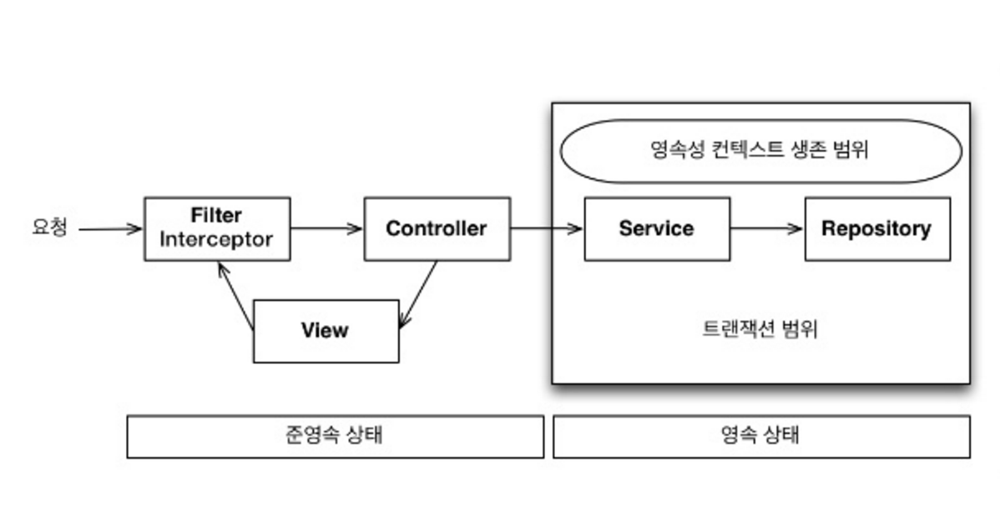

# Chapter 13. 웹 애플리케이션과 영속성 관리

## 1. 트랜잭션 범위의 영속성 컨텍스트

- 순수하게 J2SE 환경에서 JPA 를 사용하면 개발자가 직접 엔티티 매니저를 생성하고 트랜잭션 관리해야 한다.
- 하지만 스프링이나 J2EE 컨테이너 환경에서 JPA 를 사용하면 컨테이너가 제공하는 전략을 따라야 한다.

### 1-1. 스프링 컨테이너의 기본 전략

---

- 스프링 컨테이너는 트랜잭션 범위의 영속성 컨텍스트 전략을 기본으로 사용한다.
    - 트랜잭션의 범위와 영속성 컨텍스트의 생존 범위가 같다.
    - 트랜잭션을 시작할 때 영속성 컨텍스트를 생성하고 트랜잭션이 끝날 때 영속성 컨텍스트를 종료한다.
    - 같은 트랜잭션 안에서는 항상 같은 영속성 컨텍스트에 접근한다.
        
        
        

- 보통 비즈니스 로직을 시작하는 서비스 계층에 `@Transactional` 선언해서 트랜잭션을 시작
    - 이 어노테이션이 있으면 메소드를 실행하기 직전에 스프링의 트랜잭션 AOP 가 먼저 동작
- 스프링 트랜잭션 AOP 는 대상 메소드 호출 직전에 트랜잭션을 시작, 정상 종료되면 커밋+종료
    - 트랜잭션 커밋하면 JPA 는 영속성 컨텍스트를 플러시해서 변경 내용을 DB 에 반영 후 커밋
    - 만약 예외가 발생하면 트랜잭션을 롤백하고 종료. 이 때는 플러시 호출 x

- 트랜잭션 범위의 영속성 컨텍스트 예제
    
    ```java
    @Contorller
    class HelloController {
    		@Autowired HelloService helloService;
    		
    		public void hello() {
    				//반환된 member 엔티티는 준영속 상태 -- 4
    				Member member = helloService.logic();
    		}
    }
    
    @Service
    class HelloService {
    		@PersistenceContext //엔티티 매니저 주입
    		EntityManager em;
    
    		@Autowired Repository1 repository1;
    		@Autowired Repository2 repository2;
    
    		//트랜잭션 시작 -- 1
    		@Transactional
    		public void logic() {
    				repository1.hello();
    				
    				//member는 영속 상태 -- 2
    				Member member = repository2.findMember();
    				return member;
    		}
    		//트랜잭션 종료 -- 3
    }
    
    @Repository
    class Repository1 {
    		@PersistenceContext
    		EntityManager em;
    
    		public void hello() {
    				em.xxx(); //A. 영속성 컨텍스트 접근
    		}
    }
    
    @Repository
    class Repository2 {
    		@PersistenceContext
    		EntityManager em;
    
    		public Member member() {
    				return em.find(Member.class, "id1"); //B. 영속성 컨텍스트 접근
    		}
    }
    ```
    
    1. HelloService.logic() 메소드에 `@Transactional`을 선언해서 트랜잭션을 먼저 시작
    2. findMember()를 통해 조회한 member 엔티티는 트랜잭션 범위 안이므로 영속성 컨텍스트 관리 상태, 따라서 영속 상태
    3. `@Transactional`을 선언한 메소드가 정상 종료되면 트랜잭션 커밋, 이때 영속성 컨텍스트를 종료하고 영속성 컨텍스트가 사라졌으므로 엔티티는 준영속 상태
    4. 서비스 메소드가 끝나면 트랜잭션과 영속성 컨텍스트가 종료되므로 반환된 member 엔티티는 준영속 상태
- 트랜잭션이 같으면 같은 영속성 컨텍스트를 사용한다
    - 트런잭션 범위의 영속성 컨텍스트 전략은 다양한 위치에서 엔티티 매니저를 주입받아 사용해도 트랜잭션이 같으면 항상 같은 영속성 컨텍스트를 사용
    - 엔티티 매니저를 쓰는 A, B는 같은 트랜잭션 범위 안이므로 같은 영속성 컨텍스트 사용
    
    
    
- 트랜잭션이 다르면 다른 영속성 컨텍스트를 사용한다
    - 여러 스레드에서 동시에 요청이 와서 같은 엔티티 매니저를 사용해도 트랜잭션에 따라 접근하는 영속성 컨텍스트가 다르다.
    - 스프링 컨테이너는 스레드마다 각각 다른 트랜잭션을 할당
    - 같은 엔티티 매니저를 호출해도 접근하는 영속성 컨텍스트가 다르므로 멀티스레드 상황에 안전하다.
    
    
    

👉 스프링, J2EE 컨테이너의 가장 큰 장점: 트랜잭션과 복잡한 멀티 스레드 상황을 컨테이너가 처리해준다.


## 2. 준영속 상태와 지연 로딩

- 스프링이나 J2EE 컨테이너는 트랜잭션 범위의 영속성 컨텍스트 전략을 기본으로 사용
    - 트랜잭션은 보통 서비스 계층에서 시작하므로 서비스 계층과 함께 영속성 컨텍스트도 종료된다.
- 서비스, 리포지토리 계층에선 영속성 컨텍스트에 관리, 컨트롤러, 뷰 같은 프리젠테이션 계층에선 준영속 상태

- 주문 엔티티 코드
    
    ```java
    @Entity
    public class Order {
    		@Id @GeneratedValue
    		private Long id;
    
    		@ManyToOne(fetch = FetchType.LAZY) //지연 로딩 전략
    		pirvate Member member; //주문 회원
    }
    ```
    
- 영속성 컨텍스트 전략(기본 전략)을 사용하면 프리젠테이션 계층(트랜잭션 x)에서 엔티티는 준영속 상태

👉 변경 감지와 지연로딩이 동작하지 않음

- 컨트롤러 로직
    
    ```java
    class OrderController {
    		public String view(Long orderId) {
    				Order order = orderService.findOne(orderId);
    				Member member = order.getMember();
    				**member.getName(); //지연 로딩 시 예외 발생**
    		}
    }
    ```
    

- 준영속 상태와 변경 감지
    - 변경 감지 기능은 영속성 컨텍스트가 살아 있는 서비스 계층(트랜잭션 범위)까지만 동작하고 영속성 컨텍스트가 종료된 프리젠테이션 계층에서는 동작하지 않는다.
    - 비즈니스 로직은 서비스 계층에서 끝내고 프리젠테이션 계층은 데이터를 보여주는데 집중해야 한다.
    
    👉 따라서 변경 감지 기능이 프리젠테이션 계층에 동작하지 않아도 특별한 문제는 없음
    
- 준영속 상태와 지연 로딩
    - 준영속 상태의 가장 골치 아픈 문제는 지연 로딩 기능이 동작하지 않는다는 점이다.
        1. 뷰를 렌더링할 때 연관된 엔티티도 함께 사용해야 하는데 연관된 엔티티를 지연 로딩으로 설정해서 프록시 객체로 조회했다.
        2. 초기화하지 않은 프록시 객체를 사용하면 실제 데이터를 볼러오기 위해 초기화를 시도한다.
        3. 하지만 준영속 상태는 영속성 컨텍스트가 없으므로 지연 로딩을 할 수 없어 예외를 발생시킨다.
            - 하이버네이트를 구현체로 사용시 `LazyInitializationException` 발생
    - 준영속 상태의 지연 로딩 문제를 해결하는 방법 2가지
        - 뷰가 필요한 엔티티를 미리 로딩해두는 방법 (어디서 미리 로딩하느냐에 따른 3가지 방법)
            - 글로벌 페치 전략 수정
            - JPQL 페치 조인(fetch join)
            - 강제로 초기화
        - OSIV 를 사용해서 엔티티를 항상 영속 상태로 유지하는 방법

### 2-1. **글로벌 페치 전략으로 수정**

---

- 가장 간단한 방법은 글로벌 페치 전략을 지연로딩에서 즉시 로딩으로 변경하면 된다.
    - 글로벌 페치 전략 - 즉시 로딩 설정
        
        ```java
        // 주문 엔티티를 조회하면 연관된 member 엔티티도 항상 함께 로딩한다.
        @Entity
        public class Order {
        		@Id @GeneratedValue
        		private Long id;
        
        		@ManyToOne(fetch = FetchType.EAGER) //즉시 로딩 전략
        		private Member member; //주문 회원
        		...
        }
        ```
        
    - 프리젠테이션 로직
        
        ```java
        Order order = orderService.findOne(orderId);
        Member member = order.getMember();
        member.getName(); //이미 로딩된 엔티티
        ```
        
    - 엔티티의 `fetch` 타입을 변경하면 애플리케이션 전체에서 이 엔티티를 로딩할 때마다 해당 전략을 사용하므로 글로벌 페치 전략이라 한다.
- 글로벌 페치 전략에 즉시 로딩 사용 시 단점
    - 사용하지 않는 엔티티를 로딩한다.
        - 글로벌 전략을 즉시 로딩으로 설정하면 order 만 필요한 경우에도 즉시 로딩으로 인해 사용하지 않는 member 도 함께 조회하게 된다.
    - N+1 문제가 발생한다.
        - JPA 를 사용하면서 성능상 가장 조심해야 하는 것이 N+1 문제
        - `em.find()`로 엔티티를 조회할 때 즉시 로딩이면 JOIN 쿼리를 사용해 연관된 엔티티까지 조회
            
            ```java
            //즉시 로딩 예제
            Order order = em.find(Order.class, 1L);
            
            //실행된 SQL
            select o.*, m.*
            from Order o 
            left outer join Member m on o.MEMBER_ID=m.MEMBER_ID
            where o.id=1
            ```
            
        - `em.find()`의 경우 글로벌 즉시 로딩 전략이 좋아보이지만, JPQL을 사용할 때 문제가 발생한다.
            
            ```java
            //JPQL 즉시 로딩 예제
            List<Order orders =
            		em.createQuery("select o from Order o", Order.class)
            			.getResultList(); //연관된 모든 엔티티를 조회
            
            //실행된 SQL
            select * from Order //JPQL로 실행된 SQL
            select * from Member where id = ? //EAGER로 실행된 SQL
            select * from Member where id = ? //EAGER로 실행된 SQL
            select * from Member where id = ? //EAGER로 실행된 SQL
            ....
            ```
            
            - JPA 가 JPQL 을 분석해서 SQL 을 생성할 때는 글로벌 페치 전략을 참고하지 않고 오직 JPQL 자체만 사용한다 → 즉시 로딩이든 지연 로딩이든 JPQL 쿼리 자체에 충실하게 SQL 을 만든다.
        
        👉 내부에서 동작하는 순서
        
        1. `select o from Order o` JPQL을 분석해 `select * from Order` SQL 을 생성
        2. DB 에서 결과를 받아 order 엔티티 인스턴스들을 생성
        3. `Order.member`의 글로벌 페치 전략이 즉시 로딩이므로 order 로딩하는 즉시 연관된 member 도 로딩해야 한다.
        4. 연관된 member 를 영속성 컨텍스트에서 조회
        5. 만약 영속성 컨텍스트에 없으면 `select * from Member where id = ?` SQL 을 조회한 order 엔티티 수만큼 실행한다.
        
        <aside>
        💡 N+1 이 발생하면 SQL 이 상당히 많이 호출되므로 조회 성능에 치명적, JPQL 페치 조인으로 해결할 수 있다.
        
        </aside>
        

### 2-2. JPQL 페치 조인

---

- 페치 조인: JPQL 을 호출하는 시점에 함께 로딩할 엔티티를 선택할 수 있다.
    - 페치 조인 사용 전
        
        ```java
        JPQL: select 0 from Order o
        SQL: select * from Order
        ```
        
    - 페치 조인 사용 후
        
        ```java
        JPQL:
        	select o 
        	from Order o
        	join fetch o.member
        
        SQL:
        	select o.*, m.*
        	from Order o
        	join Member m on o.MEMBER_ID=m.MEMBER_ID
        ```
        
- 페치 조인은 조인 명령어 마지막에 `fetch`를 넣어주면 된다. SQL JOIN 을 사용해서 페치 조인 대상까지 함께 조회한다.

👉 페치 조인은 N+1 문제를 해결하면서 화면에 필요한 엔티티를 미리 로딩하는 현실적인 방법이다.

- JPQ 페치 조인의 단점
    - 무분별하게 사용하면 화면에 맞춘 리포지토리 메소드가 증가할 수 있다.
        
        → 프레젠테이션 계층이 알게 모르게 데이터 접근 계층을 침범하는 것
        
        - ex>
            - 화면 A 를 위해 order 만 조회하는 `repository.findOrder()`
            - 화면 B 를 위해 order 와 member 를 페치 조인으로 조회하는 `repository.findOrderWithMember()`
            
            → 최적화는 할 수 있지만 뷰와 리포지토리 간에 논리적인 의존관계 발생한다.
            

→ 다른 대안은 `repository.findOrder()` 하나만 만들고 여기서 페치 조인으로 함께 로딩하는 것

✔️ 무분별한 최적화로 프레젠테이션 계층과 데이터 접근 계층 간에 의존 관계가 급격하게 증가하는 것 보다는 적절한 선에서 타협점을 찾는 것이 합리적이다.

### 2-3. **강제로 초기화**

---

- 영속성 컨텍스트가 있을 때 프리젠테이션 계층이 필요한 엔티티를 강제로 초기화 후 반환하는 방법
    - 프록시 강제 초기화
        
        ```java
        class OrderService{
        
            @Transactional
            public Order findOrder(id){
                Order order = orderRepository.findOrder(id);
                **order.getMember().getName(); //프록시 객체를 강제로 초기화**
                return order;
            }
        }
        ```
        
- 글로벌 페치 전략을 지연 로딩으로 설정하면 연관된 엔티티를 프로시 객체로 조회, 실제 사용하는 시점에 초기화된다.
    - `order.getMember()`까지만 호출하면 단순히 프록시 객체만 반환, 초기화는 하지 않음
    - 프록시 객체는 `member.getName()`처럼 실제 값을 사용하는 시점에 초기화
- 초기화된 프록시 객체는 준영속 상태에서도 사용할 수 있다.
    - 하이버네이트를 사용하면 `initialize()`로 프록시를 강제 초기화할 수 있다.
    - JPA 표준에는 프록시 초기화 메소드가 없다. 초기화 여부만 확인 가능
        
        ```java
        PersistenceUnitUtil persistenceUnitUtil = em.getEntityManagerFactory().getPersistenceUnitUtil();
        boolean isLoaded = persistenceUnitUtil.isLoaded(order.getMember());
        ```
        

👉 비즈니스 로직을 담당하는 서비스 계층에서 프리젠테이션 계층을 위한 프록시 초기화 역할 분리 필요

→ FACADE 계층이 그 역할을 담당

### 2-4. **FACADE 계층 추가**

---

- 프리젠테이션 계층과 서비스 계층 사이에 FACADE 계층을 하나 더 두는 방법
- FACADE 계층을 도입해서 서비스 계층과 프리젠테이션 계층 사이에 논리적인 의존성을 분리할 수 있다.
    
    
    

👉 프록시를 초기화하려면 영속성 컨텍스트가 필요하므로 FACADE 에서 트랜잭션을 시작해야 한다.

- FACADE 계층의 역할과 특징
    - 프리젠테이션 계층과 도메인 모델 계층 간의 논리적 의존성을 분리해준다.
    - 프리젠테이션 계층에서 필요한 프록시 객체를 초기화한다.
    - 서비스 계층을 호출해서 비즈니스 로직을 실행한다.
    - 리포지토리를 직접 호출해서 뷰가 요구하는 엔티티를 찾는다.
- FACADE 계층 추가
    
    ```java
    class OrderFacade {
    		@Autowired OrderService orderService;
    
    		public Order findOrder(id) {
    				Order order = orderService.findOrder(id);
    				//프리젠테이션 계층이 필요한 프록시 객체를 강제로 초기화
    				order.getMember().getName();
    				return order;
    		}
    }
    
    class OrderService {
    		public Order findOrder(id) {
    				return orderRepository.findOrder(id);
    		}
    }
    ```
    
    - OrderService에 있던 프록시 초기화 코드를 OrderFacade로 이동
    - FACADE 계층을 이용해 서비스 계층과 프리젠테이션 계층 간에 논리적 의존 관계를 제거
    - 프리젠테이션 계층을 위한 초기화 코드는 모두 FACADE 가 담당
    - 단점은 계층이 하나 더 끼어든다는 점
        - 더 많은 코드를 작성해야 한다.
        - FACADE 에는 단순히 서비스 계층을 호출만 하는 위임 코드가 상당히 많을 것이다.

### 2-5. 준영속 상태와 지연 로딩의 문제점

---

- 뷰를 개발할 때 필요한 엔티티를 미리 초기화하는 방법은 생각보다 오류 가능성이 높다.
    
    → FACADE 나 서비스 클래스까지 열어보는 것이 번거롭고 놓치기 쉽기 때문
    
- 로직과 뷰가 물리적으로 나누어져 있지만 논리적으로는 서로 의존한다는 문제
    - FACADE 를 사용해서 어느 정도 해소할 수 있지만 상당히 번거롭다.
    - 화면별로 최적화된 엔티티를 맞아떨어지게 초기화해서 조회하려면 FACADE 계층에 여러 종류의 조회 메소드가 필요하다.
        
        ```java
        //화면 A는 order만 필요하다
        getOrder();
        
        //화면 B는 order, order.member가 필요하다
        getOrderWithMember();
        
        //order, order.orderItems가 필요하다
        getOrderWithOrderItems()
        
        //order, order.member, order.orderItems가 필요하다
        getOrderWithMemberWithOrderItems()
        ```
        

👉 모든 문제는 엔티티가 프리젠테이션 계층에서 준영속 상태이기 떄문에 발생한다.


## 3. OSIV

- OSIV(`Open Session In View`)는 영속성 컨텍스트를 뷰까지 열어둔다는 의미
    - OSIV 는 하이버네이트에서 사용하는 용어
    - JPA 는 OEIV(`Open EntityManager In View`) 관례상 OSIV 라 부름

### 3-1. 과거 OSIV: 요청 당 트랜잭션

---

- OSIV 의 핵심은 뷰에서도 지연 로딩이 가능하도록 하는 것
- 요청 당 트랜잭션(Transaction per Request) 방식의 OSIV
    - 가장 단순한 구현 방법
    - 클라이언트의 요청이 들어오자마자 서블릿 필터나 스프링 인터셉터에서 트랜잭션을 시작하고 요청이 끝날 때 트랜잭션도 끝내는 것
    
    
    
    - 영속성 컨텍스트가 처음부터 끝까지 살아있으므로 조회한 엔티티도 영속 상태를 유지한다.
    - 뷰에서도 지연 로딩을 할 수 있으므로 엔티티를 미리 초기화할 필요가 없고 FACADE 계층 없이도 뷰에 독립적인 서비스 계층을 유지할 수 있다.
- 요청 당 트랜잭션 방식의 OSIV 문제점
    - 컨트롤러나 뷰 같은 프리젠테이션 계층이 엔티티를 변경할 수 있다는 점
        
        ```java
        class MemberController {
        		
        		public String viewmember(Long id) {
        				Member member = memberService.getMember(id);
        				member.setName("XXX"); //보안상 XXX로 변경
        				model.addAttribute("member", member);
        				...				
        		}
        }
        ```
        
        - 뷰에 노출할 때만 이름을 변경하고, 실제 DB 에는 반영하고 싶지 않은 경우 문제 발생
    - 요청 당 트랜잭션 방식의 OSIV 는 뷰를 렌더링 후 커밋 → 영속성 컨텍스트 플러시
    - 변경 감지 기능이 작동해서 변경된 엔티티를 DB 에 반영한다.

👉 프리젠테이션 계층에서 엔티티를 수정하지 못하도록 막으면 된다.

- 프리젠테이션 계층에서 엔티티 수정을 막는 방법
    - 엔티티를 읽기 전용 인터페이스로 제공
        - 읽기 전용 메소드만 제공하는 인터페이스를 프리젠테이션 계층에 제공하는 방법
        
        ```java
        interface MemberView {
        		public String getName();
        }
        
        @Entity
        class Member implements MemberView {
        		...
        }
        
        class MemberService {
        		public MemberView getMember(id) {
        				return memberRepository.findById(id);
        		}
        }
        ```
        
    - 엔티티 래핑
        - 엔티티의 읽기 전용 메소드만 가지고 있는 엔티티를 감싼 객체를 만들고 이것을 반환하는 방법
        
        ```java
        class MemberWrapper {
        		private Member member;
        
        		public MemberWrapper(Member member) {
        				this.member = member;
        		}
        
        		//읽기 전용 메소드만 제공
        		public String getName() {
        				member.getName();
        		}
        }
        ```
        
    - DTO 만 반환
        - 가장 전통적인 방법
        - 엔티티 대신에 단순히 데이터만 전달하는 객체인 DTO 를 생성해서 반환
        - 이 방법은 OSIV 를 사용하는 장점을 사용할 수 없고 DTO 클래스를 하나 더 만들어야 한다.
        
        ```java
        class MemberDTO {
        		private String name;
        		//Getter, Setter
        }
        
        ...
        MemberDTO memberDTO = new MemberDTO();
        memberDTO.setName(member.getName());
        return memberDTO;
        ```
        

👉 모두 코드량이 상당히 증가한다는 단점. 최근에는 거의 사용하지 않는다.

- 최근에는 이런 문제점을 보완해서 비즈니스 계층에서만 트랜잭션을 유지하는 방식의 OSIV 를 사용한다.
    
    → 스프링 프레임워크가 제공하는 OSIV
    

### 3-2. 스프링 OSIV: 비즈니스 계층 트랜잭션

---

- 스프링 프레임워크가 제공하는 OSIV 라이브러리
    - 스프링 프레임워크의 spring-orm.jar는 다양한 OSIV 클래스를 제공한다.
    - OSIV 를 서블릿 필터에서 적용할지 스프링 인터셉터에서 적용할지에 따라 원하는 클래스를 선택해서 사용하면 된다.
    - 하이버네이트 OSIV 서블릿 필터
        - `org.springframework.orm.hibernate4.support.OpenSessionInViewFilter`
    - 하이버네이트 OSIV 스프링 인터셉터
        - `org.springframework.orm.hibernate4.support.OpenSessionInViewInterceptor`
    - JPA OEIV 서블릿 필터
        - `org.springframework.orm.jpa.support.OpenEntityManagerInViewFilter`
    - JPA OEIV 스프링 인터셉터
        - `org.springframework.orm.jpa.support.OpenEntityManagerInViewInterceptor`
- 스프링 OSIV 분석
    - 요청 당 트랜잭션 방식의 OSIV 의 문제를 어느 정도 해결했다.
        - 프리젠테이션 데이터를 변경할 수 있다는 문제
    - 스프링 프레임워크가 제공하는 OSIV는 "비즈니스 계층에서 트랜잭션을 사용하는 OSIV"
        
        
        
- 스프링 OSIV 의 동작 원리
    1. 클라이언트의 요청이 들어오면 서블릿 필터나, 스프링 인터셉터에서 영속성 컨텍스트를 생성한다. 단 이때 트랜잭션은 시작하지는 않는다.
    2. 서비스 계층에서 `@Transactional`로 트랜잭션을 시작할 때 1번에서 미리 생성해둔 영속성 컨텍스트를 찾아와서 트랜잭션을 시작한다.
    3. 서비스 계층이 끝나면 트랜잭션을 커밋하고 영속성 컨텍스트를 플러시한다. 이때 트랜잭션은 끝내지만 영속성 컨텍스트는 종료하지 않는다.
    4. 컨트롤러와 뷰까지 영속성 컨텍스트가 유지되므로 조회한 엔티티는 영속 상태를 유지한다.
    5. 서블릿 필터나, 스프링 인터셉터로 요청이 돌아오면 영속성 컨텍스트를 종료한다. 이때 플러시를 호출하지 않고 바로 종료한다.
- 트랜잭션 없이 읽기
    - 영속성 컨텍스트를 통한 모든 변경은 트랜잭션 안에서 이뤄져야 한다.
        - 트랜잭션 없이 엔티티 변경 후 영속성 컨텍스트를 플러시하면 `TransactionRequiredException` 예외 발생
    - 트랜잭션 없이 읽기(Nontransactional reads): 엔티티를 변경하지 않고 단순히 조회만 할 때는 트랜잭션이 없어도 된다. 프록시를 초기화하는 지연 로딩도 조회 기능이므로 트랜잭션 없이 읽기가 가능하다.
        - 영속성 컨텍스트는 트랜잭션 범위 안에서 엔티티를 조회하고 수정할 수 있다.
        - 영속성 컨텍스트는 트랜잭션 범위 밖에서 엔티티를 조회만 할 수 있다. → 트랜잭션 없이 읽기
    
    <aside>
    💡 스프링이 제공하는 OSIV 를 사용하면 프레젠테이션 계층에서는 트랜잭션이 없으므로 엔티티를 수정할 수 없다. → 기존 OSIV 의 단점 보완
    
    </aside>
    

- 비즈니스 계층 트랜잭션 OSIV 특징
    - 영속성 컨텍스트를 프리젠테이션 계층까지 유지한다.
    - 프리젠테이션 계층에는 트랜잭션이 없으므로 엔티티를 수정할 수 없다.
    - 프리젠테이션 계층에는 트랜잭션이 없지만 트랜잭션 없이 읽기를 사용해서 지연 로딩을 할 수 있다.
- 스프링이 제공하는 OSIV 적용 예제
    
    ```java
    class MemberController {
    		
    		public String viewMember(Long id) {
    				Member member = memberService.getMember(id);
    				member.setName("XXX"); //보안상 XXX로 변경
    				model.addAtrribute("member", member);
    		}
    }
    ```
    
    - 스프링의 OSIV 의 경우 2가지 이유로 플러시가 동작하지 않는다.
        - 트랜잭션을 사용하는 서비스 계층이 끝날 때 트랜잭션이 커밋되면서 이미 플러시해버렸다. 그리고 스프링이 제공하는 OSIV 서블릿 필터나 인터셉터는 요청이 끝나면 플러시를 호출하지 않고 `em.close()`로 영속성 컨텍스트를 종료한다.
        - 프리젠테이션 계층에서 `em.flush()`를 호출해서 강제 플러시해도 트랜잭션 범위 밖이므로 데이터를 수정할 수 없다는 예외가 발생
            
            ```java
            javax.persistence.TransactionRequiredException: no transaction is in progress
            ```
            
- 스프링 OSIV 주의사항
    - 프리젠테이션 계층에서 엔티티를 수정한 직후 트랜잭션을 시작하는 서비스 호출시 문제 발생
        
        ```java
        class MemberController {
        		public String viewMember(Long id) {
        				Member member = memberService.getMember(id);
        				member.setName("XXX");
        				
        				memberService.biz();
        				return "view"
        		}
        }
        
        class MemberService {
        		@Transactional
        		public void biz() {
        				//... 비즈니스 로직 실행
        		}
        }
        ```
        
    - 실행 순서
        1. 컨트롤러에서 회원 엔티티를 조회하고 이름 수정
        2. `biz()` 메소드를 실행해서 트랜잭션이 있는 비즈니스 로직 실행
        3. 트랜잭션 AOP 가 동작하면서 영속성 컨텍스트에 트랜잭션을 시작, 그리고 `biz()` 메소드 실행
        4. `biz()` 메소드가 끝나면 트랜잭션 AOP 는 영속성 컨텍스트를 플러시, 이 때 변경 감지가 동작하면서 회원 엔티티 수정 사항을 DB 에 반영한다.
    - 문제를 해결하는 단순한 방법 → 트랜잭션이 있는 비즈니스 로직을 모두 호출 후 엔티티 변경
        
        ```java
        memberService.biz(); //비즈니스 로직 먼저 실행
        
        Member member = memberService.getMember(id);
        member.setName("XXX"); //마지막에 엔티티를 수정
        ```
        
    
    👉 스프링 OSIV 는 같은 영속성 컨텍스트를 여러 트랜잭션이 공유할 수 있으므로 이런 문제 발생한다.
    
    - OSIV 를 사용하지 않는 트랜잭션 범위의 영속성 컨텍스트 전략은 트랜잭션 생명주기와 영속성 컨텍스트의 생명주기가 같으므로 이런 문제가 발생하지 않는다.

### 3-3. OSIV 정리

---

- Spring OSIV 의 특징
    - 클라이언트의 요청이 들어올 때 영속성 컨텍스트를 생성해서 요청이 끝날 때까지 같은 영속성 컨텍스트를 유지한다. 따라서 한 번 조회한 엔티티는 요청이 끝날 때까지 영속 상태를 유지한다.
    - 엔티티 수정은 트랜잭션이 있는 계층에서만 동작한다. 트랜잭션이 없는 프레젠테이션 계층은 지연 로딩을 포함해서 조회만 할 수 있다.
- Spring OSIV 의 단점
    - OSIV를 적용하면 같은 영속성 컨텍스트를 여러 트랜잭션이 공유할 수 있다는 점을 주의해야 한다. 특히 트랜잭션 롤백 시 주의해야 한다.
    - 프레젠테이션 계층에서 엔티티를 수정하고 비즈니스 로직을 수행하면 엔티티가 수정될 수 있다.
    - 프레젠테이션 계층에서 지연 로딩에 의한 SQL이 수행될 수 있으므로 성능 튜닝 시에 확인해야 할 부분이 넓어지게 된다.
- OSIV vs FACADE vs DTO
    - OSIV 를 사용하지 않는 방법들은 결국 준영속 상태가 되기 전에 프록시를 초기화해야 하므로 OSIV 와 비교해서 지루한 코드를 많이 작성해야 한다.
- OSIV 를 사용하는 방법이 만능이 아니다.
    - 복잡한 통계 화면을 구성할 때는 엔티티로 조회하기보다는 처음부터 JPQL 을 이용해 필요한 데이터들만 조회해서 DTO 로 조회하는 것이 더 효과적일 수 있다.
- OSIV 는 같은 JVM 을 벗어난 원격 상황에서는 사용할 수 없다.
    - 원격지인 클라이언트에서 연관된 엔티티를 지연 로딩하는 것은 불가능하다. 결국 클라이언트가 필요한 데이터를 모두 JSON 으로 생성해서 반환해야 한다.
