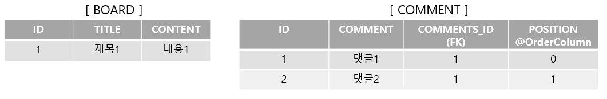

# Chapter 14. 컬렉션과 부가 기능

## 1. 컬렉션

- JPA는 자바에서 기본으로 제공하는 `Collection`, `List`, `Set`, `Map` 컬렉션을 지원
- 컬렉션을 사용하는 상황
    - `@OneToMany`, `@ManyToMany`를 사용해서 일대다나 다대다 엔테티 관계를 매핑할 경우
    - `@ElementCollection`을 사용해서 값 타입을 하나 이상 보관할 경우
- 자바 컬렉션 인터페이스의 특징들
    - `Collection`: 자바가 제공하는 최상위 컬렉션, 하이버네이트는 중복을 허용하고 순서를 보장하지 않는다고 가정
    - `Set`: 중복을 허용하지 않는 컬렉션, 순서를 보장하지 않음
    - `List`: 순서가 있는 컬렉션, 순서를 보장하고 중복을 허용
    - `Map`: Key, Value 구조로 되어 있는 특수한 컬렉션

### 1-1. JPA 와 컬렉션

---

- 하이버네이트는 엔티티를 영속 상태로 만들 때 컬렉션 필드를 하이버네이트에서 준비한 컬렉션으로 감싸서 사용한다.
- JPA 컬렉션 사용

    ```java
    @Entity
    public class Team {
    		@Id
    		private String id;
    		
    		@OneToMany
    		@JoinColumn
    		private Collection<Member> members = new ArrayList<Member>();
    		...
    }
    
    //실행 코드
    Team team = new Team();
    
    System.out.println("before persist = "+ team.getMembers().getClass());
    **em.persist(team);**
    System.out.println("after persist = " + team.getMebers().getClass());
    
    //출력 결과
    **before persist = class java.util.ArrayList
    after persist = class org.hibernate.collection.internal.PersistentBag**
    ```


👉 하이버네이트는 컬렉션을 효율적으로 관리하기 위해 엔티티를 영속 상태로 만들 때 원본 컬렉션을 감싸는 내장 컬렉션을 생성해서 사용하도록 참조를 변경한다. 래퍼 컬렉션으로도 부른다.

- 따라서 컬렉션 사용 시 즉시 초기화해서 사용하는 것을 권장한다.

    ```java
    Collection<Member> members = new ArrayList<Member>();
    ```


- 하이버네이트 내장 컬렉션과 특징


    | 컬렉션 인터페이스 | 내장 컬렉션 | 중복 허용 | 순서 보관 |
    | --- | --- | --- | --- |
    | Collection, List | PersistenceBag | O | X |
    | Set | PersistenceSet | X | X |
    | List + @OrderColumn | PersistentList | O | O |

### 1-2. Collection, List

---

- `Collection`, `List` 인터페이스는 중복을 허용하고 `PersistentBag` 래퍼 컬렉션을 사용
- `ArrayList`로 초기화하면 된다.

    ```java
    //Entity
    ...
    @OneToMany
    @JoinColumn
    private Collection<CollectionChild> collection = new ArrayList<CollectionChild>();
    
    @OneToMany
    @JoinColumn
    private List<ListChild> list = new ArrayList<ListChild>();
    ```

- 객체를 추가하는 `add()` 메소드는 항상 `true` 반환, 찾거나 삭제할 때는 `equals()` 메소드 사용한다.

    ```java
    List<Comment> comments = new ArrayList<Comment>();
    ...
    
    boolean result = comments.add(data); //단순 추가, 항상 true
    
    comments.contains(comment); //equals 비교
    comments.remove(comment); //equals 비교
    ```


👉 `Collection`, `List`는 엔티티 추가할 때 중복된 엔티티가 있는지 비교하지 않고 단순히 저장만 하므로, 엔티티를 추가해도 지연 로딩된 컬렉션을 초기화하지 않는다.

### 1-3. Set

---

- `Set`은 중복을 허용하지 않는 컬렉션, `PersistentSet`을 컬렉션 래퍼로 사용
- `HashSet`으로 초기화하면 된다. (`LinkedHashSet`도 `PersistentSet`)

    ```java
    @Entity
    public class Parent {
    		@OneToMany
    		@JoinColumn
    		private Set<SetChild> set = new HashSet<SetChild>();
    		...
    }
    ```

- `add()` 메소드로 객체를 추가할 때 마다 `equals()` 메소드로 같은 객체가 있는지 비교한다.
    - 같은 객체가 없으면 객체를 추가하고 `true` 반환, 이미 있어서 추가 실패하면 `false`를 반환
    - 해시 알고리즘을 사용하므로 `hashcode()`도 함께 사용해서 비교

    ```java
    Set<Comment> comments = new HashSet<Comment>();
    ...
    
    boolean result = comments.add(data); //hashcode + equals 비교
    comments.contains(comment); //hashcode + equals 비교
    comments.remove(comment); //hashcode + equals 비교
    ```


👉 `Set`은 추가할때 중복 엔티티를 비교, 따라서 엔티티를 추가할 때 지연 로딩된 컬렉션을 초기화한다.

### 1-4. List + `@OrderColumn`

---

- `List` 인터페이스에 `@OrderColumn`을 추가하면 순서가 있는 특수한 컬렉션으로 인식
    - 순서가 있다는 의미는 DB 에 순서 값을 저장해서 조회할 때 사용한다는 의미
- 하이버네이트 내부 컬렉션인 `PersistentList`를 사용

    ```java
    @Entity
    public class Board {
    		@Id @GeneratedValue
    		private Long id;
    
    		private String title;
    		private String content;
    
    		@OneToMany(mappedBy = "board")
    		**@OrderColumn(name = "POSITION")**
    		private List<Comment> comments = new ArrayList<Comment>()
    		...
    }
    
    @Entity
    public class Comment {
    		@Id @GeneratedValue
    		private Long id;
    
    		private String comment;
    
    		@ManyToOne
    		@JoinColumn(name = "BOARD_ID")
    		private Board board;
    
    		...
    }
    
    //사용 코드
    list.add(1, data1); //1번 위치에 data1 저장
    list.add(data1);
    list.get(10); //10번 위치에 있는 값 조회
    ```

    - 순서가 있는 컬렉션은 DB 에 순서 값도 함께 관리한다.

      

- `@OrderColumn`의 단점 → 직접 POSITION 값을 관리하거나 `@OrderBy`사용 권장
    - `@OrderColumn`을 Board 엔티티에 매핑하므로 Comment 는 POSITION 값을 알 수 없음. 그래서 Board.comment 의 위치 값을 사용해서 POSITION 값을 UPDATE 하는 SQL 이 추가 발생
    - `List`를 변경하면 연관된 많은 위치 값을 변경해야 함, 가운데 값을 줄이면 POSITION 의 값을 각각 하나씩 줄이게 되므로 많은 UPDATE 문이 발생
    - POSITION 값이 없으면 조회한 `List`에는 `null`이 보관된다. 강제로 삭제 후 POSITION 값을 수정하지 않으면 [0, 2, 3]이 되어 1 값이 없는 현상 발생. 그로 인해 `NullPointException` 발생

### 1-5. `@OrderBy`

---

- `@OrderBy`는 DB 의 ORDER BY 절을 사용해서 컬렉션을 정렬한다.

  → 순서용 컬럼을 매핑하지 않아도 된다.

- `@OrderBy`는 모든 컬렉션에 사용 가능
- `@OrderBy` 예제

    ```java
    @Entity
    public class Team {
    		@Id @GeneratedValue
    		private Long id;
    		private String name;
    
    		@OneToMany(mappedBy = "team")
    		@OrderBy("username desc, id asc")
    		private Set<Member> members = new HashSet<Member>();
    		...
    }
    
    @Entity
    public class Member {
    		@Id @GeneratedValue
    		private Long id;
    
    		@Column(name = "MEMBER_NAME")
    		private String username;
    
    		@ManyToOne
    		private Team team;
    		...
    }
    ```

- `@OrderBy`의 값은 JPQL 의 order by 절처럼 엔티티의 필드를 대상으로 한다.

    ```java
    //초기화
    Team findTeam = em.find(Team.class, team.getId());
    findTeam.getMembers().size(); //초기화
    
    //Team.members를 초기화 할 때 SQL 실행결과
    SELECT M.*
    FROM
    		MEMBER M
    WHERE
    		M.TEAM_ID=?
    ORDER BY
    		M.MEMBER_NAME DESC,
    		M.ID ASC
    ```


<aside>
💡 Hibernate는 `Set`에 `@OrderBy`를 적용해서 결과를 조회하면 순서를 유지하기 위해 `HashSet` 대신에 `LinkedHashSet`을 내부에서 사용한다.

</aside>


## 2. `@Converter`

- 컨버터(converter)를 사용하면 엔티티의 데이터를 변환해서 DB 에 저장할 수 있다.
- ex> VIP 를 Y와 N으로 지정하고 싶은 경우 (JPA 는 자바의 `boolean`을 숫자 0, 1 로 저장)

    ```java
    CREATE TABLE MEMBER (
    		ID VARCHAR(255) NOT NULL,
    		USERNAME VARCHAR(255),
    		**VIP VARCHAR(1) NOT NULL,**
    		PRIMARY KEY (ID)
    )
    
    @Entity
    public class Member {
    		@Id
    		private String id;
    		private String username;
    
    		**@Convert(converter=BooleanToYNConverter.class)**
    		**private boolean vip;**
    
    		//Getter, Setter
    		...
    }
    ```

    - `@Convert`를 적용해서 DB 에 저장되기 직전에 BooleanToYNConverter 컨버터가 동작하도록 했다.
    - BooealnToYnConverter 컨버터

        ```java
        @Convert
        public class BooealnToYnConverter implements AttributeConverter<Booelan, String> {
        
        		@Override
        		public String convertToDatebaseColumn(Boolean attribute) {
        				return (attribute != null && attribute) ? "Y" : "N";
        		}
        
        		@Override
        		public Boolean convertToEntityAttribute(String dbData) {
        				return "Y".equals(dbData);
        		}
        }
        ```


- 컨버터 클래스는 `@Converter` 어노테이션을 사용하고 `AttributeConverter` 인터페이스 구현 필요
- 제네릭에는 현재 타입과 변환할 타입을 지정해야 한다.(ex> `<Boolean, String>`)
- `AttributeConverter` 인터페이스

    ```java
    public interface AttributeConverter<X, Y> {
    		public Y convertToDatabaseColumn (X attribute);
    		public X convertToEntityAttribute (Y dbData);
    }
    ```

    - `convertToDatabaseColumn()`: 엔티티 데이터를 DB 컬럼에 저장할 데이터로 변환
    - `convertToEntityAttribute()`: DB에서 조회한 컬럼 데이터를 엔티티의 데이터로 변환
- 컨버터는 클래스 레벨에도 설정 가능
    - 단 이때는 `attributeName` 속성으로 어떤 필드에 컨버터를 적용할지 명시해야 한다.

    ```java
    @Entity
    **@Convert(converter=BooleanToYNConverter.class, attributeName = "vip")**
    public class Member {
    		@Id
    		private String id;
    		private String username;
    
    		private boolean vip;
    		...
    }
    ```


### 2-1. 글로벌 설정

---

- 모든 `Boolean` 타입에 컨버터를 적용하려면 `@Converter(autoApply = true)` 옵션을 적용

    ```java
    **@Converter(autoApply = true)**
    public class BooleanToYNConverter implements AttributeConverter<Boolean, String> {
    		...
    }
    ```

    ```java
    @Entity
    public class Member {
    		@Id
    		private String id;
    		private String username;
    
    		// @Convert를 지정하지 않아도 저동으로 컨버터 적용
    		**private boolean vip;**
    
    		//Getter, Setter
    }
    ```


👉 글로벌 설정을 하면 `@Converter`를 적용하지 않아도 모든 `Boolean` 타입에 대해 자동으로 Converter 가 적용된다.

- `@Convert`속성 정리


    | 속성 | 기능 |
    | --- | --- |
    | converter | 사용할 컨버터를 지정 |
    | attributeName | 컨버터를 적용할 필드를 지정 |
    | disableConversion | 글로벌 컨버터나 상속 받은 컨버터를 사용하지 않는다. |


## 3. 리스너

- JPA 리스너 기능을 사용하면 엔티티의 생명주기에 따른 이벤트를 처리할 수 있다.

### 3-1. 이벤트 종류

---

- 이벤트의 종류와 발생 시점

  

1. `PostLoad`**:** 엔티티가 영속성 컨텍스트에 조회된 직후 또는 `refresh`를 호출한 후
    - 2차 캐시에 저장되어 있어도 호출된다.
2. `PrePersist`**:** `persist()` 메소드를 호출해서 엔티티를 영속성 컨텍스트에 관리하기 직전에 호출
    - 식별자 생성 전략을 사용한 경우 엔티티에 식별자는 아직 존재 X
    - 새로운 인스턴스 `merge`할 때도 수행된다.
3. `PreUpdate`**:** `flush`나 `commit`을 호출해서 엔티티를 DB 에 수정하기 직전에 호출
4. `PreRemove`**:** `remove()` 를 호출해서 엔티티를 영속성 컨텍스트에서 삭제하기 직전에 호출
    - 삭제 명령어로 영속성 전이가 일어날 때도 호출된다.
    - `orphanRemoval`은 `flush`, `commit`시 호출된다.
5. `PostPersist`**:** `flush`나 `commit`을 호출해서 엔티티를 DB 에 저장한 직후에 호출
    - 식별자가 항상 존재한다.
    - 식별자 생성 전략이 IDENTITY 면 식별자를 생성하기 위해 `persist()`를 호출하면서 DB 에 엔티티를 저장하므로 이때는 `persist()` 호출 직후에 `PostPersist` 호출된다.
6. `PostUpdate`: `flush`나 `commit`을 호출해서 엔티티를 DB 에 수정한 직후에 호출
7. `PostRemove`: `flush`나 `commit`을 호출해서 엔티티를 DB 에 삭제한 직후에 호출

### 3-2. 이벤트 적용 위치

---

- 이벤트는 엔티티에서 직접 받거나 별도의 리스너를 등록해서 받을 수 있다.
    - 엔티티에 직접 적용

        ```java
        @Entity
        public class Duck {
        
        		@Id @GeneratedValue
        		public Long id;
        
        		private String name;
        
        		@PrePersist
        		public void prePersist() {
        				System.out.println("Duck.prePersist id=" + id);
        		}
        
        		@PostPersist
        		public void postPersist() {
        				System.out.println("Duck.postPersist id=" + id);
        		}
        
        		@PostLoad
        		public void postLoad() {
        				System.out.println("Duck.postLoad");
        		}
        
        		@PreRemove
        		public void preRemove() {
        				System.out.println("Duck.preRemove");
        		}
        
        		@PostRemove
        		public void postRemove() {
        				System.out.println("Duck.postRemove");
        		}
        }
        ```

        ```
        //엔티티를 저장할 때 결과
        Duck.prePersist id=null
        Duck.postPersist id=1
        ```

    - 별도의 리스너 등록

        ```java
        @Entity
        @EntityListeners(DuckListener.class)
        public class Duck {
        		...
        }
        
        public class DuckListener {
        		@PrePersist
        		//특정 타입이 확실하면 특정 타입을 받을 수 있다.
        		private void prePersist(Object obj) {
        				System.out.println("DuckListener.prePersist obj = [" + obj + "]");
        		}
        
        		@PostPersist
        		//특정 타입이 확실하면 특정 타입을 받을 수 있다.
        		private void postPersist(Object obj) {
        				System.out.println("DuckListener.postPersist obj = [" + obj + "]");
        		}
        }
        ```

        - 리스너는 대상 엔티티를 파라미터로 받을 수 있음, 반환 타입은 `void`로 설정
    - 기본 리스너 사용
        - 모든 엔티티의 이벤트를 처리하려면 `META-INF/orm.xml`에 기본 리스너로 등록하면 된다.

            ```xml
            <?xml version"1.0" encoding="UTF-8" ?>
            <entity-mappings ...>
            
            		<persistence-unit-metadata>
            				<persistence-unit-defaults>
            						<entity-listeners>
            								<entity-listener class="jpabook.jpashop.domain.
            										listener.DefaultListner" />
            						</entity-listeners>
            				</persistence-unit-defaults>
            		</persistence-unit-metadata>
            
            </entity-mappings>
            ```

        - 여러 리스너를 등록했을 경우 이벤트 호출 순서
            - 기본 리스너
            - 부모 클래스 리스너
            - 리스너
            - 엔티티
- 더 세밀한 설정을 위한 어노테이션
    - `javax.persistence.ExcludeDefaultListeners`: 기본 리스너 무시
    - `javax.persistence.ExcludeSuperclassListeners`: 상위 클래스 이벤트 리스너 무시

    ```java
    @Entity
    @EntityListeners(DuckListener.class)
    @ExcludeDefaultListeners
    @ExcludeSuperclassListeners
    public class Duck extends BaseEntity {
    		...
    }
    ```

    - 이벤트를 잘 활용하면 공통으로 적용하는 등록 일자, 수정 일자, 등록자, 수정자 처리가 가능


## 4. 엔티티 그래프

- 엔티티 조회시 연관된 엔티티를 함께 조회하려면 글로벌 `fetch` 옵션을 `FetchType.EAGER`로 설정

    ```java
    @Entity
    class Order {
    		@ManyToOne(fetch=FetchType.EAGER)
    		Member member;
    		...
    }
    ```

- 또는 JPQL 에서 페치 조인을 사용하면 된다.

    ```java
    select o from Order o join fetch o.member
    ```


- 글로벌 `fetch` 옵션은 전체에 영향을 주고 변경할 수 없는 단점이 있다 → `FetchType.LAZY`를 쓰고 필요할때 JPQL 페치 조인을 사용한다.
- 그런데 JPQL 이 데이터 조회 기능뿐 아니라 연관된 엔티티를 함께 조회하는 기능도 제공하기 때문에 같은 JPQL 을 중복해서 작성하게 된다 → 엔티티 그래프 기능 권장

- 엔티티 그래프 기능: 엔티티 조회시점에 연관된 엔티티들을 함께 조회하는 기능

### 4-1. Named 엔티티 그래프

---

- 주문(Order)을 조회할 때 연관된 회원(Member)도 함께 조회하는 엔티티 그래프 예제

    ```java
    @NamedEntityGraph(name = "Order.withMember", attributeNodes = {
    		@NamedAttributeNode("member")
    })
    @Entity
    @Table(name = "ORDERS")
    public class Order {
    		@Id @GeneratedValue
    		@Column(name = "ORDER_ID")
    		private Long id;
    
    		**@ManyToOne(fetch = FetchType.LAZY, optional = false)**
    		@JoinColumn(name = "MEMBER_ID")
    		private Member member;
    
    		...
    }
    ```

- Named 엔티티 그래프는 `@NamedEntityGraph`로 정의한다.
    - `name`: 엔티티 그래프의 이름을 정의
    - `attributeNodes`: 함께 조회할 속성 선택한다. 이때 `@NamedAttributeNode`를 사용하고 그 값으로 함께 조회할 속성을 선택하면 된다.
- 지연 로딩으로 설정되어 있지만, 엔티티 그래프에서 함께 조회할 속성을 선택했으므로 이 엔티티 그래프를 사용하면 Order 를 조회할 때 연관된 member 도 함께 조회할 수 있다.
- 둘 이상 정의하려면 `NamedEntityGraphs`를 사용하면 된다.

### 4-2. `em.find()`에서 엔티티 그래프 사용

---

- 엔티티 그래프 사용

    ```java
    EntityGraph graph = em.getEntityGraph("Order.withMember");
    
    Map hints = new HashMap();
    hints.put("javax.persistence.fetchgraph", graph);
    
    Order order = em.find(Order.class, orderId, hints);
    
    //실행된 SQL
    select o.*, m.*
    from
    		ORDERS o
    inner join
    		Member m
    			on o.MEMBER_ID = m.MEMBER_ID
    where
    		o.ORDER_ID = ?
    ```

- Named 엔티티 그래프를 사용하려면 `em.getEntityGraph("Order.withMember")`를 사용
- 엔티티 그래프는 JPA 의 힌트 기능을 사용해서 동작
    - 힌트의 키로 `javax.persistence.fetchgraph` 사용
    - 힌트의 값으로 찾아온 엔티티 그래프를 사용

### 4-3. subgraph

---

- Order → OrderItem → Item까지 조회하는 경우 subgraph를 사용
- subgraph
    - ex> Order → OrderItem → Item 을 조회할 경우

    ```java
    @NamedEntityGraph(name = "Order.withAll", attributeNodes = {
    		@NamedAttributeNode("member"),
    		@NamedAttributeNode(value = "orderItems", subgraph = "**orderItems**")},
    		subgraphs = @NamedSubgraph(name = "**orderItems**", attributeNodes = { // 여기서는 서브그래프의 이름을 orderItems 라고 지정한 것
    				@NamedAttributeNode("item")
    		})
    )
    @Entity
    @Table(name ="ORDERS")
    public class Order {
    		@Id @GeneratedValue
    		@Column(name = "ORDER_ID")
    		private Long id;
    
    		@ManyToOne(fetch = FetchType.LAZY, optional = false)
    		@JoinColumn(name = "MEMBER_ID")
    		private Member member; //주문 회원
    
    		@OneToMany(mappedBy = "order", cascade = CascadeType.ALL)
    		private List<OrderItem> orderItems = new ArrayList<OrderItem>();
    
    		...
    }
    
    @Entity
    @Table(name = "ORDER_ITEM")
    public class OrderItem {
    		@Id @GeneratedValue
    		@Column(name = "ORDER_ITEM_ID")
    		private Long id;
    
    		@ManyToOne(fetch = FetchType.LAZY)
    		@JoinColumn(name = "ITEM_ID")
    		private Item item; //주문 상품
    
    		...
    }
    
    // 사용
    Map hints = new HashMap();
    hints.put("javax.persistence.fetchgraph", em.getEntityGraph("order.withAll"));
    
    Order order = em.find(Order.class, orderId, hints);
    
    // 실행된 SQL
    select o.*, m.*, oi.*, i.*
    from
    		ORDERS o
    inner join
    		Member m
    				on o.MEMBER_ID = m.MEMBER_ID
    left outer join
    		ORDER_ITEM oi
    				on o.ORDER_ID = oi.ORDER_ID
    left outer join
    		Item i
    				on oi.ITEM_ID = i.ITEM_ID
    where
    		o.ORDER_ID = ?
    ```

    - OrderItem → Item은 Order 의 객체 그래프가 아니다 → `subgraphs` 사용하면 된다.
- `@NamedSubgraph`를 사용해서 서브 그래프를 정의한다.

### 4-4. JPQL 에서 엔티티 그래프 사용

---

- `em.find()`와 동일하게 힌트만 추가하면 된다.

    ```java
    List<Order> resultList =
    		em.createQuery("select o from Order o where o.id = :orderId", Order.class)
    				.setParameter("orderId", orderId)
    				**.setHint("javax.persistence.fetchgraph", em.getEntityGraph("Order.withAll"))**
    				.getResultList();
    
    // 실행된 SQL
    select o.*, m.*, oi.*, i.*
    from
    		ORDERS o
    left join
    		Member m
    				on o.MEMBER_ID = m.MEMBER_ID
    left outer join
    		ORDER_ITEM oi
    				on o.ORDER_ID = oi.ORDER_ID
    left outer join
    		Item i
    				on oi.ITEM_ID = i.ITEM_ID
    where
    		o.ORDER_ID = ?
    ```

- `em.find()`에서 엔티티 그래프를 사용하면 하이버네이트는 필수 관계(`optional = false`)를 고려해서 내부 조인을 사용하지만 JPQL 에서 엔티티 그래프를 사용할 때는 항상 SQL 외부 조인을 사용한다.
    - SQL 내부 조인을 사용하려면 내부 조인을 명시하면 된다.

        ```java
        select o from Order o join fetch o.member where o.id = :orderId
        ```


### 4-5. 동적 엔티티 그래프

---

- 엔티티 그래프를 동적으로 구성하려면 `createEntityGraph()` 메소드를 사용하면 된다.

    ```java
    public <T> EntityGraph<T> createEntityGraph(Class<T> rootType);
    ```

- 처음에 사용한 Named 엔티티 그래프 동적으로 재구성 예시

    ```java
    **EntityGraph<Order> graph = em.createEntityGraph(Order.class);**
    graph.addAttributeNodes("member");
    
    Map hints = new HashMap()
    hints.get("javax.persistence.fetchgraph", graph);
    
    Order order = em.find(Order.class, orderId, hints);
    ```

- 동적 엔티티 그래프 subgraph 예시

    ```java
    **EntityGraph<Order> graph = em.createEntityGraph(Order.class);**
    graph.addAttributeNodes("member");
    Subgraph<OrderItem> orderItems = **graph.addSubgraph("orderItems");**
    orderItems.addAttributeNodes("item");
    
    Map hints = new HashMap()
    hints.get("javax.persistence.fetchgraph", graph);
    
    Order order = em.find(Order.class, orderId, hints);
    ```


### 4-6. 엔티티 그래프 정리

---

- ROOT에서 시작
    - 엔티티 그래프는 항상 조회하는 엔티티의 ROOT 에서 시작해야 한다.
- 이미 로딩된 엔티티
    - 영속성 컨텍스트에 해당 엔티티가 이미 로딩되어 있으면 엔티티 그래프가 적용되지 X

        ```java
        Order order1 = em.find(Order.class, orderId); //이미 조회
        
        hints.put("javax.persistence.fetchgraph", em.getEntityGraph("Order.withMember"));
        Order order2 = em.find(Order.class, orderId, hints); //엔티티 그래프 적용 X
        ```

- fetchgraph, loadgraph의 차이
    - `fetchgraph`는 엔티티 그래프에 선택한 속성만 함께 조회
    - `loadgraph`는 선택한 속성 + `FetchType.EAGER`로 설정된 연관관계도 함께 조회

- 참고
    - [https://milenote.tistory.com/150?category=1037499](https://milenote.tistory.com/150?category=1037499)
    - [https://www.nowwatersblog.com/jpa/ch14/14-3](https://www.nowwatersblog.com/jpa/ch14/14-3)
    - [https://github.com/ksw6169/jpa-programming/wiki/14장_컬렉션과-부가-기능](https://github.com/ksw6169/jpa-programming/wiki/14%EC%9E%A5_%EC%BB%AC%EB%A0%89%EC%85%98%EA%B3%BC-%EB%B6%80%EA%B0%80-%EA%B8%B0%EB%8A%A5)
